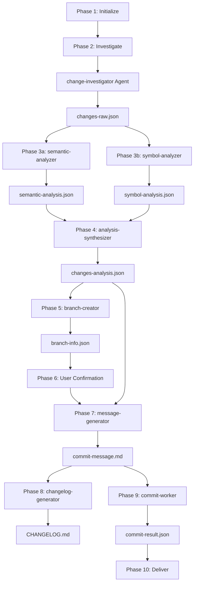
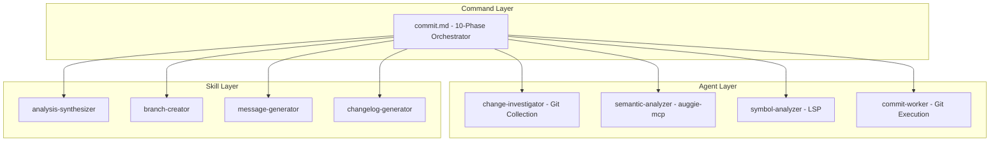

# Architecture of Commit Workflow

## 1. Identity

- **What it is:** A 10-phase automated git commit workflow with parallel code analysis.
- **Purpose:** Automates conventional commits with intelligent type/scope inference using dual-analysis strategy (auggie-mcp + LSP).

## 2. Core Components

- `plugins/commit/commands/commit.md` (`/commit`): Main orchestrator defining 10-phase workflow with parallel execution pattern.
- `plugins/commit/agents/change-investigator.md` (`change-investigator`): Git state collection agent, outputs `changes-raw.json`.
- `plugins/commit/agents/semantic-analyzer.md` (`semantic-analyzer`): Auggie-mcp based semantic analysis, runs in parallel.
- `plugins/commit/agents/symbol-analyzer.md` (`symbol-analyzer`): LSP-based symbol analysis, runs in parallel.
- `plugins/commit/agents/commit-worker.md` (`commit-worker`): Safe git commit execution with error recovery.
- `plugins/commit/skills/analysis-synthesizer/SKILL.md` (`analysis-synthesizer`): Merges parallel analysis results.
- `plugins/commit/skills/branch-creator/SKILL.md` (`branch-creator`): Creates feature branches with naming convention.
- `plugins/commit/skills/message-generator/SKILL.md` (`message-generator`): Generates conventional commit messages with emoji.
- `plugins/commit/skills/changelog-generator/SKILL.md` (`changelog-generator`): Updates CHANGELOG.md under [Unreleased].

## 3. Execution Flow (LLM Retrieval Map)

### Phase 1-2: Initialize & Investigate (Sequential)

- **1. Initialize:** Create run directory at `openspec/changes/{change_id}/`.
- **2. Investigate:** Task calls `change-investigator` agent.
  - Git commands: `git status --porcelain`, `git diff --staged`
  - Output: `changes-raw.json`, `investigation-summary.md`

### Phase 3: Parallel Analysis (Critical)

Two agents launched simultaneously in ONE message with `run_in_background=true`:

- **3a. Semantic:** `semantic-analyzer` uses auggie-mcp for feature grouping and dependencies.
- **3b. Symbol:** `symbol-analyzer` uses LSP for class/function symbols and scope derivation.

Output: `semantic-analysis.json`, `symbol-analysis.json`

### Phase 4-5: Synthesize & Branch (Sequential)

- **4. Synthesize:** `analysis-synthesizer` merges results with conflict resolution.
  - Type priority: semantic analysis (understands purpose)
  - Scope priority: symbol analysis if high confidence (LSP precision)
  - Output: `changes-analysis.json`
- **5. Branch:** `branch-creator` generates branch using `<type>/<scope>-<description>` format.
  - Output: `branch-info.json`

### Phase 6: User Confirmation (HARD STOP)

User chooses: accept / customize / cancel / split

- **6B Split Mode:** If split, executes multiple commits with `git reset HEAD` then selective staging.

### Phase 7-9: Message, Changelog, Execute (Sequential)

- **7. Message:** `message-generator` creates `type(scope): emoji description` format.
- **8. Changelog:** `changelog-generator` updates CHANGELOG.md (unless `--no-changelog`).
- **9. Execute:** `commit-worker` performs safe git commit with HEREDOC format.

### Phase 10: Deliver (HARD STOP)

Summary and next action options: Push & PR / Merge back / Push only / Done.

## 4. Data Flow Diagram

## 5. Architecture Layers

## 6. Design Rationale

- **Parallel Analysis:** Reduces workflow time from `T(semantic) + T(symbol)` to `max(T(semantic), T(symbol))`.
- **Dual-Tool Strategy:** Auggie-mcp provides semantic understanding; LSP provides precise symbol information.
- **Run Directory Isolation:** Timestamped directories prevent artifact collision across concurrent runs.
- **Agent-Skill Separation:** Agents handle orchestration; skills provide atomic reusable operations.
