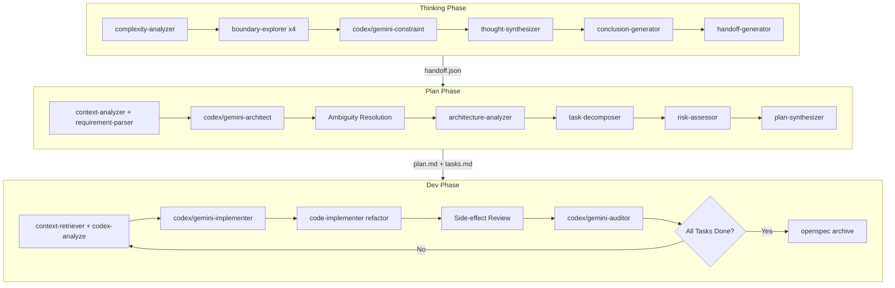

# Architecture of TPD Workflow

## 1. Identity

- **What it is:** A three-phase development workflow (Thinking → Plan → Dev) with multi-model collaboration.
- **Purpose:** Transform ambiguous requirements into zero-decision executable plans and iteratively implement minimal verifiable phases.

## 2. Core Components

- `plugins/tpd/commands/thinking.md` (`/tpd:thinking`): Deep thinking workflow with complexity-based depth routing (light/deep/ultra).
- `plugins/tpd/commands/plan.md` (`/tpd:plan`): OpenSpec planning with multi-model architecture analysis and PBT property extraction.
- `plugins/tpd/commands/dev.md` (`/tpd:dev`): Iterative development with prototype → refactor → audit flow.
- `plugins/tpd/commands/init.md` (`/tpd:init`): System initialization for OpenSpec and MCP tool validation.
- `plugins/tpd/skills/codex-cli/SKILL.md` (`tpd:codex-cli`): Backend analysis wrapper using `codeagent-wrapper codex`.
- `plugins/tpd/skills/gemini-cli/SKILL.md` (`tpd:gemini-cli`): Frontend analysis wrapper using `codeagent-wrapper gemini`.

## 3. Execution Flow (LLM Retrieval Map)



### 3.1 Thinking Phase

- **1. Complexity Assessment:** `plugins/tpd/skills/complexity-analyzer/SKILL.md` evaluates problem (1-10 score → light/deep/ultra).
- **2. Boundary Exploration:** `plugins/tpd/agents/investigation/boundary-explorer.md` explores context boundaries via `mcp__auggie-mcp__codebase-retrieval`.
- **3. Constraint Analysis:** `plugins/tpd/agents/reasoning/codex-constraint.md` and `gemini-constraint.md` analyze constraints from backend/frontend perspectives.
- **4. Synthesis:** `plugins/tpd/skills/thought-synthesizer/SKILL.md` aggregates constraints into unified set.
- **5. Handoff:** `plugins/tpd/skills/handoff-generator/SKILL.md` produces `handoff.json` for Plan phase.

### 3.2 Plan Phase

- **1. Context Retrieval:** `plugins/tpd/agents/investigation/context-analyzer.md` retrieves codebase context.
- **2. Multi-Model Architecture:** `plugins/tpd/agents/planning/codex-architect.md` (backend) and `gemini-architect.md` (frontend) generate architecture plans.
- **3. Ambiguity Resolution:** MCP direct calls to identify and resolve all decision points.
- **4. Integration:** Sequential skills: `architecture-analyzer` → `task-decomposer` → `risk-assessor` → `plan-synthesizer`.
- **5. Validation:** Execute `openspec validate --strict`.

### 3.3 Dev Phase

- **1. Prototype Generation:** `plugins/tpd/agents/execution/codex-implementer.md` and `gemini-implementer.md` produce Unified Diff patches.
- **2. Refactor:** `plugins/tpd/skills/code-implementer/SKILL.md` refactors prototypes (includes LSP impact analysis).
- **3. Audit:** `plugins/tpd/agents/execution/codex-auditor.md` (security/performance) and `gemini-auditor.md` (UX/accessibility).

## 4. Parallel Execution Constraints

| Phase    | Step                   | Max Agents | Agent Types                               |
| -------- | ---------------------- | ---------- | ----------------------------------------- |
| Thinking | Boundary Exploration   | 4          | `boundary-explorer`                       |
| Thinking | Constraint Analysis    | 2          | `codex-constraint`, `gemini-constraint`   |
| Plan     | Context + Requirements | 2          | `context-analyzer`, `requirement-parser`  |
| Plan     | Architecture           | 2          | `codex-architect`, `gemini-architect`     |
| Dev      | Context + Analysis     | 2          | `context-retriever`, `codex-implementer`  |
| Dev      | Prototype              | 2          | `codex-implementer`, `gemini-implementer` |
| Dev      | Audit                  | 2          | `codex-auditor`, `gemini-auditor`         |

## 5. Artifact Directory Structure

```
openspec/changes/${PROPOSAL_ID}/
├── artifacts/
│   ├── thinking/
│   │   ├── complexity-analysis.md
│   │   ├── boundaries.json
│   │   ├── explore-*.json
│   │   ├── codex-thought.md
│   │   ├── gemini-thought.md
│   │   ├── synthesis.md
│   │   ├── conclusion.md
│   │   └── handoff.json
│   ├── plan/
│   │   ├── context.md
│   │   ├── requirements.md
│   │   ├── codex-plan.md
│   │   ├── gemini-plan.md
│   │   ├── architecture.md
│   │   ├── tasks.md
│   │   └── plan.md
│   └── dev/
│       ├── context.md
│       ├── prototype-codex.diff
│       ├── prototype-gemini.diff
│       ├── changes.md
│       ├── audit-codex.md
│       └── audit-gemini.md
└── tasks.md
```

## 6. Design Rationale

- **Boundary-Based Exploration:** Agents split by context boundaries (module/directory/domain), not roles. Ensures comprehensive constraint discovery.
- **Sandbox Safety:** All external model calls use `--sandbox read-only`. Claude reviews and refactors all code before applying.
- **Constraint-First Philosophy:** Thinking outputs constraints (not solutions), Plan eliminates ambiguities (not assumptions), Dev implements minimal phases (not complete features).
