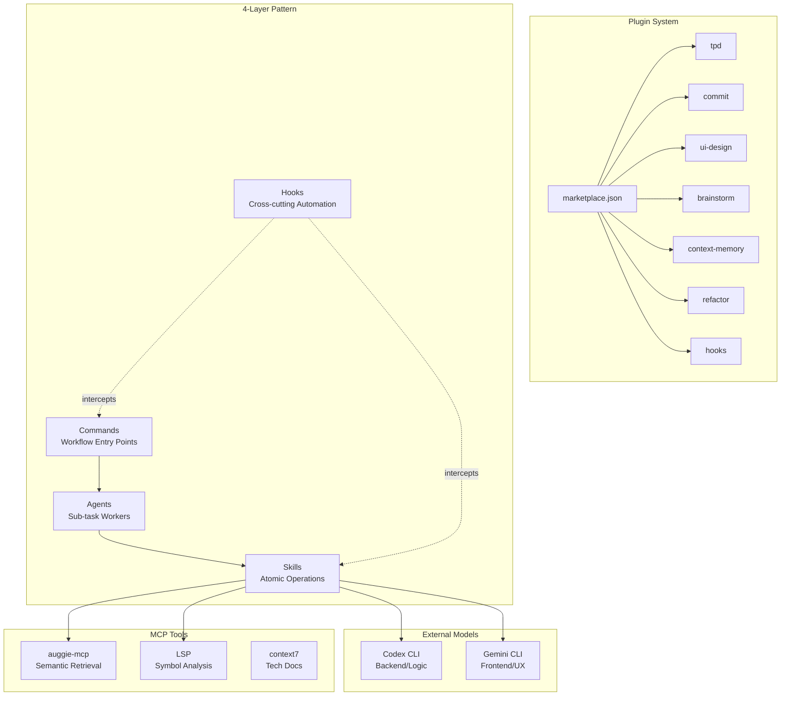

# CCG-Workflows

## 1. Identity

- **What it is:** A local plugin marketplace and workflow collection for Claude Code CLI.
- **Purpose:** Provides 7 specialized plugins that enable AI-assisted development workflows with multi-model collaboration, automated commit management, brainstorming, and code refactoring.

## 2. High-Level Description

CCG-Workflows is a plugin ecosystem designed for Claude Code users and plugin developers. It implements a 4-layer architecture (Commands, Agents, Skills, Hooks) that orchestrates complex development workflows. The system enables multi-model collaboration by integrating external models (Codex, Gemini) through sandboxed CLI wrappers, where Claude acts as the final code sovereignty layer reviewing and applying all changes.

## 3. Plugin Catalog

| Plugin             | Version | Entry Command                            | Purpose                                                                                                             |
| ------------------ | ------- | ---------------------------------------- | ------------------------------------------------------------------------------------------------------------------- |
| **tpd**            | 2.0.0   | `/tpd:thinking`, `/tpd:plan`, `/tpd:dev` | Three-phase workflow: constraint discovery, executable planning, iterative implementation with OpenSpec integration |
| **commit**         | 2.0.0   | `/commit`                                | 10-phase automated commit workflow with parallel semantic/symbol analysis                                           |
| **ui-design**      | 2.0.0   | `/ui-design`                             | UI/UX design workflow: requirement analysis, style recommendation, prototype generation, quality validation         |
| **brainstorm**     | 1.1.0   | `/brainstorm`                            | 4-phase ideation workflow with multi-model parallel idea generation                                                 |
| **context-memory** | 1.0.0   | `/memory`                                | Project memory management: context loading, session persistence, code mapping, CLAUDE.md updates                    |
| **refactor**       | 1.0.0   | `/refactor`                              | Code refactoring workflow: smell detection, impact analysis, safe execution                                         |
| **hooks**          | 1.0.0   | (passive)                                | Cross-cutting automation: security guards, logging, quality checks, intent evaluation                               |

## 4. Tech Stack

- **Configuration:** YAML frontmatter in Markdown files (commands, skills, agents)
- **Scripts:** Bash (hook scripts, sync utilities), TypeScript (analysis utilities)
- **Data Exchange:** JSON artifacts, Unified Diff patches
- **External Integration:** `codeagent-wrapper` CLI for Codex/Gemini, MCP tools (auggie-mcp, LSP, context7, core_memory)

## 5. Architecture Overview

## 6. Key Features

### Multi-Model Collaboration

- **Parallel Execution:** Codex and Gemini run concurrently via background processes
- **Role-Based Delegation:** Codex handles backend/architecture, Gemini handles frontend/UX
- **Sandbox Enforcement:** All external models use `--sandbox read-only`, producing Unified Diff patches
- **Code Sovereignty:** Claude reviews and refactors all external output before applying

### OpenSpec Integration (TPD Plugin)

- Artifact management in `openspec/changes/${PROPOSAL_ID}/artifacts/`
- Thinking phase exports constraints, Plan phase eliminates ambiguities, Dev phase implements minimal phases
- Strict validation via `openspec validate --strict`

### Plugin Marketplace

- Local marketplace defined in `.claude-plugin/marketplace.json`
- Install via `claude plugin marketplace add .` then `claude plugin install <name>@ccg-workflows`
- Sync utility: `scripts/sync-plugins.sh` for development workflows

### Hook System

- 5 lifecycle points: UserPromptSubmit, PreToolUse, PostToolUse, PermissionRequest, Notification
- Security hooks: privacy-firewall, db-guard, killshell-guard
- Optimization hooks: read-limit, auto-backup, auto-format
- Smart routing: unified-eval injects plugin catalog for intent-based routing

## 7. Target Audience

- **Claude Code CLI Users:** Install plugins to enhance development workflows
- **Plugin Developers:** Use the 4-layer pattern and marketplace infrastructure to build new plugins

## 8. Source of Truth

- **Marketplace Registry:** `.claude-plugin/marketplace.json`
- **Plugin Metadata:** `plugins/<name>/.claude-plugin/plugin.json`
- **Sync Script:** `scripts/sync-plugins.sh`
- **Validation Script:** `scripts/validate-skills.sh`
