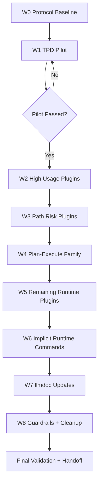

# Plugin Migration Subtask Breakdown (Hard Cutover)

## Scope

- Target: `plugins/*/commands/*.md`
- Goal: Replace all runtime artifact paths with OpenSpec-only paths.
- Policy: No fallback, no dual-read, no legacy `.claude/*/runs/*` runtime writes.

## Unified Input / Output Contract

### Input
- `change_id`
- `workflow` (plugin command namespace)
- `run_id`
- upstream `artifact-manifest.json` (if dependency exists)

### Output
- workflow outputs under `openspec/changes/<change-id>/` (phase subdirs optional)
- `artifact-manifest.json` (minimum fields)
  - `workflow`
  - `run_id`
  - `phase`
  - `artifacts[]`
  - `depends_on[]`
  - `status`
- optional `lineage.json`

## Subtasks by Execution Wave

| Wave | Subtask ID | Target | Input | Output | Files (<=3 per task) | Acceptance |
|---|---|---|---|---|---|---|
| W0 | S0-1 | Protocol setup | Existing plan + OpenSpec rules | Protocol baseline | `.../plugin-subtasks.md` | Contract fields complete |
| W1 | S1-1 | tpd thinking | question + change_id + run_id | thinking manifest | `plugins/tpd/commands/thinking.md` | manifest checkpoint exists |
| W1 | S1-2 | tpd plan | proposal + thinking manifest | plan manifest + lineage | `plugins/tpd/commands/plan.md` | no cp from thinking |
| W1 | S1-3 | tpd dev | plan manifest (+thinking optional) | dev manifest + lineage | `plugins/tpd/commands/dev.md` | no cp from plan/thinking |
| W1 | S1-4 | tpd rules | new hard-cutover policy | aligned workflow rules | `plugins/tpd/.trae/rules/workflow-rules.md` | legacy runtime disallowed |
| W2 | S2-1 | commit | git changes + run context | OpenSpec run artifacts | `plugins/commit/commands/commit.md` | no `.claude/committing/runs` |
| W2 | S2-2 | brainstorm | topic + run context | OpenSpec run artifacts | `plugins/brainstorm/commands/brainstorm.md` | no `.claude/brainstorm/runs` |
| W2 | S2-3 | ui-design | description + run context | OpenSpec run artifacts | `plugins/ui-design/commands/ui-design.md` | no `.claude/ui-design/runs` |
| W3 | S3-1 | bug-investigation | bug report + run context | OpenSpec run artifacts | `plugins/bug-investigation/commands/investigate.md` | no absolute path |
| W3 | S3-2 | code-review | diff scope + run context | OpenSpec run artifacts | `plugins/code-review/commands/review.md` | no absolute path |
| W4 | S4-1 | plan-execute(plan) | request + run_id | OpenSpec planning artifacts | `plugins/plan-execute/commands/plan.md` | no `.claude/plan-execute/runs` |
| W4 | S4-2 | plan-execute(csv) | run_id + csv | OpenSpec csv artifacts | `plugins/plan-execute/commands/csv.md` | no `.claude/plan-execute/runs` |
| W4 | S4-3 | plan-execute(execute) | run_id + plan artifacts | OpenSpec execute artifacts | `plugins/plan-execute/commands/execute.md` | OpenSpec-only prerequisite lookup |
| W5 | S5-1 | database-design | db requirement | OpenSpec run artifacts | `plugins/database-design/commands/design.md` | no legacy run path |
| W5 | S5-2 | security-audit | target + run context | OpenSpec run artifacts | `plugins/security-audit/commands/audit.md` | no legacy run path |
| W5 | S5-3 | tdd | feature + tests | OpenSpec run artifacts | `plugins/tdd/commands/tdd.md` | no legacy run path |
| W5 | S5-4 | feature-impl | feature request | OpenSpec run artifacts | `plugins/feature-impl/commands/implement.md` | no legacy run path |
| W5 | S5-5 | refactor | target + mode | OpenSpec run artifacts | `plugins/refactor/commands/refactor.md` | no legacy run path |
| W5 | S5-6 | refactor-team | target + team mode | OpenSpec run artifacts | `plugins/refactor-team/commands/refactor.md` | no legacy run path |
| W6 | S6-1 | context-memory | command runtime assumptions | OpenSpec-compatible path policy | `plugins/context-memory/commands/memory.md` | no hidden legacy runtime dependency |
| W6 | S6-2 | docflow | command runtime assumptions | OpenSpec-compatible path policy | `plugins/docflow/commands/init-doc.md`, `plugins/docflow/commands/what.md`, `plugins/docflow/commands/with-scout.md` | no hidden legacy runtime dependency |
| W7 | S7-1 | docs runtime architecture | migrated implementation | updated architecture docs | `llmdoc/architecture/workflow-orchestration.md`, `llmdoc/architecture/plugin-system.md` | docs match cutover policy |
| W7 | S7-2 | docs conventions | migrated implementation | updated conventions | `llmdoc/reference/coding-conventions.md`, `llmdoc/reference/workflow-inventory.md` | no legacy runtime guidance |
| W8 | S8-1 | guardrails | command definitions | legacy-path check | `scripts/validate-skills.sh` (or new script) | legacy path check enforced |
| W8 | S8-2 | cleanup runbook | legacy directories | cleanup report | `.../cleanup-report.md` | before/after metrics included |

## Execution Flow (Subtask Orchestration)



## Lifecycle Cleanup Procedure (One-time, Hard Cutover)

Use this procedure after command migration is complete to remove historical runtime artifacts under project-local `.claude/*/runs/*`.

### 1) Dry-run inventory (required first)

```bash
./scripts/cleanup-legacy-runs.sh
```

Expected: prints target run roots, run directory counts, and total KB with a `SUMMARY mode=dry-run ...` line.

### 2) Execute cleanup (one-time)

```bash
./scripts/cleanup-legacy-runs.sh --execute
```

Expected: removes only `.claude/<plugin>/runs` directories inside this repository and prints `SUMMARY mode=execute ...`.

### 3) Post-cleanup verification

```bash
./scripts/cleanup-legacy-runs.sh
rg -n "\\.claude/.*/runs|/Users/.*/\\.claude/" plugins/*/commands/*.md
```

Acceptance:
- Dry-run before execute reports non-zero legacy targets (if present).
- Execute mode reduces legacy targets to zero.
- Command definitions remain free of legacy runtime paths.

## Batch Verification Commands

```bash
# legacy run path should be fully removed from command definitions
rg -n "\.claude/.*/runs" plugins/*/commands/*.md

# hardcoded absolute legacy run path should be removed
rg -n "/Users/.*/\.claude/" plugins/*/commands/*.md

# independent runtime directories should be removed
rg -n "\.runtime/" plugins/*/commands/*.md

# OpenSpec artifacts hierarchy should not be used as runtime path
rg -n "openspec/changes/.*/artifacts" plugins/*/commands/*.md

# openspec change validation
openspec validate refactor-plugin-artifact-governance-with-openspec --strict --no-interactive
```
