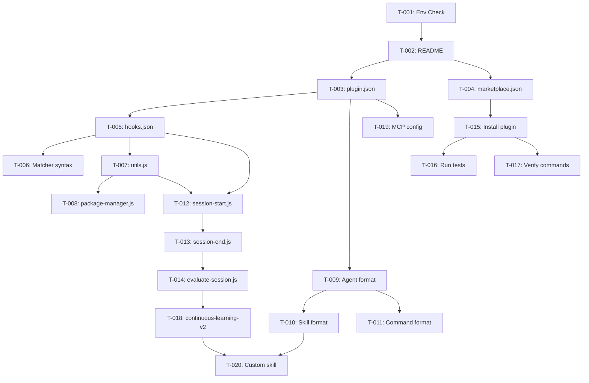

# Task Decomposition: Understand Everything Claude Code

## Metadata

- Decomposition Time: 2026-02-02T10:20:00Z
- Total Tasks: 20
- Execution Phases: 6 (Phase 0-5)
- Critical Path Length: 8 tasks
- Max Parallelism: 3 tasks

---

## WBS Structure

```
Learning Plan: everything-claude-code
├── 0. Environment Validation (30 min)
│   └── T-001: Verify prerequisites
├── 1. Foundation (2-4h)
│   ├── 1.1 Project Overview
│   │   ├── T-002: Read README.md
│   │   └── T-003: Analyze plugin.json
│   └── 1.2 Discovery Mechanism
│       └── T-004: Analyze marketplace.json
├── 2. Core Concepts (4-6h)
│   ├── 2.1 Automation Layer
│   │   ├── T-005: Study hooks.json
│   │   └── T-006: Master matcher syntax
│   ├── 2.2 Execution Engine
│   │   ├── T-007: Learn utils.js
│   │   └── T-008: Learn package-manager.js
│   └── 2.3 Component Formats
│       ├── T-009: Analyze agent format
│       ├── T-010: Analyze skill format
│       └── T-011: Analyze command format
├── 3. Integration Patterns (3-5h)
│   ├── 3.1 Session Lifecycle
│   │   ├── T-012: Trace session-start.js
│   │   └── T-013: Trace session-end.js
│   └── 3.2 Learning Loop
│       └── T-014: Trace evaluate-session.js
├── 4. Practical Usage (2-3h)
│   ├── T-015: Install plugin
│   ├── T-016: Run test suite
│   └── T-017: Verify slash commands
└── 5. Advanced Features (6-8h)
    ├── T-018: Study continuous-learning-v2
    ├── T-019: Configure MCP integration
    └── T-020: Create custom skill
```

---

## Execution Phases

### Phase 0: Environment Validation (No Dependencies)

| ID    | Task                 | Type  | Est | DoD                                                    |
| ----- | -------------------- | ----- | --- | ------------------------------------------------------ |
| T-001 | Verify prerequisites | setup | 30m | Node.js ≥18, Claude CLI ≥2.1.0, CLAUDE_PLUGIN_ROOT set |

**Deliverable**: Environment check commands pass

### Phase 1: Foundation (Depends on Phase 0)

| ID    | Task                     | Type     | Est | Depends | DoD                                                   |
| ----- | ------------------------ | -------- | --- | ------- | ----------------------------------------------------- |
| T-002 | Read README.md           | reading  | 30m | T-001   | Can explain project purpose and structure             |
| T-003 | Analyze plugin.json      | analysis | 45m | T-002   | `notes/phase1-summary.md` contains field explanations |
| T-004 | Analyze marketplace.json | analysis | 30m | T-002   | Can explain discovery mechanism                       |

**Deliverable**: `notes/phase1-summary.md` with plugin.json field descriptions

### Phase 2: Core Concepts (Depends on Phase 1)

| ID    | Task                     | Type     | Est | Depends | DoD                                                  |
| ----- | ------------------------ | -------- | --- | ------- | ---------------------------------------------------- |
| T-005 | Study hooks.json         | analysis | 1h  | T-003   | Can list all 6 event types and their triggers        |
| T-006 | Master matcher syntax    | practice | 45m | T-005   | Can write custom matcher expression                  |
| T-007 | Learn utils.js           | analysis | 1h  | T-005   | Can use readStdinJson, log, output functions         |
| T-008 | Learn package-manager.js | analysis | 30m | T-007   | Can explain detection chain                          |
| T-009 | Analyze agent format     | analysis | 45m | T-003   | `examples/my-agent.md` created with valid YAML       |
| T-010 | Analyze skill format     | analysis | 45m | T-009   | `examples/my-skill/SKILL.md` created with valid YAML |
| T-011 | Analyze command format   | analysis | 30m | T-009   | Can explain command → agent → skill flow             |

**Deliverable**: `examples/my-agent.md` + `examples/my-skill/SKILL.md`

### Phase 3: Integration Patterns (Depends on Phase 2)

| ID    | Task                      | Type     | Est | Depends      | DoD                                                  |
| ----- | ------------------------- | -------- | --- | ------------ | ---------------------------------------------------- |
| T-012 | Trace session-start.js    | analysis | 1h  | T-007, T-005 | `notes/hook-trace.md` contains SessionStart flow     |
| T-013 | Trace session-end.js      | analysis | 1h  | T-012        | Hook trace includes SessionEnd and state persistence |
| T-014 | Trace evaluate-session.js | analysis | 1h  | T-013        | Hook trace includes pattern extraction logic         |

**Deliverable**: `notes/hook-trace.md` with complete SessionStart → SessionEnd trace

### Phase 4: Practical Usage (Depends on Phase 1-3)

| ID    | Task                  | Type     | Est | Depends | DoD                                                 |
| ----- | --------------------- | -------- | --- | ------- | --------------------------------------------------- |
| T-015 | Install plugin        | practice | 30m | T-004   | Plugin installed, no errors                         |
| T-016 | Run test suite        | practice | 45m | T-015   | `logs/test-results.txt` shows all tests pass        |
| T-017 | Verify slash commands | practice | 30m | T-015   | `logs/install-output.txt` shows commands registered |

**Deliverable**: `logs/install-output.txt` + `logs/test-results.txt`

### Phase 5: Advanced Features (Depends on Phase 4)

| ID    | Task                         | Type     | Est | Depends      | DoD                                                                 |
| ----- | ---------------------------- | -------- | --- | ------------ | ------------------------------------------------------------------- |
| T-018 | Study continuous-learning-v2 | analysis | 2h  | T-014        | `notes/continuous-learning-analysis.md` explains instinct mechanism |
| T-019 | Configure MCP integration    | practice | 1h  | T-003        | One MCP server configured and working                               |
| T-020 | Create custom skill          | practice | 2h  | T-010, T-018 | Custom skill created and callable                                   |

**Deliverable**: `notes/continuous-learning-analysis.md`

---

## Dependency Graph



---

## Critical Path

```
T-001 → T-002 → T-003 → T-005 → T-007 → T-012 → T-013 → T-014 → T-018
```

**Critical Tasks** (zero float): T-001, T-002, T-003, T-005, T-007, T-012, T-013, T-014, T-018

**Critical Path Duration**: ~9.5 hours

---

## Parallel Execution Recommendations

| Parallel Group | Tasks               | Description                    | Savings |
| -------------- | ------------------- | ------------------------------ | ------- |
| Group A        | T-003, T-004        | plugin.json + marketplace.json | 30m     |
| Group B        | T-006, T-007        | Matcher syntax + utils.js      | 45m     |
| Group C        | T-009, T-010, T-011 | Agent/Skill/Command formats    | 1h      |
| Group D        | T-012, T-013        | Session lifecycle scripts      | 1h      |
| Group E        | T-016, T-017        | Test + verify                  | 30m     |
| Group F        | T-019, T-020        | MCP + Custom skill             | 1h      |

**Potential Time Savings**: ~4-5 hours through parallelization

---

## Milestones

| Milestone                  | Completion Criteria    | Deliverable               | Est Cumulative |
| -------------------------- | ---------------------- | ------------------------- | -------------- |
| M0: Environment Ready      | T-001 complete         | Env checks pass           | 0.5h           |
| M1: Foundation Complete    | T-002 ~ T-004 complete | `notes/phase1-summary.md` | 2.5h           |
| M2: Concepts Mastered      | T-005 ~ T-011 complete | Example files created     | 8h             |
| M3: Integration Understood | T-012 ~ T-014 complete | `notes/hook-trace.md`     | 11h            |
| M4: Practical Verified     | T-015 ~ T-017 complete | Log files saved           | 13h            |
| M5: Learning Complete      | T-018 ~ T-020 complete | All deliverables ready    | 17-20h         |

---

## Task Card Details

### T-001: Verify Prerequisites

| Field | Value                |
| ----- | -------------------- |
| ID    | T-001                |
| Name  | Verify prerequisites |
| Type  | setup                |
| Est   | 30 min               |
| Phase | 0                    |

**Input**: System environment

**Output**: Verification checklist completed

**Acceptance Criteria**:

- [ ] `node --version` returns ≥ v18.0.0
- [ ] `claude --version` returns ≥ 2.1.0
- [ ] `echo $CLAUDE_PLUGIN_ROOT` returns valid path
- [ ] CLI basics (cd, ls, cat, mkdir) work

---

### T-003: Analyze plugin.json

| Field   | Value               |
| ------- | ------------------- |
| ID      | T-003               |
| Name    | Analyze plugin.json |
| Type    | analysis            |
| Est     | 45 min              |
| Depends | T-002               |

**Input**: `.claude-plugin/plugin.json`

**Output**: `notes/phase1-summary.md`

**Acceptance Criteria**:

- [ ] Explains `name`, `version`, `description` fields
- [ ] Explains `skills` array (directory paths)
- [ ] Explains `agents` array (file paths)
- [ ] Documents that NO `hooks` field is allowed (H1)

---

### T-012: Trace session-start.js

| Field   | Value                  |
| ------- | ---------------------- |
| ID      | T-012                  |
| Name    | Trace session-start.js |
| Type    | analysis               |
| Est     | 1 hour                 |
| Depends | T-007, T-005           |

**Input**: `scripts/hooks/session-start.js`

**Output**: `notes/hook-trace.md` (partial)

**Acceptance Criteria**:

- [ ] Documents hook trigger mechanism
- [ ] Traces recent session loading (7 days)
- [ ] Traces package manager detection
- [ ] Traces skill availability reporting

---

### T-018: Study continuous-learning-v2

| Field   | Value                        |
| ------- | ---------------------------- |
| ID      | T-018                        |
| Name    | Study continuous-learning-v2 |
| Type    | analysis                     |
| Est     | 2 hours                      |
| Depends | T-014                        |

**Input**: `skills/continuous-learning-v2/SKILL.md`

**Output**: `notes/continuous-learning-analysis.md`

**Acceptance Criteria**:

- [ ] Explains instinct confidence scoring (0.3-0.9)
- [ ] Traces Hooks → observations → instincts → /evolve flow
- [ ] Documents observer agent role (Haiku, background)
- [ ] Explains /instinct-status and /evolve commands

---

## Quality Gates

- ✅ Followed WBS 100% rule (all learning work covered)
- ✅ Each task has clear DoD (Definition of Done)
- ✅ Dependencies form DAG (no cycles)
- ✅ Critical path identified (9.5h duration)
- ✅ Task granularity reasonable (30m - 2h per task)
- ✅ Deliverables match constraints.md C1

---

Next step: Call risk-assessor for risk assessment
