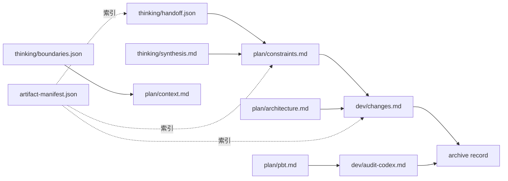

# Plan: 方案3（OpenSpec 控制全过程）详细实施方案

## 🎯 任务概述

当前 `plugins` 体系的中间产物分散在 `.claude/*/runs/*` 与 `openspec/changes/*/artifacts/*` 两条链路上，存在路径规范不一致、跨阶段复制冗余、生命周期缺失等问题。

本方案目标是：以 `plugins/tpd` 为试点，建立“OpenSpec 统一控制面 + 标准化产物协议 + 生命周期治理”，并强制推广到其他插件（commit/brainstorm/ui-design 等），停止旧 `.claude/*/runs/*` 产物写入。

---

## 1. 背景与问题定义

### 1.1 现状症状

1. 产物目录双轨并存：
   - 常规插件：`.claude/{plugin}/runs/{run_id}`
   - TPD：`openspec/changes/{proposal_id}/artifacts/{phase}`
2. 路径定义风格不统一：相对路径、绝对路径、不同命名同时存在。
3. TPD 阶段间使用 `cp` 复制上游产物（thinking→plan，plan→dev），形成冗余副本。
4. OpenSpec 规范基线不足（capability specs 缺失），难以形成“可验证治理”。

### 1.2 根因

- 缺少统一的产物协议（路径、命名、元数据、来源追溯）。
- 缺少跨插件统一的运行态状态机与清理策略。
- 当前流程偏“文件复制交接”，而非“引用事实源（source of truth）”。

---

## 2. 目标与非目标

### 2.1 目标（Goals）

- 建立统一的 OpenSpec 产物治理标准（目录、manifest、状态、清理）。
- 在 `tpd` 上落地“按需引用上游产物”替代“跨阶段复制”。
- 全插件切换到 OpenSpec 单一路径，不保留旧产物兼容读取。
- 建立可度量的治理指标（可追溯、可恢复、可清理、可验证）。
- 为其他插件提供可复用迁移模板。

### 2.2 非目标（Non-Goals）

- 不在第一阶段重写所有插件命令。
- 不改变插件业务语义（只治理运行产物协议和流程控制）。
- 不提供历史 run 的运行时兼容读取（无双读层）。

---

## 3. 目标架构（Target Architecture）

### 3.1 统一目录约定

```text
openspec/changes/<change-id>/
├── proposal.md
├── tasks.md
├── design.md
├── specs/
└── artifacts/
    └── <workflow>/
        └── <run-id>/
            ├── thinking/
            ├── plan/
            ├── dev/
            └── meta/
                ├── run-state.json
                ├── artifact-manifest.json
                └── lineage.json
```

> 注：`tpd` 与其他插件统一采用 OpenSpec 路径；切换完成后不再向 `.claude/*/runs/*` 写入任何新产物。

### 3.2 关键设计原则

- **Single Source of Truth**：上游产物不复制，只引用。
- **Manifest-Driven**：每阶段必须更新 `artifact-manifest.json`。
- **Hard Cutover**：切换后只读/写 OpenSpec 路径，不提供旧路径回退。
- **Lifecycle Managed**：定义 TTL、归档、清理命令与审计日志。

---

## 4. 全流程“产入 / 产出”设计（以 tpd 为例）

## 4.1 Thinking 阶段

**产入（Input）**
- 用户问题描述
- OpenSpec 初始化状态
- 代码边界检索结果（auggie）

**处理**
- 复杂度评估
- 边界探索
- 多模型约束分析
- 综合结论与交接

**产出（Output）**
- `input.md`
- `complexity-analysis.md`
- `boundaries.json`
- `explore-*.json`
- `codex-thought.md`（可选）
- `gemini-thought.md`（可选）
- `synthesis.md`
- `clarifications.md`（可选）
- `conclusion.md`
- `handoff.md` / `handoff.json`
- `state.json`
- `artifact-manifest.json`（新增要求）

## 4.2 Plan 阶段

**产入（Input）**
- `proposal.md`
- thinking 阶段 manifest 与 handoff（若存在）

**处理**
- 复用边界上下文
- 需求解析与架构规划
- 歧义澄清与约束收敛
- PBT 属性提取
- 任务分解与风险评估

**产出（Output）**
- `proposal.md`（run 快照引用，不复制正文）
- `context.md`
- `requirements.md`
- `codex-plan.md`
- `gemini-plan.md`
- `ambiguities.md`
- `constraints.md`
- `pbt.md`
- `architecture.md`
- `tasks.md`
- `risks.md`
- `plan.md`
- `state.json`
- `artifact-manifest.json`

## 4.3 Dev 阶段

**产入（Input）**
- plan 阶段核心产物（`architecture/constraints/pbt/tasks/context`）
- thinking 约束（可选）

**处理**
- 任务切片
- 按需上下文加载
- 原型 diff 生成
- 实施与审计闭环

**产出（Output）**
- `tasks-scope.md`
- `analysis-codex.md`
- `prototype-codex.diff`
- `prototype-gemini.diff`
- `changes.md`
- `audit-codex.md`
- `audit-gemini.md`
- `state.json`
- `artifact-manifest.json`

## 4.4 Archive 阶段

**产入（Input）**
- dev 阶段完成状态
- OpenSpec 验证结果

**处理**
- `/openspec:apply`
- `/openspec:archive`
- 生命周期策略应用（保留/归档/清理）

**产出（Output）**
- 归档记录
- 生命周期审计日志
- 可追溯 lineage

---

## 5. 端到端流程图（tpd 示例）

## 5.1 业务执行流程（目标态）

```mermaid
flowchart TD
    A[用户输入需求] --> B[/tpd:thinking]
    B --> B1[生成 Proposal + Run 上下文]
    B1 --> B2[写 thinking 产物 + state + manifest]
    B2 --> C{存在 open questions?}
    C -- 是 --> C1[AskUserQuestion\n写 clarifications]
    C -- 否 --> D[/tpd:plan]
    C1 --> D

    D --> D1[读取 proposal + thinking manifest 引用]
    D1 --> D2[生成 context/requirements/\nconstraints/pbt/tasks/plan]
    D2 --> D3[写 plan manifest + state]
    D3 --> E{Plan 审批通过?}
    E -- 否 --> D2
    E -- 是 --> F[/tpd:dev]

    F --> F1[按 manifest 引用读取 plan/thinking\n不做跨阶段复制]
    F1 --> F2[analysis -> prototype diff -> changes -> audits]
    F2 --> G{测试与审计通过?}
    G -- 否 --> F2
    G -- 是 --> H[/openspec:apply]
    H --> I[/openspec:archive]
    I --> J[更新 lifecycle + 清理策略]
```

## 5.2 产物流与来源追溯图（Lineage）



---

## 6. 分阶段落地计划（执行级）

## Phase 0：规范基线（1-2 天）

**输入**
- `openspec/AGENTS.md`
- 当前 tpd 命令与产物结构

**动作**
1. 补齐 `openspec/project.md` 项目约束（命名、路径、验证、清理）。
2. 新建 capability specs：
   - `artifact-governance`
   - `workflow-lifecycle`
3. 定义 `artifact-manifest.json` 字段规范。
4. 定义强切换策略（Cutover 开关、切换时间点、禁写旧目录规则）。

**输出**
- OpenSpec 可验证治理基线
- `openspec list --specs` 可见能力清单

**验收**
- `openspec validate --strict --no-interactive` 通过

## Phase 1：TPD 协议化改造（2-3 天）

**输入**
- `plugins/tpd/commands/{thinking,plan,dev}.md`

**动作**
1. 将 thinking/plan/dev 的“cp 复制”替换为 manifest 引用。
2. 每一步 checkpoint 后更新 `artifact-manifest.json`。
3. 引入 `lineage.json` 记录上游依赖路径。
4. 移除旧路径回退读取逻辑，缺失 OpenSpec 产物即失败并告警。

**输出**
- `tpd` 全流程 manifest 驱动
- 无跨阶段冗余复制

**验收**
- thinking→plan→dev 全链路跑通
- plan/dev 目录不再新增 `thinking-*` / `plan-*` 复制文件

## Phase 2：横向推广（3-5 天）

**输入**
- commit / brainstorm / ui-design 命令文件

**动作**
1. 定义通用 RUN_DIR 解析器（禁止硬编码绝对路径）。
2. 插件仅写入 OpenSpec 路径，删除 `.claude/*/runs` 写入逻辑。
3. 补齐插件级 state/manifest 更新。

**输出**
- 插件产物路径统一
- 多插件可追溯与可恢复

**验收**
- 新 run 的 100% 产物进入 OpenSpec 统一路径

## Phase 3：生命周期治理（持续）

**输入**
- OpenSpec 统一路径下的运行产物
- 历史 `.claude/*/runs/*` 存量文件

**动作**
1. 定义保留策略（按状态 + 按时间 + 按数量）。
2. 新增清理命令（dry-run + execute 双模式）。
3. 一次性归档或删除历史 `.claude/*/runs/*` 存量文件。
4. 生成治理报表（体积、数量、失效 run、孤儿产物）。

**输出**
- 可运维的产物治理体系

**验收**
- 产物规模增长可控，清理可审计可回滚

---

## 7. 里程碑与时间表（建议）

- M1（第 2 天）：完成 OpenSpec 基线与 manifest 规范。
- M2（第 5 天）：TPD 全流程改造完成并稳定运行。
- M3（第 10 天）：commit/brainstorm/ui-design 完成迁移。
- M4（第 14 天）：生命周期清理与治理报表上线。

---

## 8. 风险、权衡与回滚

### 风险

- 历史 run 在切换后不可直接恢复执行。
- 不同插件迁移节奏不一致。
- 短期开发效率下降（治理成本上升）。

### 缓解

- 切换前导出历史 run 快照（只归档，不运行时读取）。
- 先 tpd 试点，沉淀模板再推广。
- 每阶段加验收门禁与回归用例。

### 回滚

- 若切换失败，整体回滚到 Cutover 前提交（代码级回滚，不保留运行时双读）。
- 切换后产生的 OpenSpec 产物保留，便于问题排查。

---

## 9. 成功指标（KPI）

1. 新 run 产物进入统一路径比例 = 100%。
2. 跨阶段复制文件数量下降为 0（无兼容白名单）。
3. 每个阶段都有 manifest 与 state，且校验通过率 100%。
4. 平均定位一次 run 的上下游耗时下降 ≥ 50%。
5. 历史 `.claude/*/runs/*` 存量文件 100% 可归档/可清理。

---

## 10. 立即可执行的下一步（Action Items）

1. 创建 OpenSpec 变更：`refactor-plugin-artifact-governance-with-openspec`。
2. 先落 `proposal.md + tasks.md + design.md + specs delta`。
3. 在 tpd 中先改 plan/dev 的复制链路，再改 thinking 输出 manifest，并删除旧路径回退读取。
4. 跑一次端到端示例并验证 lineage 与强切换后的稳定性。
