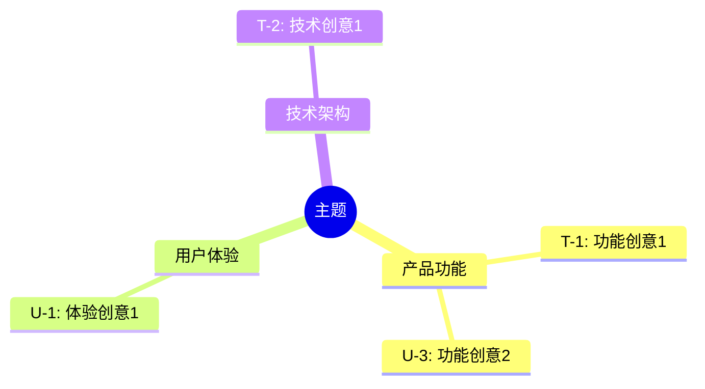
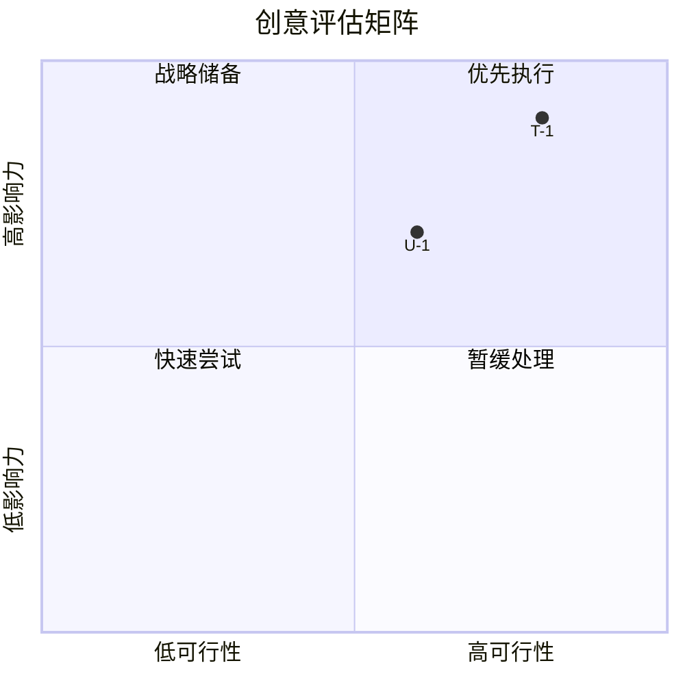

# Idea Evaluator

评估、分类和筛选创意；生成可视化评估结果。

## 参数

| 参数     | 类型   | 必需 | 描述                                                             |
| -------- | ------ | ---- | ---------------------------------------------------------------- |
| run_dir  | string | 是   | 运行目录路径                                                     |
| criteria | string | 否   | 优先维度 (balanced/impact/feasibility/innovation)，默认 balanced |

## 前置条件

1. 验证 `${run_dir}/ideas-pool.md` 存在
2. 验证创意数量 >= 5
3. 如果不满足，提示用户先运行 @idea-generator

## 工作流程

### Step 1: 读取创意池

```bash
ideas_pool=$(cat "${run_dir}/ideas-pool.md")
```

解析：创意 ID、标题、描述、来源、现有分数。

### Step 2: 亲和图分组

**分组维度：**

- 产品功能：新功能、增强
- 用户体验：交互优化、情感设计
- 技术架构：架构改进、性能
- 商业模式：变现、合作
- 运营增长：获客策略、留存

**规则：** 每个创意属于一个主要分组，可有次要标签。

### Step 3: 构建评估矩阵

**按 criteria 设置权重：**

| 预设        | 影响力 | 可行性 | 创新度 | 契合度 |
| ----------- | ------ | ------ | ------ | ------ |
| balanced    | 35%    | 35%    | 20%    | 10%    |
| impact      | 50%    | 25%    | 15%    | 10%    |
| feasibility | 25%    | 50%    | 15%    | 10%    |
| innovation  | 25%    | 25%    | 40%    | 10%    |

**对每个创意评分 (1-5)：**

- **影响力 (Impact):** 问题解决程度、受益范围、价值大小
- **可行性 (Feasibility):** 技术难度、资源需求、时间成本
- **创新度 (Innovation):** 新颖度、差异化、市场反应
- **契合度 (Alignment):** 目标契合、约束合规、能力匹配

**综合分数：** `Impact*W1 + Feasibility*W2 + Innovation*W3 + Alignment*W4`

### Step 4: 生成 Mermaid 可视化

**思维导图（创意分组）：**



**四象限图（影响力 vs 可行性）：**



### Step 5: 排名选出 Top 5

按综合分数降序排序，选出 Top 5。

### Step 6: 生成 evaluation.md

```markdown
---
generated_at: { timestamp }
topic: "{topic}"
total_ideas: { N }
criteria: "{criteria}"
top_count: 5
---

# 创意评估报告

## 1. 概览

**评估模式**: {criteria}
**权重**: 影响力 {W1}%, 可行性 {W2}%, 创新度 {W3}%, 契合度 {W4}%

## 2. 思维导图

{mermaid_mindmap}

## 3. 评估矩阵

{mermaid_quadrant}

### 矩阵解读

- **优先执行（高影响 + 高可行）**: T-1, U-2
- **战略储备（高影响 + 低可行）**: T-3
- **快速尝试（低影响 + 高可行）**: U-5
- **暂缓处理（低影响 + 低可行）**: T-7

## 4. Top 5 排名

| 排名 | ID  | 创意    | 影响力 | 可行性 | 创新度 | 契合度 | 综合分 |
| ---- | --- | ------- | ------ | ------ | ------ | ------ | ------ |
| 1    | T-1 | {title} | 4.5    | 4.0    | 3.5    | 4.0    | 4.08   |

## 5. Top 5 详情

### #1: {T-1 标题}

**来源**: 技术视角
**描述**: {desc}
**评分**: 影响力 4.5, 可行性 4.0, 创新度 3.5, 契合度 4.0
**评分理由**: {每项分数的依据}

## 6. 分组统计

| 分组     | 数量 | 平均分 | 最佳创意 |
| -------- | ---- | ------ | -------- |
| 产品功能 | 8    | 3.6    | T-1      |

## 7. 完整评估表

<details>
<summary>展开完整评估</summary>
| ID | 标题 | 分组 | 影响力 | 可行性 | 创新度 | 契合度 | 综合分 |
</details>
```

## 输出验证

确认：

- `${run_dir}/evaluation.md` 存在
- 包含完整的 Mermaid 代码块
- Top 5 有详细评估理由
- 所有创意都有评分
