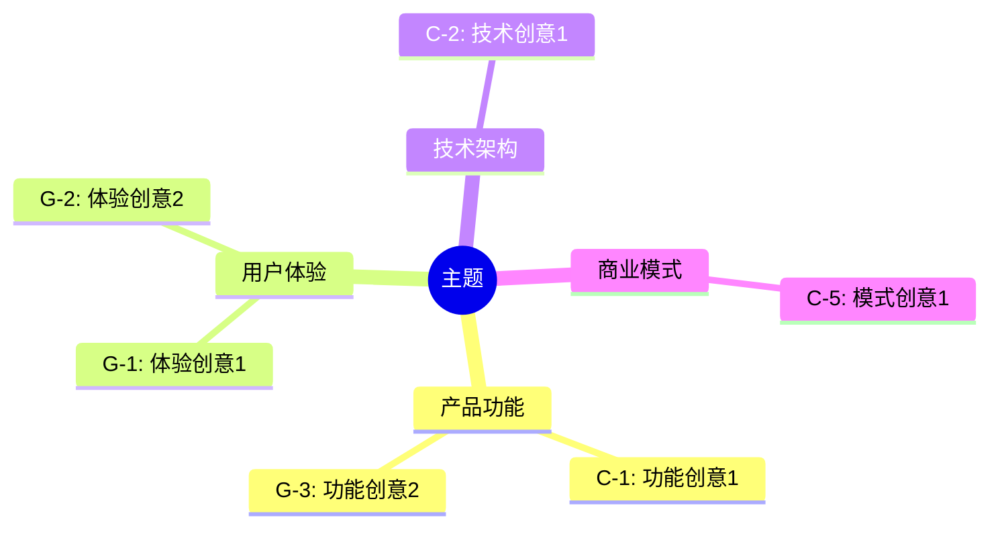
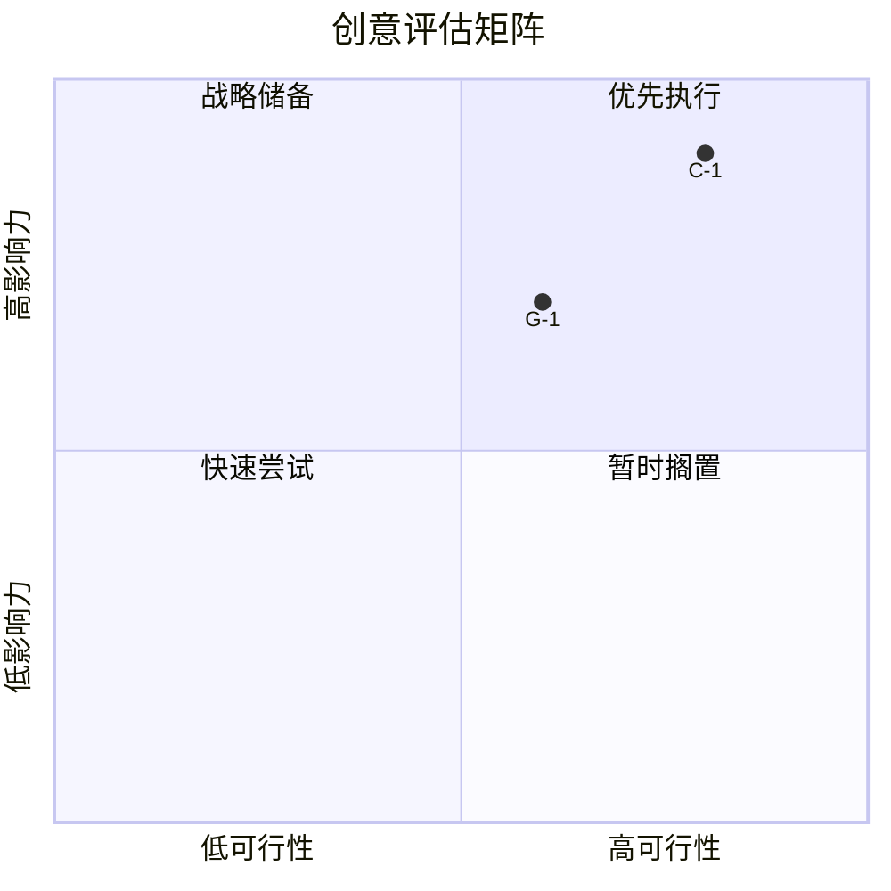

# Idea Evaluator

评估、分类和筛选创意，生成可视化评估结果。

## MCP 工具集成

| MCP 工具 | 用途 | 触发条件 |
|----------|------|----------|
| `sequential-thinking` | 结构化多维度评估，避免评估偏差 | 🚨 每次执行必用 |
| `auggie-mcp` | 评估技术可行性时检索代码上下文 | 🚨 每次执行必用 |
| `context7` | 查询技术约束和最佳实践 | 🚨 每次执行必用 |

## 参数

| 参数 | 类型 | 必需 | 说明 |
|------|------|------|------|
| run_dir | string | ✅ | 运行目录路径 |
| criteria | string | ❌ | 优先评估维度 (balanced/impact/feasibility/innovation)，默认 balanced |

## 前置检查

1. 验证 `${run_dir}/ideas-pool.md` 存在
2. 验证创意数量 ≥ 5
3. 如果不满足，提示用户先执行 idea-generator

## 执行流程

### Step 1: 读取创意池

```bash
ideas_pool=$(cat "${run_dir}/ideas-pool.md")
```

解析所有创意，提取：
- 创意 ID
- 标题
- 描述
- 来源 (codex/gemini)
- 已有评分（技术复杂度/用户价值等）

### Step 2: Affinity Mapping（亲和图分组）

将创意按主题/类型聚类：

**分组维度**：
- **产品功能**：新功能、功能增强
- **用户体验**：交互优化、情感设计
- **技术架构**：架构改进、性能优化
- **商业模式**：变现方式、合作模式
- **运营策略**：增长策略、留存策略

**分组规则**：
1. 根据创意描述关键词初步分类
2. 每个创意只属于一个主分组
3. 允许标注次要分组

### Step 2.1: 结构化评估规划（sequential-thinking）

🚨 **必须使用 sequential-thinking 规划评估策略**

```
mcp__sequential-thinking__sequentialthinking({
  thought: "规划创意评估策略。需要评估 {total_ideas} 个创意，确保评估公正、全面、可比较。",
  thoughtNumber: 1,
  totalThoughts: 6,
  nextThoughtNeeded: true
})
```

**思考步骤**：
1. **评估框架**：确认评估维度和权重是否适合当前主题
2. **基准设定**：建立各维度的评分基准
3. **技术可行性**：识别需要深入技术评估的创意
4. **偏差检查**：确保不同来源的创意得到公平评估
5. **分组策略**：确定亲和图分组的合理粒度
6. **排序逻辑**：验证综合评分公式的合理性

### Step 2.2: 技术可行性评估（auggie-mcp）

🚨 **必须执行**

```
mcp__auggie-mcp__codebase-retrieval({
  information_request: "评估以下技术创意的可行性：
  创意: {idea_title}
  描述: {idea_description}

  请分析：
  1. 现有代码是否支持该功能
  2. 需要修改哪些模块
  3. 技术风险和复杂度"
})
```

### Step 2.3: 技术约束查询（context7）

🚨 **必须执行**

```
mcp__context7__query-docs({
  libraryId: "{relevant_library_id}",
  query: "{idea_description} 实现复杂度、限制条件、性能影响"
})
```

### Step 3: 构建评估矩阵

根据 criteria 参数选择权重（详见 references/evaluation-criteria.md）：

| 预设 | Impact | Feasibility | Innovation | Alignment |
|------|--------|-------------|------------|-----------|
| balanced | 35% | 35% | 20% | 10% |
| impact | 50% | 25% | 15% | 10% |
| feasibility | 25% | 50% | 15% | 10% |
| innovation | 25% | 25% | 40% | 10% |

**评估每个创意**：

1. **Impact（影响力）**: 1-5 分
   - 解决问题的程度
   - 受益人数/范围
   - 价值大小

2. **Feasibility（可行性）**: 1-5 分
   - 技术难度
   - 资源需求
   - 时间成本

3. **Innovation（创新度）**: 1-5 分
   - 新颖程度
   - 差异化程度
   - 市场反应预期

4. **Alignment（契合度）**: 1-5 分
   - 与目标的契合
   - 与约束的符合
   - 与现有能力的匹配

**计算综合分**：
```
综合分 = Impact × W1 + Feasibility × W2 + Innovation × W3 + Alignment × W4
```

### Step 4: 生成 Mermaid 可视化

**思维导图（创意分组）**：



**评估矩阵（Impact vs Feasibility）**：



### Step 5: 排序筛选 Top 5

按综合分降序排列，选出 Top 5。

### Step 6: 生成 evaluation.md

```markdown
---
generated_at: {timestamp}
topic: "{topic}"
total_ideas: {N}
criteria: "{criteria}"
top_count: 5
---

# 创意评估报告

## 1. 评估概览

**评估标准**: {criteria} 模式
**权重配置**:
- Impact: {W1}%
- Feasibility: {W2}%
- Innovation: {W3}%
- Alignment: {W4}%

**创意总数**: {N}
**分组数**: {G}

## 2. 思维导图

{mermaid_mindmap}

## 3. 评估矩阵

{mermaid_quadrant}

### 矩阵解读

- **优先执行（高影响 + 高可行）**: C-1, G-2
- **战略储备（高影响 + 低可行）**: C-3
- **快速尝试（低影响 + 高可行）**: G-5
- **暂时搁置（低影响 + 低可行）**: C-7

## 4. Top 5 排名

| 排名 | ID | 创意 | 影响力 | 可行性 | 创新度 | 契合度 | 综合分 |
|------|-----|------|--------|--------|--------|--------|--------|
| 🥇 | C-1 | {标题} | 4.5 | 4.0 | 3.5 | 4.0 | 4.08 |
| 🥈 | G-1 | {标题} | 4.0 | 4.5 | 4.0 | 3.5 | 4.03 |
| 🥉 | C-2 | {标题} | 3.5 | 4.5 | 4.0 | 4.0 | 3.93 |
| 4 | G-3 | {标题} | 4.0 | 3.5 | 4.5 | 3.5 | 3.88 |
| 5 | C-4 | {标题} | 3.5 | 4.0 | 4.0 | 4.5 | 3.85 |

## 5. Top 5 详情

### 🥇 第一名: {C-1 标题}

**来源**: Codex
**描述**: {描述}

**评估详情**:
- 影响力: ⭐⭐⭐⭐⭐ (4.5) - {理由}
- 可行性: ⭐⭐⭐⭐ (4.0) - {理由}
- 创新度: ⭐⭐⭐⭐ (3.5) - {理由}
- 契合度: ⭐⭐⭐⭐ (4.0) - {理由}

**综合分**: 4.08

---

### 🥈 第二名: {G-1 标题}
...

## 6. 分组统计

| 分组 | 创意数 | 平均分 | Top 创意 |
|------|--------|--------|----------|
| 产品功能 | 8 | 3.6 | C-1 |
| 用户体验 | 6 | 3.4 | G-1 |
| 技术架构 | 4 | 3.2 | C-2 |
| 商业模式 | 2 | 2.8 | C-5 |

## 7. 完整评估表

<details>
<summary>点击展开完整评估</summary>

| ID | 标题 | 分组 | 影响力 | 可行性 | 创新度 | 契合度 | 综合分 |
|-----|------|------|--------|--------|--------|--------|--------|
| C-1 | ... | 产品功能 | 4.5 | 4.0 | 3.5 | 4.0 | 4.08 |
| ... | ... | ... | ... | ... | ... | ... | ... |

</details>
```

## 输出验证

确认：
- `${run_dir}/evaluation.md` 存在
- 包含完整的 Mermaid 代码块
- Top 5 有详细评估理由
- 所有创意都有评分

## 参考文档

- 评估标准: references/evaluation-criteria.md
- Mermaid 模板: references/mermaid-templates.md
