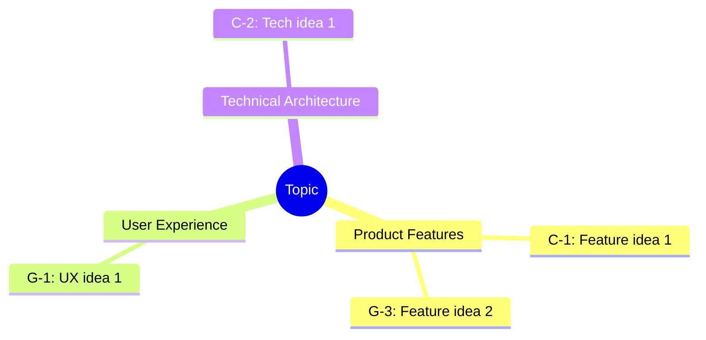
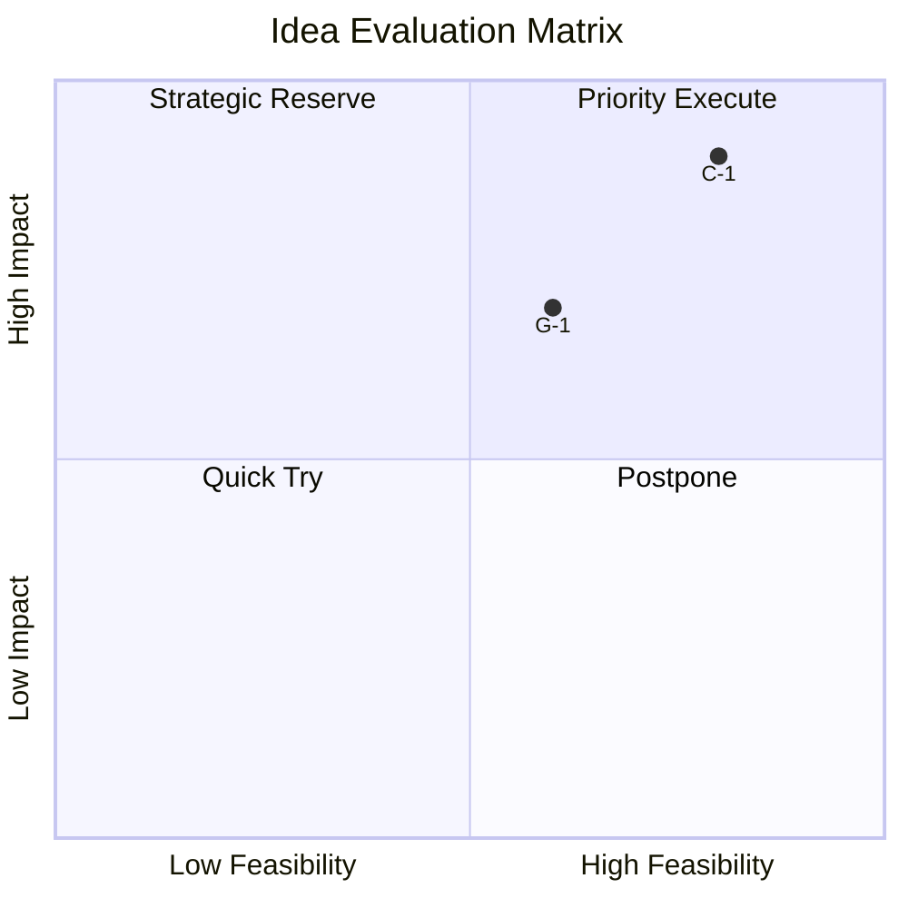

# Idea Evaluator

Evaluate, categorize, and filter ideas; generate visualized evaluation results.

## Script Entry

```bash
npx tsx scripts/calculate_scores.ts [args]
```

## Resource Usage

- Reference docs: `references/evaluation-criteria.md`
- Assets: `assets/evaluation-weights.json`
- Execution script: `scripts/calculate_scores.ts`

## MCP Tool Integration

| Tool         | Purpose                                          | Required |
| ------------ | ------------------------------------------------ | -------- |
| `auggie-mcp` | Retrieve code context for feasibility assessment | Yes      |
| `context7`   | Query technical constraints and best practices   | Yes      |

## Parameters

| Param    | Type   | Required | Description                                                                   |
| -------- | ------ | -------- | ----------------------------------------------------------------------------- |
| run_dir  | string | Yes      | Run directory path                                                            |
| criteria | string | No       | Priority dimension (balanced/impact/feasibility/innovation), default balanced |

## Prerequisites

1. Verify `${run_dir}/ideas-pool.md` exists
2. Verify idea count >= 5
3. If not met, prompt user to run idea-generator first

## Workflow

### Step 1: Read Ideas Pool

```bash
ideas_pool=$(cat "${run_dir}/ideas-pool.md")
```

Parse: idea ID, title, description, source (codex/gemini), existing scores.

### Step 2: Affinity Mapping

**Grouping dimensions:**

- Product Features: new features, enhancements
- User Experience: interaction optimization, emotional design
- Technical Architecture: architecture improvements, performance
- Business Model: monetization, partnerships
- Operations: growth strategy, retention

**Rules:** Each idea belongs to one primary group, may have secondary tag.

**Required MCP call:**

```
  thought: "Plan idea evaluation strategy. Evaluating {total_ideas} ideas, ensure fair, comprehensive, comparable assessment.",
  thoughtNumber: 1,
  totalThoughts: 6,
  nextThoughtNeeded: true
})
```

**Focus areas:** Evaluation framework -> Baseline setting -> Technical feasibility -> Bias check -> Grouping strategy -> Scoring logic

### Step 2.2: Technical Feasibility (auggie-mcp)

```
mcp__auggie-mcp__codebase-retrieval({
  information_request: "Evaluate feasibility of idea: {idea_title}
  Description: {idea_description}
  Analyze: 1. Code support 2. Modules to modify 3. Technical risks"
})
```

### Step 2.3: Technical Constraints (context7)

```
mcp__context7__query-docs({
  libraryId: "{relevant_library_id}",
  query: "{idea_description} implementation complexity, limitations, performance impact"
})
```

### Step 3: Build Evaluation Matrix

**Weight presets by criteria:**

| Preset      | Impact | Feasibility | Innovation | Alignment |
| ----------- | ------ | ----------- | ---------- | --------- |
| balanced    | 35%    | 35%         | 20%        | 10%       |
| impact      | 50%    | 25%         | 15%        | 10%       |
| feasibility | 25%    | 50%         | 15%        | 10%       |
| innovation  | 25%    | 25%         | 40%        | 10%       |

**Score each idea (1-5):**

- **Impact:** Problem solving degree, beneficiary scope, value size
- **Feasibility:** Technical difficulty, resource needs, time cost
- **Innovation:** Novelty, differentiation, market reaction
- **Alignment:** Goal fit, constraint compliance, capability match

**Composite score:** `Impact*W1 + Feasibility*W2 + Innovation*W3 + Alignment*W4`

### Step 4: Generate Mermaid Visualizations

**Mindmap (idea grouping):**



**Quadrant Chart (Impact vs Feasibility):**



### Step 5: Rank and Select Top 5

Sort by composite score descending, select Top 5.

### Step 6: Generate evaluation.md

```markdown
---
generated_at: { timestamp }
topic: "{topic}"
total_ideas: { N }
criteria: "{criteria}"
top_count: 5
---

# Idea Evaluation Report

## 1. Overview

**Criteria**: {criteria} mode
**Weights**: Impact {W1}%, Feasibility {W2}%, Innovation {W3}%, Alignment {W4}%

## 2. Mindmap

{mermaid_mindmap}

## 3. Evaluation Matrix

{mermaid_quadrant}

### Matrix Interpretation

- **Priority Execute (high impact + high feasibility)**: C-1, G-2
- **Strategic Reserve (high impact + low feasibility)**: C-3
- **Quick Try (low impact + high feasibility)**: G-5
- **Postpone (low impact + low feasibility)**: C-7

## 4. Top 5 Ranking

| Rank | ID  | Idea    | Impact | Feasibility | Innovation | Alignment | Score |
| ---- | --- | ------- | ------ | ----------- | ---------- | --------- | ----- |
| 1    | C-1 | {title} | 4.5    | 4.0         | 3.5        | 4.0       | 4.08  |

## 5. Top 5 Details

### #1: {C-1 title}

**Source**: Codex
**Description**: {desc}
**Scores**: Impact 4.5, Feasibility 4.0, Innovation 3.5, Alignment 4.0
**Rationale**: {reasoning for each score}

## 6. Group Statistics

| Group            | Count | Avg Score | Top Idea |
| ---------------- | ----- | --------- | -------- |
| Product Features | 8     | 3.6       | C-1      |

## 7. Full Evaluation Table

<details>
<summary>Expand full evaluation</summary>
| ID | Title | Group | Impact | Feasibility | Innovation | Alignment | Score |
</details>
```

## Output Validation

Confirm:

- `${run_dir}/evaluation.md` exists
- Contains complete Mermaid code blocks
- Top 5 has detailed evaluation reasoning
- All ideas have scores
