# Mermaid Visualization Templates

## Mind Map

### Basic Template - Idea Grouping


### Variant - With Icons

```mermaid
mindmap
  root((🎯 Topic))
    💡 Product Features
      ⭐ C-1: Core feature
      C-4: Supporting feature
    🎨 User Experience
      ⭐ G-1: Key experience
      G-2: Enhanced experience
    ⚙️ Technical Architecture
      C-2: Infrastructure
    💰 Business Model
      C-5: Monetization method
```



### Variant - Hierarchical Expansion


---

## Evaluation Matrix (Quadrant Chart)

### Basic Template - Impact vs Feasibility


### Variant - With Color Annotations


### Coordinate Calculation Method

Convert 1-5 scores to 0-1 coordinates:

```
Coordinate Value = (Score - 1) / 4
```

| Score | Coordinate Value |
| ----- | ---------------- |
| 1     | 0.00             |
| 2     | 0.25             |
| 3     | 0.50             |
| 4     | 0.75             |
| 5     | 1.00             |

---

## Ranking Display (Flow Chart)

### Top 3 Display

```mermaid
graph LR
    subgraph "🏆 Top 3 Ideas"
        A["🥇 C-1<br/>Idea Title<br/>Score: 4.08"]
        B["🥈 G-1<br/>Idea Title<br/>Score: 4.03"]
        C["🥉 C-2<br/>Idea Title<br/>Score: 3.93"]
    end

    A --> B --> C
```



### Top 5 Vertical Display

```mermaid
graph TB
    subgraph "🎯 Top 5 Idea Ranking"
        A["🥇 1st Place - C-1<br/>Idea Title<br/>Score: 4.08"]
        B["🥈 2nd Place - G-1<br/>Idea Title<br/>Score: 4.03"]
        C["🥉 3rd Place - C-2<br/>Idea Title<br/>Score: 3.93"]
        D["4️⃣ 4th Place - G-3<br/>Idea Title<br/>Score: 3.88"]
        E["5️⃣ 5th Place - C-4<br/>Idea Title<br/>Score: 3.85"]
    end

    A --> B --> C --> D --> E
```



---

## Group Statistics (Pie Chart)

### Source Distribution


### Category Distribution


---

## Implementation Roadmap (Gantt)

### Priority-Based Roadmap


---

## Evaluation Details (Table)

### Markdown Table Template

```markdown
| Rank | ID  | Idea       |   Impact   | Feasibility | Innovation | Alignment |  Score   |
| :--: | :-: | :--------- | :--------: | :---------: | :--------: | :-------: | :------: |
|  🥇  | C-1 | Idea Title | ⭐⭐⭐⭐⭐ |  ⭐⭐⭐⭐   |  ⭐⭐⭐⭐  | ⭐⭐⭐⭐  | **4.08** |
|  🥈  | G-1 | Idea Title |  ⭐⭐⭐⭐  | ⭐⭐⭐⭐⭐  |  ⭐⭐⭐⭐  |  ⭐⭐⭐   | **4.03** |
|  🥉  | C-2 | Idea Title |  ⭐⭐⭐⭐  | ⭐⭐⭐⭐⭐  |  ⭐⭐⭐⭐  | ⭐⭐⭐⭐  | **3.93** |
```

### Star Rating Conversion

| Score | Display    |
| ----- | ---------- |
| 5     | ⭐⭐⭐⭐⭐ |
| 4     | ⭐⭐⭐⭐   |
| 3     | ⭐⭐⭐     |
| 2     | ⭐⭐       |
| 1     | ⭐         |

---

## Usage Guidelines

### Mermaid Compatibility

1. Ensure code blocks use ` ```mermaid ` markup
2. Avoid special characters in node labels
3. Use `<br/>` for line breaks
4. Wrap Chinese content in quotes

### Rendering Test

After generation, preview in the following tools:

- GitHub/GitLab preview
- VS Code Mermaid plugin
- https://mermaid.live

### Handling Long Content

When idea count exceeds 20:

1. Mind map shows only top ideas
2. Evaluation matrix shows only key ideas
3. Use tables for complete listings
