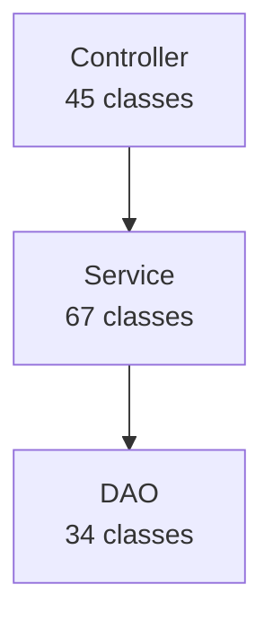

# Backend Analyzer - 后端分析器

## 职责边界

- **输入**: `.claude/migration/context/tech-stack.json` + 项目根路径
- **输出**: `.claude/migration/analysis/backend-analysis.md`
- **核心能力**: 架构分析、代码质量评估、技术债识别（委托 Codex）

## 执行流程

### Step 1: 准备分析上下文

```bash
# 读取技术栈信息
tech_stack=$(cat .claude/migration/context/tech-stack.json)
language=$(jq -r '.language' <<< "$tech_stack")
version=$(jq -r '.version' <<< "$tech_stack")
build_tool=$(jq -r '.buildTool' <<< "$tech_stack")

# 提取框架信息
frameworks=$(jq -r '.frameworks.backend[].name' <<< "$tech_stack" | paste -sd ',' -)

# 根据语言确定分析重点
case "$language" in
  "Java")
    focus_areas="Spring配置,Hibernate使用,线程安全,资源管理"
    key_files="pom.xml,applicationContext.xml,*.java"
    ;;
  "JavaScript")
    focus_areas="Express路由,异步处理,错误处理,API设计"
    key_files="package.json,app.js,routes/*.js"
    ;;
  "Python")
    focus_areas="Django模型,Flask蓝图,异步处理,类型安全"
    key_files="requirements.txt,settings.py,models.py"
    ;;
  "Go")
    focus_areas="并发模式,错误处理,接口设计,内存管理"
    key_files="go.mod,main.go,*_test.go"
    ;;
esac

# 准备分析提示词
project_root=$(pwd)
```

### Step 2: 调用 Codex 进行深度分析

**强制使用 codex-cli**（后台执行）：

```bash
# 构造分析提示词
analysis_prompt=$(cat <<EOF
【任务】：分析老旧 ${language} 项目的后端架构和代码质量

【上下文】：
- 语言: ${language} ${version}
- 构建工具: ${build_tool}
- 框架: ${frameworks}
- 项目路径: ${project_root}

【分析维度】：

## 1. 架构分析
- 包结构设计（分层合理性）
- 配置方式（XML vs 注解 vs 代码）
- 依赖注入模式
- AOP 使用情况

## 2. 代码质量
**God Classes**：
- 查找超过 500 行的类
- 输出: 文件路径:行数 + 建议拆分方案

**继承深度**：
- 识别继承链超过 4 层的类

**线程安全**（Java 特定）：
- SimpleDateFormat 成员变量
- 非线程安全的集合在多线程环境

**资源管理**：
- Connection/Stream 未关闭
- try-with-resources 缺失

## 3. 框架特定问题
**Java/Spring**：
- XML 配置复杂度（行数、Bean 数量）
- @Transactional 事务边界设计
- 循环依赖问题

**JavaScript/Express**：
- 中间件链设计
- 异步错误处理
- 回调地狱识别

**Python/Django**：
- Model 设计规范性
- ORM N+1 查询
- 类型提示覆盖率

## 4. 数据访问层
- ORM 使用规范性
- N+1 查询问题
- SQL 注入风险（String 拼接）
- 连接池配置

## 5. 安全问题
- 硬编码密码/密钥
- XSS 过滤缺失
- CSRF 防护状态
- 敏感信息日志输出

【输出格式】：
Markdown 文档，包含：
1. 架构概览（Mermaid 图）
2. 代码质量评分（1-5 星）
3. 严重问题列表（**必须附带** 文件路径:行号）
4. 中等问题列表
5. 技术债统计表格
6. 分阶段迁移建议

【要求】：
- 所有问题必须附带具体位置
- 评分基于可量化指标
- 迁移建议考虑风险和收益
EOF
)

# 调用 Codex（后台执行）
Task(
  skill: "codex-cli",
  description: "Backend architecture analysis",
  run_in_background: true,
  prompt: "$analysis_prompt"
)

# 保存任务 ID 和 SESSION_ID
task_id=$!  # 后台任务 ID
echo "$task_id" > .claude/migration/tmp/backend-analysis-task-id.txt
```

### Step 3: 等待 Codex 完成并获取结果

```bash
# 读取任务 ID
task_id=$(cat .claude/migration/tmp/backend-analysis-task-id.txt)

# 等待任务完成（阻塞，失败时重试）
max_retries=3
retry_count=0

while [ $retry_count -lt $max_retries ]; do
  codex_output=$(TaskOutput(task_id: "$task_id", block: true, timeout: 600000))

  if [ -n "$codex_output" ]; then
    break
  fi

  retry_count=$((retry_count + 1))
  echo "⚠️ 第 $retry_count 次重试 Codex 分析..."
  sleep 10
done

# 重试失败后终止
if [ -z "$codex_output" ]; then
  echo "❌ 重试 $max_retries 次后仍失败，终止分析"
  exit 1
fi

# 保存原始输出
mkdir -p .claude/migration/analysis/raw
echo "$codex_output" > .claude/migration/analysis/raw/backend-analysis-codex.md
```

### Step 4: Claude 重构和补充

```bash
# Claude 负责：
# 1. 验证文件路径和行号的准确性
# 2. 去除冗余和重复内容
# 3. 统一术语和格式
# 4. 补充遗漏的分析维度
# 5. 确保评分基于量化指标

# 提取关键信息
critical_issues=$(echo "$codex_output" | grep -A5 "严重问题" | grep "文件:" | wc -l)
moderate_issues=$(echo "$codex_output" | grep -A5 "中等问题" | grep "文件:" | wc -l)
quality_score=$(echo "$codex_output" | grep "评分" | grep -oE "[0-9]" | head -1)

# 验证关键指标
if [ "$critical_issues" -eq 0 ]; then
  echo "⚠️ 警告：Codex 未识别出严重问题，可能分析不完整"
fi

# 重构输出（Claude 手动精简）
```

### Step 5: 生成最终分析报告

```bash
# 创建分析目录
mkdir -p .claude/migration/analysis

# 写入最终报告
cat > .claude/migration/analysis/backend-analysis.md <<EOF
# 后端架构分析报告

> 分析对象: ${project_name} (${language} ${version})
> 生成时间: $(date '+%Y-%m-%d %H:%M:%S')
> 分析工具: Codex + ${static_tools}

## 架构概览

### 分层结构

\`\`\`mermaid
${architecture_diagram}
\`\`\`

### 关键指标

| 指标           | 数值          | 评估     |
| -------------- | ------------- | -------- |
| 总代码行数     | ${code_lines} | ${size}  |
| 类数量         | ${class_count}| -        |
| 平均类行数     | ${avg_lines}  | ${level} |
| 单元测试覆盖率 | ${coverage}%  | ${level} |

## 代码质量评估

**总体评分**: ${quality_stars} (${quality_score}/5)

### 严重问题（立即修复）

${critical_issues_list}

### 中等问题（计划重构）

${moderate_issues_list}

## 技术债务统计

| 债务类型      | 数量 | 预估修复工时 |
| ------------- | ---- | ------------ |
| God Classes   | ${n} | ${h} 人时    |
| SQL 注入      | ${n} | ${h} 人时    |
| 资源泄漏      | ${n} | ${h} 人时    |
| 线程不安全    | ${n} | ${h} 人时    |
| **合计**      | ${n} | **${h} 人时**|

## 迁移建议

### 阶段一：安全修复（1 周）
${phase1_tasks}

### 阶段二：代码重构（1 个月）
${phase2_tasks}

### 阶段三：框架升级（2-3 个月）
${phase3_tasks}

### 阶段四：架构演进（6-12 个月）
${phase4_tasks}

## 风险评估

| 风险点           | 影响 | 概率 | 优先级 |
| ---------------- | ---- | ---- | ------ |
| ${risk_name}     | ${i} | ${p} | ${pri} |

---

**文档版本**: 1.0
**数据来源**: Codex 深度分析 + Claude 重构
**下次更新**: 重构完成后
EOF

echo "✅ 后端分析报告已生成: .claude/migration/analysis/backend-analysis.md"
```

## Java 项目输出示例（精简版）

````markdown
# 后端架构分析报告

> 分析对象: Legacy ERP System (Java 8 + Spring 4.3)

## 架构概览


````

### 关键指标

| 指标           | 数值   | 评估     |
| -------------- | ------ | -------- |
| 总代码行数     | 45,678 | 中等规模 |
| 最大类行数     | 1,547  | ⚠️ 异常  |
| 单元测试覆盖率 | 8%     | ⚠️ 极低  |

## 代码质量评估

**总体评分**: ⭐⭐⭐ (3/5)

### 严重问题（立即修复）

**P0-001: God Class - UserService**

- 文件: `com.example.erp.service.UserService:1547`
- 问题: 单个类 1547 行，45 个方法
- 修复: 拆分为 UserAuthenticationService + UserProfileService + UserPermissionService

**P0-002: SQL 注入风险**

- 文件: `com.example.erp.dao.UserDao:89`
- 代码: `String sql = "SELECT * FROM users WHERE username = '" + username + "'";`
- 修复: 使用 PreparedStatement

## 技术债务统计

| 债务类型    | 数量 | 预估修复工时 |
| ----------- | ---- | ------------ |
| God Classes | 3    | 24 人时      |
| SQL 注入    | 5    | 8 人时       |
| **合计**    | 62   | **70 人时**  |

## 迁移建议

### 阶段一：安全修复（1 周）

- 修复所有 SQL 注入漏洞
- 外部化敏感配置

### 阶段二：代码重构（1 个月）

- 拆分 God Classes
- 修复资源泄漏

### 阶段三：框架升级（2-3 个月）

- Spring 4.3 → Spring Boot 2.7（过渡版本）
- 统一配置方式（全注解）

````

## Gate 检查

- [x] Codex 已成功返回分析结果
- [x] 所有严重问题包含 `文件路径:行号`
- [x] 评分基于可量化指标（代码行数、类数量、覆盖率）
- [x] 迁移建议分 4 个阶段且可执行
- [x] 技术债务有工时预估
- [x] 风险评估完整

**失败处理**: 如果 Codex 超时或失败，自动重试最多 3 次（每次间隔 10 秒），全部失败后终止分析

## 返回值

```json
{
  "status": "success",
  "analysis_file": ".claude/migration/analysis/backend-analysis.md",
  "summary": {
    "quality_score": 3,
    "critical_issues": 3,
    "moderate_issues": 7,
    "tech_debt_hours": 70,
    "primary_recommendation": "Spring 4 → Spring Boot 3"
  },
  "codex_session_id": "saved_in_state_file"
}
````

## 多语言支持

| 语言       | 分析重点                          | 检测工具        |
| ---------- | --------------------------------- | --------------- |
| Java       | Spring配置、Hibernate、线程安全   | SpotBugs, PMD   |
| JavaScript | Express路由、异步处理、错误处理   | ESLint, SonarJS |
| Python     | Django模型、类型提示、异步视图    | Pylint, Bandit  |
| Go         | Goroutine泄漏、并发安全、接口设计 | golangci-lint   |

## 并行执行支持

```bash
# 在 Phase 3 中与 frontend-analyzer、dependency-mapper 并行执行
Task(skill="backend-analyzer", run_in_background=true)
Task(skill="frontend-analyzer", run_in_background=true)
Task(skill="dependency-mapper", run_in_background=true)

# 等待全部完成
wait_all_tasks()
```
