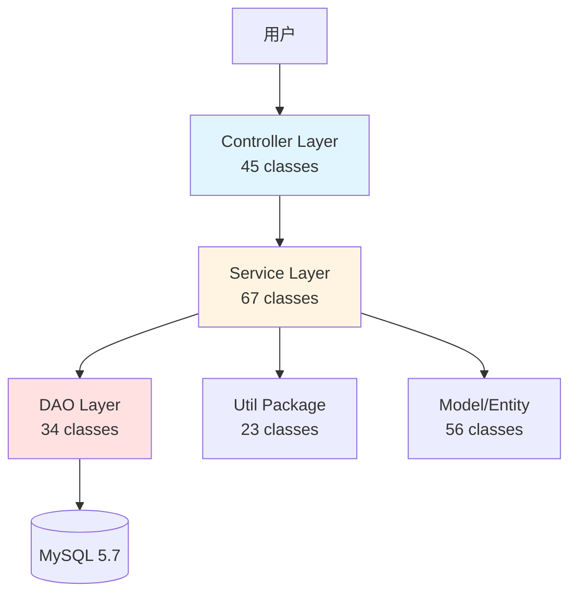
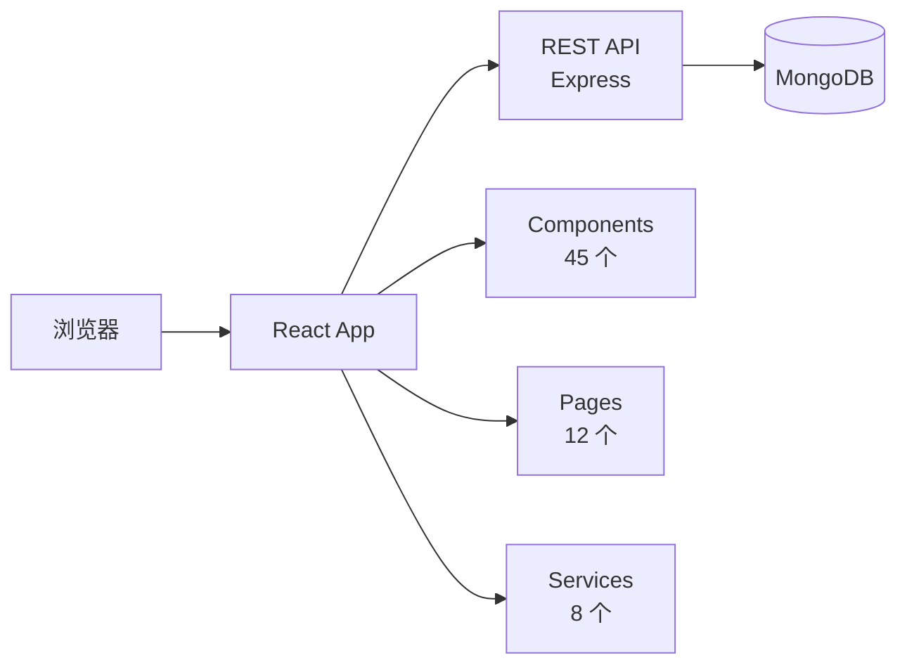

# Claude Doc Generator - 根级 CLAUDE.md 生成器

## 职责边界

- **输入**: `project-structure.json` + `tech-stack.json`
- **输出**: `项目根/CLAUDE.md`
- **核心能力**: 生成高层架构文档，支持未来迁移理解原项目

## 执行流程

### Step 1: 读取上下文

```bash
project_structure=$(cat .claude/migration/context/project-structure.json)
tech_stack=$(cat .claude/migration/context/tech-stack.json)

# 提取关键信息
project_name=$(echo $project_structure | jq -r '.project_name')
project_type=$(echo $project_structure | jq -r '.project_type')
modules_count=$(echo $project_structure | jq -r '.statistics.modules_count')
code_lines=$(echo $project_structure | jq -r '.statistics.code_lines')

language=$(echo $tech_stack | jq -r '.language')
language_version=$(echo $tech_stack | jq -r '.version')
build_tool=$(echo $tech_stack | jq -r '.buildTool')
```

### Step 2: 生成 Mermaid 架构图

**Java 项目架构图**:



**JavaScript 项目架构图**:



### Step 3: 根据项目类型选择模板

**Java Maven 模板**:

````markdown
# ${project_name}

> 自动生成于 ${timestamp} | ${language} ${version} + ${主要框架}

## 项目概览

**技术栈**: ${language} ${version} + ${frameworks}
**架构风格**: ${architecture}
**构建工具**: ${build_tool}
**打包方式**: ${packaging}
**应用服务器**: ${app_server}（如果是 WAR）

## 模块结构

```
${project_structure}
```

**模块说明**:

- `controller/` - Spring MVC 控制器（${count} 类）
- `service/` - 业务逻辑层（${count} 类）
- `dao/` - 数据访问层（${count} 类）
- `model/` - Hibernate 实体类（${count} 类）

[📄 查看详细文档](./src/main/java/com/example/controller/CLAUDE.md)

## 技术栈

### 后端框架

- Spring Framework ${version} ${eol_status}
- Hibernate ${version}
- Spring MVC (${config_type} 配置为主)

### 数据库

- ${database} ${version}
- ${connection_pool} 连接池

### 构建依赖

- Maven ${version}
- 编译目标: Java ${target_version}

## 架构决策

### 数据访问层

- **ORM 框架**: Hibernate ${version}
- **二级缓存**: ${cache_config}
- **事务管理**: Spring 声明式事务

### Web 层

- **视图技术**: ${view_tech}
- **前端框架**: ${frontend}
- **表单验证**: Hibernate Validator

### 配置管理

- **Spring 配置**: ${config_type}（XML vs 注解）
- **Bean 作用域**: 主要使用 Singleton
- **属性注入**: 构造器注入 + Setter 注入

## 关键流程

### 用户登录流程

`LoginController.login()` → `AuthService.authenticate()` → `UserDao.findByUsername()`

### 订单创建流程

`OrderController.create()` → `OrderService.createOrder()` [@Transactional] → 库存扣减 → 通知发送

## 已知技术债

1. **God Class**: UserService (${lines} 行)
2. **SQL 注入**: ${count} 处
3. **配置混乱**: XML 和注解混用
4. **单元测试**: 覆盖率 ${coverage}%

## 依赖清单

### 核心依赖

${core_dependencies}

### 构建插件

${build_plugins}

## 迁移建议

### 短期（1-3 月）

- 修复安全漏洞
- 外部化配置

### 中期（3-6 月）

- Spring ${old_version} → Spring Boot ${new_version}
- 统一配置方式

### 长期（6-12 月）

- Java ${old_version} → Java ${new_version}
- 微服务拆分

---

**文档版本**: 1.0
**生成时间**: ${timestamp}
**下次更新**: 重大重构或迁移完成后
````

**JavaScript 模板**:

````markdown
# ${project_name}

> 自动生成于 ${timestamp} | ${runtime} ${version} + ${framework}

## 项目概览

**技术栈**: ${frontend_framework} + ${backend_framework}
**架构风格**: ${architecture}（SPA + REST API / SSR）
**构建工具**: ${build_tool}
**包管理**: ${package_manager}

## 目录结构

```
${project_structure}
```

**目录说明**:

- `src/components/` - React 组件（${count} 个）
- `src/pages/` - 页面组件（${count} 个）
- `src/services/` - API 服务（${count} 个）
- `src/utils/` - 工具函数（${count} 个）

## 技术栈

### 前端

- ${frontend_framework} ${version}
- ${state_management}（状态管理）
- ${ui_library}（UI 组件库）

### 后端

- ${backend_framework} ${version}
- ${database} ${version}
- ${auth_library}（认证）

### 构建工具

- ${build_tool} ${version}
- ${bundler} ${version}

## 架构决策

### 路由管理

- **库**: React Router ${version}
- **模式**: ${routing_mode}（Hash vs History）

### 状态管理

- **方案**: ${state_solution}
- **数据流**: ${data_flow}

### API 通信

- **协议**: REST API
- **客户端**: Axios / Fetch
- **认证**: JWT Token

## 关键流程

### 用户登录

`LoginPage` → `authService.login()` → `API /auth/login` → 存储 Token

### 数据加载

`Component.useEffect()` → `dataService.fetch()` → Redux Store → 组件渲染

## 已知技术债

1. **依赖过时**: React ${old_version}（EOL: ${date}）
2. **无单元测试**: 覆盖率 ${coverage}%
3. **Callback Hell**: ${count} 处未使用 async/await

## 迁移建议

### 短期（1-3 月）

- 升级 React ${old_version} → ${new_version}
- 添加单元测试

### 中期（3-6 月）

- 重构为 TypeScript
- 引入代码分割

### 长期（6-12 月）

- 迁移到 Next.js（SSR）
- 微前端拆分
````

### Step 4: 填充具体数据

```bash
# 从 tech-stack.json 提取框架信息
frameworks=$(echo $tech_stack | jq -r '.frameworks.backend[].name' | paste -sd ',' -)

# 从 project-structure.json 提取模块信息
key_directories=$(echo $project_structure | jq -r '.key_directories[]' | paste -sd '\n' -)

# 生成模块树
tree_output=$(generate_tree_from_structure "$project_structure")

# 替换模板变量
final_doc=$(sed "s/\${project_name}/$project_name/g" template.md)
final_doc=$(sed "s/\${language}/$language/g" <<< "$final_doc")
final_doc=$(sed "s/\${frameworks}/$frameworks/g" <<< "$final_doc")
```

### Step 5: 添加导航链接

```markdown
## 模块文档导航

- [Controller 层](./src/main/java/com/example/controller/CLAUDE.md)
- [Service 层](./src/main/java/com/example/service/CLAUDE.md)
- [DAO 层](./src/main/java/com/example/dao/CLAUDE.md)
- [Model 层](./src/main/java/com/example/model/CLAUDE.md)
```

### Step 6: 写入文件

```bash
# 写入项目根目录
cat > CLAUDE.md <<EOF
${final_doc}
EOF

echo "✅ 根级 CLAUDE.md 已生成: $(pwd)/CLAUDE.md"
```

## Java 项目完整示例

**输出文件**: `CLAUDE.md`

````markdown
# Legacy ERP System

> 自动生成于 2026-01-13 14:30:00 | Java 8 + Spring 4.3 + Hibernate 5.2

## 项目概览

**技术栈**: Java 8 + Spring Framework 4.3 + Hibernate 5.2 + MySQL 5.7
**架构风格**: 单体三层 MVC
**构建工具**: Maven 3.6
**打包方式**: WAR
**应用服务器**: Tomcat 8.5

## 模块结构

```
src/main/java/com/example/erp/
├── controller/     # Spring MVC 控制器（45 类）
├── service/        # 业务逻辑层（67 类）
├── dao/            # 数据访问层（34 类）
├── model/          # Hibernate 实体（56 类）
└── util/           # 工具类（23 类）
```

**模块说明**:

- `controller/` - Spring MVC 控制器（45 类）
  [📄 详细文档](./src/main/java/com/example/erp/controller/CLAUDE.md)
- `service/` - 业务逻辑层（67 类）
  [📄 详细文档](./src/main/java/com/example/erp/service/CLAUDE.md)
- `dao/` - 数据访问层（34 类）
  [📄 详细文档](./src/main/java/com/example/erp/dao/CLAUDE.md)
- `model/` - Hibernate 实体类（56 类）
  [📄 详细文档](./src/main/java/com/example/erp/model/CLAUDE.md)

## 架构图


## 技术栈

### 后端框架

- Spring Framework 4.3.25 ⚠️ **EOL: 2020-12-31**
- Hibernate 5.2.17
- Spring MVC (XML 配置为主)

### 数据库

- MySQL 5.7
- Druid 连接池

### 构建依赖

- Maven 3.6
- 编译目标: Java 1.8

## 架构决策

### 数据访问层

- **ORM 框架**: Hibernate 5.2
- **二级缓存**: EhCache
- **事务管理**: Spring 声明式事务 (@Transactional)

### Web 层

- **视图技术**: JSP + JSTL
- **前端框架**: jQuery 1.12 + Bootstrap 3
- **表单验证**: Hibernate Validator

### 配置管理

- **Spring 配置**: XML 为主 (applicationContext.xml)
- **Bean 作用域**: 主要使用 Singleton
- **属性注入**: 构造器注入 + Setter 注入

## 关键流程

### 用户登录流程

`LoginController.login()` → `AuthService.authenticate()` → `UserDao.findByUsername()` → Hibernate Session

### 订单创建流程

`OrderController.create()` → `OrderService.createOrder()` [@Transactional] → `OrderDao.save()` + `InventoryService.deductStock()` + `NotificationService.sendEmail()`

## 已知技术债

1. **God Classes**: UserService (1547 行)、OrderService (1203 行)
2. **SQL 注入风险**: 5 处字符串拼接查询
3. **配置混乱**: XML 和注解混用，无统一规范
4. **单元测试**: 覆盖率 <10%
5. **资源泄漏**: 12 处 IO 流未正确关闭

## 依赖清单

### 核心依赖

- spring-webmvc: 4.3.25.RELEASE
- hibernate-core: 5.2.17.Final
- mysql-connector-java: 5.1.47

### 构建插件

- maven-compiler-plugin: 3.8.1 (target: 1.8)
- maven-war-plugin: 3.2.3

## 迁移建议

### 短期改进（1-3 个月）

1. 外部化配置（数据库密码）
2. 修复 SQL 注入漏洞
3. 添加单元测试（目标覆盖率 >50%）

### 中期重构（3-6 个月）

1. 拆分 God Classes
2. 统一配置方式（全面转向注解）
3. 引入 Spring Boot 适配层

### 长期规划（6-12 个月）

1. Spring 4.3 → Spring Boot 3.2
2. Java 8 → Java 17
3. 微服务拆分（订单模块、库存模块、用户模块）
4. 前后端分离（替换 JSP 为 RESTful API + React）

---

**文档版本**: 1.0
**生成时间**: 2026-01-13 14:30:00
**下次更新**: 重大重构或迁移完成后
**相关文档**: [迁移分析](./.claude/migration/README.md)
````

## Gate 检查

- [x] 项目概览已填充（名称、技术栈、架构）
- [x] 模块结构已生成（含文件统计）
- [x] 架构图已生成（Mermaid）
- [x] 技术栈列表完整（框架版本、EOL 状态）
- [x] 已知技术债已列出
- [x] 迁移建议已分阶段
- [x] 模块导航链接已添加

**失败处理**: 如果关键信息缺失，使用占位符并标记 `[待补充]`

## 返回值

```json
{
  "status": "success",
  "claude_md_path": "/path/to/project/CLAUDE.md",
  "sections": {
    "overview": true,
    "architecture_diagram": true,
    "tech_stack": true,
    "tech_debt": true,
    "migration_suggestions": true
  }
}
```

## 模板变量列表

| 变量             | 来源              | 示例                    |
| ---------------- | ----------------- | ----------------------- |
| ${project_name}  | project-structure | "Legacy ERP System"     |
| ${language}      | tech-stack        | "Java"                  |
| ${version}       | tech-stack        | "8"                     |
| ${frameworks}    | tech-stack        | "Spring 4.3, Hibernate" |
| ${architecture}  | tech-stack        | "Monolithic MVC"        |
| ${build_tool}    | tech-stack        | "Maven"                 |
| ${code_lines}    | project-structure | 45678                   |
| ${modules_count} | project-structure | 1                       |
