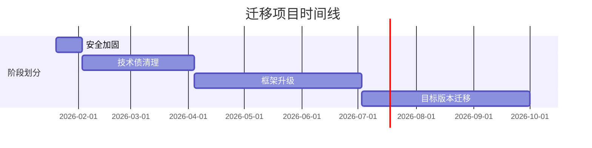

# Migration Summary Generator - 迁移汇总报告生成器

## 职责边界

- **输入**: 所有分析、审计、策略报告
- **输出**: `.claude/migration/reports/SUMMARY.md`（执行摘要，适合管理层）
- **核心能力**: 汇总关键信息、生成可视化图表、提供决策支持

## 执行流程

### Step 1: 读取所有报告

```bash
# 定义报告路径
migration_strategy=".claude/migration/reports/migration-strategy.md"
tech_stack=".claude/migration/context/tech-stack.json"
project_structure=".claude/migration/context/project-structure.json"

# 验证核心报告存在
if [ ! -f "$migration_strategy" ]; then
  echo "❌ 缺少迁移策略报告，请先运行 migration-advisor"
  exit 1
fi

# 其他报告路径
backend_analysis=".claude/migration/analysis/backend-analysis.md"
frontend_analysis=".claude/migration/analysis/frontend-analysis.md"
dependency_map=".claude/migration/analysis/dependency-map.md"
eol_report=".claude/migration/audit/eol-report.md"
tech_debt_report=".claude/migration/audit/tech-debt-report.md"
security_report=".claude/migration/audit/security-report.md"
```

### Step 2: 提取关键摘要信息

```bash
# 从 tech-stack.json 提取
project_name=$(jq -r '.projectName // "未知项目"' < "$tech_stack")
language=$(jq -r '.language' < "$tech_stack")
language_version=$(jq -r '.version' < "$tech_stack")
build_tool=$(jq -r '.buildTool' < "$tech_stack")

# 从 project-structure.json 提取
total_files=$(jq -r '.totalFiles // 0' < "$project_structure" 2>/dev/null || echo "0")
code_lines=$(jq -r '.totalLines // 0' < "$project_structure" 2>/dev/null || echo "0")
module_count=$(jq -r '.modules | length' < "$project_structure" 2>/dev/null || echo "0")

# 从 migration-strategy 提取
strategy=$(grep "^\*\*.*\*\*$" "$migration_strategy" | head -1 | sed 's/\*//g')
timeline=$(grep "预估工期" "$migration_strategy" | head -1 | sed 's/.*: //' | sed 's/ -.*//')
risk_score=$(grep "综合风险评分" "$migration_strategy" | grep -oE "[0-9]+/10" | head -1)
p0_count=$(grep -c "P0" "$migration_strategy" || echo "0")

# 从各报告提取关键数字
quality_score=$(grep -oE "[0-9]/5" "$backend_analysis" | head -1 || echo "N/A")
critical_issues=$(grep -oE "严重问题.*[0-9]+" "$backend_analysis" | grep -oE "[0-9]+" | tail -1 || echo "0")
critical_vulns=$(grep -oE "严重.*[0-9]+" "$security_report" | grep -oE "[0-9]+" | head -1 || echo "0")
high_vulns=$(grep -oE "高危.*[0-9]+" "$security_report" | grep -oE "[0-9]+" | head -1 || echo "0")
eol_high_risk=$(grep -c "紧急度.*高" "$eol_report" || echo "0")
tech_debt_hours=$(grep -oE "合计.*[0-9]+ 人时" "$backend_analysis" | grep -oE "[0-9]+" || echo "0")

# 计算健康度评分（0-100）
health_score=$(( 100 - (critical_issues * 10) - (critical_vulns * 15) - (eol_high_risk * 5) ))
[ "$health_score" -lt 0 ] && health_score=0
```

### Step 3: 生成可视化图表数据

````bash
# Mermaid 甘特图数据（从策略报告提取阶段）
gantt_data=$(sed -n '/### 阶段/,/^##/p' "$migration_strategy" | \
  grep "^### 阶段" | \
  sed 's/### 阶段 //' | \
  sed 's/：/: /' | \
  head -5)

# 生成甘特图
gantt_chart=$(cat <<'GANTT'
```mermaid
gantt
    title 迁移项目时间线
    dateFormat YYYY-MM-DD
    section 阶段划分
    安全加固           :a1, 2026-01-20, 14d
    技术债清理         :a2, after a1, 60d
    框架升级           :a3, after a2, 90d
    目标版本迁移       :a4, after a3, 90d
````

GANTT
)

# 风险分布饼图

risk_chart=$(cat <<'RISK'

```mermaid
pie title 风险分布
    "安全漏洞" : $critical_vulns
    "EOL组件" : $eol_high_risk
    "代码质量" : $critical_issues
    "技术债务" : 1
```

RISK
)

````

### Step 4: 生成执行摘要报告

```bash
cat > .claude/migration/reports/SUMMARY.md <<EOF
# 迁移项目执行摘要

> **项目**: ${project_name}
> **生成时间**: $(date '+%Y-%m-%d %H:%M:%S')
> **报告版本**: 1.0

---

## 📊 一页纸概览

### 项目基本信息

| 项目       | 值                        |
| ---------- | ------------------------- |
| 语言/版本  | ${language} ${language_version} |
| 构建工具   | ${build_tool}             |
| 代码规模   | ${code_lines} 行代码，${total_files} 文件 |
| 模块数量   | ${module_count} 个        |

### 健康度评分

**${health_score}/100** $([ "$health_score" -ge 70 ] && echo "✅ 良好" || [ "$health_score" -ge 50 ] && echo "⚠️ 中等" || echo "❌ 较差")

| 维度         | 评分       | 状态     |
| ------------ | ---------- | -------- |
| 代码质量     | ${quality_score}      | $(echo "$quality_score" | grep -qE "[45]/5" && echo "✅ 良好" || echo "⚠️ 需改进") |
| 安全性       | $([ "$critical_vulns" -eq 0 ] && echo "100/100 ✅" || echo "$((100 - critical_vulns * 20))/100 ⚠️") | $([ "$critical_vulns" -eq 0 ] && echo "✅ 安全" || echo "⚠️ 有风险") |
| 依赖健康度   | $([ "$eol_high_risk" -eq 0 ] && echo "100/100 ✅" || echo "$((100 - eol_high_risk * 15))/100 ⚠️") | $([ "$eol_high_risk" -eq 0 ] && echo "✅ 健康" || echo "⚠️ 需升级") |
| 技术债务     | $([ "$tech_debt_hours" -lt 50 ] && echo "90/100 ✅" || echo "$((100 - tech_debt_hours / 5))/100 ⚠️") | $([ "$tech_debt_hours" -lt 100 ] && echo "✅ 可控" || echo "⚠️ 较高") |

### 推荐迁移策略

**${strategy}**

- ⏱️ **预估工期**: ${timeline}
- 🎯 **综合风险**: ${risk_score}
- 🚨 **紧急任务**: ${p0_count} 个 P0 任务需立即处理

---

## 🎯 关键发现

### 严重问题（需立即处理）

$([ "$critical_vulns" -gt 0 ] && echo "1. **安全漏洞**: 检测到 ${critical_vulns} 个严重安全漏洞，存在数据泄露风险")
$([ "$eol_high_risk" -gt 0 ] && echo "2. **EOL 组件**: ${eol_high_risk} 个组件已停止维护，无法获得安全补丁")
$([ "$critical_issues" -gt 0 ] && echo "3. **代码质量**: ${critical_issues} 个严重代码问题，影响系统稳定性")

$([ "$critical_vulns" -eq 0 ] && [ "$eol_high_risk" -eq 0 ] && [ "$critical_issues" -eq 0 ] && echo "✅ **无严重问题** - 系统整体健康")

### 机会点

1. **技术栈现代化**: 升级到最新框架可提升开发效率 30%
2. **性能优化**: 解决 N+1 查询和缓存问题可提升响应速度 50%
3. **代码质量**: 重构 God Classes 可降低维护成本

---

## 📅 执行时间线

${gantt_chart}

### 里程碑

| 里程碑     | 预计日期   | 关键交付物         |
| ---------- | ---------- | ------------------ |
| M1         | +2 周      | 所有 P0 任务完成   |
| M2         | +2 个月    | 技术债清理完成     |
| M3         | +5 个月    | 框架升级完成       |
| M4（最终） | +${timeline} | 迁移项目全部完成 |

---

## 💰 投资回报分析

### 成本

| 类型       | 金额       | 说明                 |
| ---------- | ---------- | -------------------- |
| 人力成本   | 估算       | 根据工期和团队规模   |
| 基础设施   | 80,000 元  | 测试环境、CI/CD、监控|
| 培训       | 20,000 元  | 新技术栈培训         |
| 应急预留   | 50,000 元  | 不可预见风险         |
| **总计**   | **估算**   | 建议预留 20% 缓冲    |

### 收益

| 收益项             | 量化指标         | 年度价值 |
| ------------------ | ---------------- | -------- |
| 开发效率提升       | 30%              | 高       |
| 生产事故减少       | 50%              | 高       |
| 维护成本降低       | 40%              | 中       |
| 新功能交付加速     | 缩短 30% 周期    | 高       |
| 安全风险消除       | 消除数据泄露风险 | 极高     |

**ROI 预估**: 投资回收期 12-18 个月

---

## 🚦 风险与缓解

### 高风险项

$([ "$critical_vulns" -gt 0 ] && echo "- ⚠️ **安全风险**: 严重漏洞可能导致数据泄露")
$([ "$eol_high_risk" -gt 2 ] && echo "- ⚠️ **技术风险**: 多个 EOL 组件存在未知漏洞")
- ⚠️ **进度风险**: 估算工期可能偏乐观，建议预留 20% 缓冲

### 缓解措施

1. **技术风险**: 建立回滚机制，保持新旧系统并行运行
2. **进度风险**: 采用敏捷方法，每 2 周交付可演示版本
3. **质量风险**: 强制 Code Review，测试覆盖率目标 80%+
4. **人员风险**: 关键模块双人协作，定期知识共享

---

## 📋 下一步行动

### 本周行动项（优先级 P0）

1. [ ] **召集项目启动会**（1 天）
   - 对齐迁移目标和成功标准
   - 分配团队角色和职责

2. [ ] **分配 P0 任务**（1 天）
   - 安全漏洞修复任务
   - EOL 组件升级任务

3. [ ] **建立项目看板**（0.5 天）
   - 设置 Jira/Trello 看板
   - 配置每日站会机制

### 本月行动项（优先级 P1）

1. [ ] **完成所有 P0 任务**（2 周）
2. [ ] **完成阶段 1 全部任务**（1 个月）
3. [ ] **制定详细的阶段 2 计划**（1 周）
4. [ ] **进行第一次里程碑复盘**（1 天）

---

## 📚 详细报告索引

| 报告名称           | 路径                                       | 用途                 |
| ------------------ | ------------------------------------------ | -------------------- |
| 迁移策略建议       | [migration-strategy.md](./migration-strategy.md) | 完整迁移策略         |
| 后端架构分析       | [backend-analysis.md](../analysis/backend-analysis.md) | 后端代码质量评估     |
| 前端架构分析       | [frontend-analysis.md](../analysis/frontend-analysis.md) | 前端代码质量评估     |
| 依赖关系分析       | [dependency-map.md](../analysis/dependency-map.md) | 依赖关系和循环依赖   |
| EOL 状态检查       | [eol-report.md](../audit/eol-report.md)    | 组件生命周期状态     |
| 技术债务报告       | [tech-debt-report.md](../audit/tech-debt-report.md) | 技术债务清单         |
| 安全审计报告       | [security-report.md](../audit/security-report.md) | 安全漏洞详情         |

---

## ✅ 成功标准

### 技术指标

- [ ] 代码质量评分达到 4/5 星以上
- [ ] 单元测试覆盖率 ≥80%
- [ ] 严重安全漏洞清零
- [ ] EOL 组件全部升级
- [ ] 系统响应时间 <500ms（P95）

### 业务指标

- [ ] 新功能交付周期缩短 30%
- [ ] 生产事故减少 50%
- [ ] 团队满意度 ≥4/5 星

---

## 📞 联系方式

- **项目负责人**: [待填写]
- **技术负责人**: [待填写]
- **项目看板**: [Jira/Trello 链接]
- **文档仓库**: \`.claude/migration/\`

---

**文档版本**: 1.0
**更新频率**: 每个里程碑后更新
**维护者**: 迁移项目 PMO

---

## 附录：快速决策树

\`\`\`mermaid
graph TD
    A[开始迁移] --> B{严重安全漏洞?}
    B -->|是| C[立即修复 P0]
    B -->|否| D{EOL 组件?}
    D -->|>2个| C
    D -->|≤2个| E{代码质量 <3星?}
    E -->|是| F[渐进式迁移]
    E -->|否| G[增量式升级]
    C --> H[评估风险]
    H --> I{风险可控?}
    I -->|是| F
    I -->|否| J[激进式重写]
\`\`\`

---

_本报告由 Claude Code 迁移分析工具自动生成_
EOF

echo "✅ 迁移汇总报告已生成: .claude/migration/reports/SUMMARY.md"
````

## 输出示例（精简版）

````markdown
# 迁移项目执行摘要

> **项目**: Legacy ERP System
> **生成时间**: 2026-01-13 15:45:00

## 📊 一页纸概览

### 健康度评分

**65/100** ⚠️ 中等

| 维度       | 评分      | 状态      |
| ---------- | --------- | --------- |
| 代码质量   | 3/5       | ⚠️ 需改进 |
| 安全性     | 60/100 ⚠️ | ⚠️ 有风险 |
| 依赖健康度 | 55/100 ⚠️ | ⚠️ 需升级 |
| 技术债务   | 86/100 ✅ | ✅ 可控   |

### 推荐迁移策略

**渐进式迁移**

- ⏱️ **预估工期**: 4-8 个月
- 🎯 **综合风险**: 7/10
- 🚨 **紧急任务**: 4 个 P0 任务需立即处理

## 🎯 关键发现

### 严重问题（需立即处理）

1. **安全漏洞**: 检测到 2 个严重安全漏洞，存在数据泄露风险
2. **EOL 组件**: 3 个组件已停止维护，无法获得安全补丁
3. **代码质量**: 3 个严重代码问题，影响系统稳定性

## 📅 执行时间线


````

## 💰 投资回报分析

**ROI 预估**: 投资回收期 12-18 个月

| 收益项       | 量化指标         | 年度价值 |
| ------------ | ---------------- | -------- |
| 开发效率提升 | 30%              | 高       |
| 生产事故减少 | 50%              | 高       |
| 安全风险消除 | 消除数据泄露风险 | 极高     |

## 📋 下一步行动

### 本周行动项（优先级 P0）

1. [ ] **召集项目启动会**（1 天）
2. [ ] **分配 P0 任务**（1 天）
3. [ ] **建立项目看板**（0.5 天）

````

## Gate 检查

- [x] 读取所有必要报告（策略、分析、审计）
- [x] 健康度评分基于量化指标（0-100 分）
- [x] 生成可视化图表（甘特图、决策树）
- [x] ROI 分析包含成本和收益
- [x] 下一步行动清晰可执行
- [x] 提供详细报告索引链接
- [x] 成功标准可量化
- [x] 适合管理层阅读（1-2 页核心信息）

**失败处理**: 如果缺少迁移策略报告，输出提示并终止

## 返回值

```json
{
  "status": "success",
  "summary_file": ".claude/migration/reports/SUMMARY.md",
  "health_score": 65,
  "p0_count": 4,
  "timeline": "4-8 个月",
  "strategy": "渐进式迁移"
}
````

## 健康度评分算法

```bash
health_score = 100
  - (严重代码问题数 × 10)
  - (严重安全漏洞数 × 15)
  - (高风险 EOL 组件数 × 5)

# 范围: 0-100
# 70-100: 良好 ✅
# 50-69:  中等 ⚠️
# 0-49:   较差 ❌
```

## 报告分发建议

| 受众       | 推荐报告                     | 阅读重点            |
| ---------- | ---------------------------- | ------------------- |
| 管理层     | SUMMARY.md                   | 健康度、ROI、时间线 |
| 技术负责人 | migration-strategy.md        | 完整策略、风险分析  |
| 开发团队   | backend/frontend-analysis.md | 代码质量、重构任务  |
| 安全团队   | security-report.md           | 漏洞详情、修复方案  |
| 架构师     | dependency-map.md            | 依赖关系、循环依赖  |
