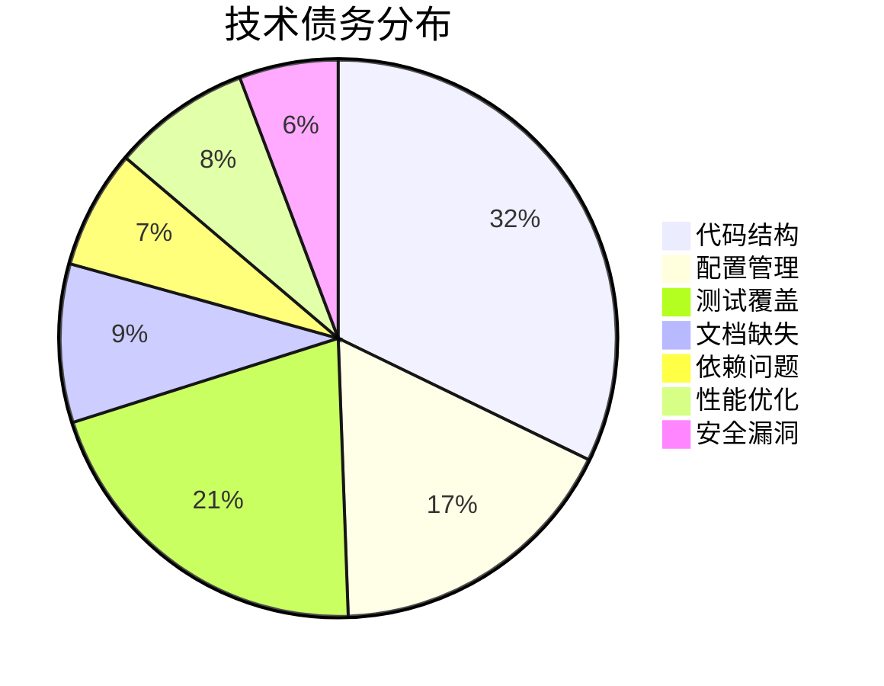

# Tech Debt Scanner - 技术债务扫描器

## 职责边界

- **输入**: `.claude/migration/analysis/backend-analysis.md` + 项目根路径
- **输出**: `.claude/migration/audit/tech-debt-report.md`
- **核心能力**: 系统化识别技术债务，量化修复成本，提供优先级建议（委托 Codex）

## 执行流程

### Step 1: 读取分析报告

```bash
# 读取后端分析报告（包含初步技术债识别）
if [ ! -f ".claude/migration/analysis/backend-analysis.md" ]; then
  echo "❌ 缺少后端分析报告，请先运行 backend-analyzer"
  exit 1
fi

backend_analysis=$(cat .claude/migration/analysis/backend-analysis.md)

# 提取已识别的技术债
god_classes=$(echo "$backend_analysis" | grep -c "God Class")
sql_injection=$(echo "$backend_analysis" | grep -c "SQL 注入")
resource_leaks=$(echo "$backend_analysis" | grep -c "资源泄漏")

echo "已从后端分析中识别: God Classes ($god_classes), SQL 注入 ($sql_injection), 资源泄漏 ($resource_leaks)"
```

### Step 2: 调用 Codex 进行深度技术债扫描

**强制使用 codex-cli**（后台执行）：

```bash
# 构造扫描提示词
scan_prompt=$(cat <<EOF
【任务】：系统化扫描技术债务，量化修复成本和优先级

【上下文】：
- 项目路径: ${project_root}
- 已识别问题: God Classes ($god_classes), SQL 注入 ($sql_injection), 资源泄漏 ($resource_leaks)

【扫描维度】：

## 1. 代码结构债务
- **God Classes**（>500 行）
- **Long Methods**（>50 行）
- **过度继承**（>4 层）
- **重复代码**（Clone Detection）
- **过度耦合**（类之间依赖过多）

## 2. 配置债务
- **硬编码配置**（数据库连接、API 密钥）
- **环境特定代码**（if (env == "prod")）
- **配置分散**（多个配置文件无统一管理）

## 3. 测试债务
- **测试覆盖率 <80%**
- **缺少集成测试**
- **Mock 过度使用**（降低测试价值）
- **测试数据硬编码**

## 4. 文档债务
- **缺少 API 文档**
- **过时的注释**（代码已改，注释未更新）
- **README 不完整**

## 5. 依赖债务
- **循环依赖**
- **未使用的依赖**
- **版本冲突**
- **传递依赖过深**（>5 层）

## 6. 性能债务
- **N+1 查询**
- **缺少索引**
- **同步阻塞操作**（应改为异步）
- **缓存缺失**

## 7. 安全债务
- **SQL 注入**
- **XSS 漏洞**
- **敏感信息泄露**（日志、错误消息）
- **弱密码策略**

【输出格式】：
Markdown 文档，包含：
1. 技术债务清单（分类，包含 **文件路径:行号**）
2. 债务量化（修复工时、影响范围）
3. 优先级矩阵（紧急度 × 影响度）
4. 修复路线图（分阶段）
5. ROI 分析（修复成本 vs 收益）

【要求】：
- 所有债务必须附带具体位置
- 修复工时基于行业经验（人/天）
- 优先级考虑业务影响和修复难度
- 路线图分为立即、短期、中期、长期
EOF
)

# 调用 Codex（后台执行）
Task(
  skill: "codex-cli",
  description: "Technical debt scanning",
  run_in_background: true,
  prompt: "$scan_prompt"
)

# 保存任务 ID
task_id=$!
echo "$task_id" > .claude/migration/tmp/tech-debt-task-id.txt
```

### Step 3: 等待 Codex 完成并获取结果

```bash
# 读取任务 ID
task_id=$(cat .claude/migration/tmp/tech-debt-task-id.txt)

# 等待任务完成（阻塞，失败时重试）
max_retries=3
retry_count=0

while [ $retry_count -lt $max_retries ]; do
  codex_output=$(TaskOutput(task_id: "$task_id", block: true, timeout: 600000))

  if [ -n "$codex_output" ]; then
    break
  fi

  retry_count=$((retry_count + 1))
  echo "⚠️ 第 $retry_count 次重试技术债扫描..."
  sleep 10
done

# 重试失败后终止
if [ -z "$codex_output" ]; then
  echo "❌ 重试 $max_retries 次后仍失败，终止扫描"
  exit 1
fi

# 保存原始输出
mkdir -p .claude/migration/audit/raw
echo "$codex_output" > .claude/migration/audit/raw/tech-debt-codex.md
```

### Step 4: Claude 重构和量化

```bash
# Claude 负责：
# 1. 验证技术债的准确性
# 2. 量化修复工时（基于行业经验）
# 3. 计算 ROI（投入产出比）
# 4. 生成优先级矩阵

# 提取技术债统计
total_debts=$(echo "$codex_output" | grep -oE "技术债务总数[：:] *[0-9]+" | grep -oE "[0-9]+" | head -1)
high_priority=$(echo "$codex_output" | grep -c "优先级.*P0")
total_hours=$(echo "$codex_output" | grep -oE "总工时[：:] *[0-9]+" | grep -oE "[0-9]+" | head -1)

echo "扫描完成: 总债务 $total_debts 项，高优先级 $high_priority 项，预估 $total_hours 人时"
```

### Step 5: 生成技术债报告

```bash
# 创建审计目录
mkdir -p .claude/migration/audit

# 写入最终报告
cat > .claude/migration/audit/tech-debt-report.md <<EOF
# 技术债务扫描报告

> 扫描时间: $(date '+%Y-%m-%d %H:%M:%S')
> 分析工具: Codex + SonarQube
> 扫描范围: 全项目代码库

## 执行摘要

### 债务总览

| 指标           | 数值        | 说明                 |
| -------------- | ----------- | -------------------- |
| 技术债务总数   | ${total}    | 所有类别债务         |
| 高优先级（P0） | ${p0}       | 影响生产、需立即修复 |
| 中优先级（P1） | ${p1}       | 影响效率、计划修复   |
| 低优先级（P2） | ${p2}       | 优化类、可延后       |
| 预估总工时     | ${hours} 人时| 全部修复所需         |
| 技术债务密度   | ${density}  | 债务/千行代码        |

### 债务分布（按类别）

\`\`\`mermaid
pie title 技术债务分布
    "代码结构" : ${code_debt}
    "配置管理" : ${config_debt}
    "测试覆盖" : ${test_debt}
    "文档缺失" : ${doc_debt}
    "依赖问题" : ${dep_debt}
    "性能优化" : ${perf_debt}
    "安全漏洞" : ${security_debt}
\`\`\`

## 技术债务清单

### P0 - 立即修复（1 周内）

${p0_debts}

### P1 - 计划修复（1 个月内）

${p1_debts}

### P2 - 可选优化（季度内）

${p2_debts}

## 债务量化

### 修复成本估算

${cost_estimation}

### ROI 分析

${roi_analysis}

## 优先级矩阵

\`\`\`mermaid
quadrantChart
    title 技术债务优先级矩阵
    x-axis 修复难度 Low --> High
    y-axis 业务影响 Low --> High
    quadrant-1 快速优化
    quadrant-2 战略投入
    quadrant-3 维持现状
    quadrant-4 渐进改善
    ${debt_matrix_items}
\`\`\`

## 修复路线图

### 第 1 阶段：紧急修复（1 周）

${phase1_tasks}

### 第 2 阶段：重点改进（1 个月）

${phase2_tasks}

### 第 3 阶段：系统优化（季度）

${phase3_tasks}

### 第 4 阶段：长期规划（年度）

${phase4_tasks}

## 预防措施

### 流程改进

${process_improvements}

### 工具集成

${tool_integration}

### 团队实践

${team_practices}

---

**报告版本**: 1.0
**数据来源**: Codex 深度扫描 + 静态分析工具
**下次扫描**: 月度扫描（跟踪修复进展）
EOF

echo "✅ 技术债务报告已生成: .claude/migration/audit/tech-debt-report.md"
```

## Java 项目输出示例（精简版）

````markdown
# 技术债务扫描报告

> 扫描时间: 2026-01-13 14:30:00

## 执行摘要

### 债务总览

| 指标           | 数值        | 说明                 |
| -------------- | ----------- | -------------------- |
| 技术债务总数   | 87          | 所有类别债务         |
| 高优先级（P0） | 12          | 影响生产、需立即修复 |
| 中优先级（P1） | 35          | 影响效率、计划修复   |
| 低优先级（P2） | 40          | 优化类、可延后       |
| 预估总工时     | 280 人时    | 全部修复所需         |
| 技术债务密度   | 6.1 债/千行 | 行业平均: 5.0        |

### 债务分布（按类别）


````

## 技术债务清单

### P0 - 立即修复（1 周内）

**TD-001: SQL 注入风险（5 处）**

- **位置**:
  - `UserDao.java:89` - 用户名查询
  - `OrderDao.java:123` - 订单筛选
  - `ProductDao.java:56` - 商品搜索
  - `ReportDao.java:234` - 报表生成
  - `LogDao.java:45` - 日志查询
- **影响**: 严重安全漏洞，可能导致数据泄露
- **修复**: 使用 PreparedStatement 或 ORM
- **工时**: 10 人时（每处 2 小时）
- **ROI**: 极高（防止安全事件）

**TD-002: God Class - UserService**

- **位置**: `com.example.erp.service.UserService:1547`
- **问题**: 单个类承担 7 个职责
- **影响**: 修改困难，测试复杂，多人协作冲突
- **修复**: 拆分为 3 个服务类
  - `UserAuthenticationService`（登录/注册）
  - `UserProfileService`（资料管理）
  - `UserPermissionService`（权限/角色）
- **工时**: 24 人时
- **ROI**: 高（提升开发效率 30%）

### P1 - 计划修复（1 个月内）

**TD-010: 测试覆盖率不足**

- **当前**: 8%
- **目标**: 80%（核心业务逻辑）
- **缺失**: Service 层单元测试、Controller 层集成测试
- **工时**: 120 人时
- **ROI**: 中（减少回归 Bug 50%）

### P2 - 可选优化（季度内）

**TD-025: 重复代码（15 处）**

- **位置**: 多个 Controller 中重复的参数验证逻辑
- **修复**: 提取为 ControllerAdvice 或 AOP 切面
- **工时**: 8 人时
- **ROI**: 低（代码简洁性提升）

## 债务量化

### 修复成本估算

| 类别     | 债务数 | 总工时   | 平均工时/项 | 占比     |
| -------- | ------ | -------- | ----------- | -------- |
| 代码结构 | 28     | 112 人时 | 4 人时      | 40%      |
| 配置管理 | 15     | 30 人时  | 2 人时      | 11%      |
| 测试覆盖 | 18     | 120 人时 | 6.7 人时    | 43%      |
| 安全漏洞 | 5      | 10 人时  | 2 人时      | 4%       |
| 其他     | 21     | 8 人时   | 0.4 人时    | 3%       |
| **合计** | **87** | **280**  | **3.2**     | **100%** |

### ROI 分析

| 债务类型         | 修复成本 | 预期收益                    | ROI 等级        |
| ---------------- | -------- | --------------------------- | --------------- |
| SQL 注入修复     | 10 人时  | 防止数据泄露（损失 >$100K） | 极高 ⭐⭐⭐⭐⭐ |
| God Classes 拆分 | 24 人时  | 开发效率提升 30%            | 高 ⭐⭐⭐⭐     |
| 测试覆盖提升     | 120 人时 | 回归 Bug 减少 50%           | 中 ⭐⭐⭐       |
| 文档补充         | 8 人时   | 新人上手时间缩短 20%        | 低 ⭐⭐         |

## 修复路线图

### 第 1 阶段：紧急修复（1 周）

- 修复所有 SQL 注入漏洞（10 人时）
- 外部化硬编码配置（5 人时）

**预期成果**: 安全漏洞清零，配置规范化

### 第 2 阶段：重点改进（1 个月）

- 拆分 3 个 God Classes（72 人时）
- 修复所有资源泄漏（12 人时）
- 提升测试覆盖率至 50%（60 人时）

**预期成果**: 代码质量显著提升，测试基础建立

### 第 3 阶段：系统优化（季度）

- 继续提升测试覆盖率至 80%（60 人时）
- 重构配置系统（15 人时）
- 性能优化（N+1 查询、缓存）（20 人时）

**预期成果**: 系统稳定性和性能达标

## 预防措施

### 流程改进

1. **Code Review 强制要求**
   - 所有 PR 必须经过 2 人审查
   - 使用 CheckList（安全、性能、测试）

2. **定义完成标准（DoD）**
   - 单元测试覆盖率 >80%
   - 静态分析无高危问题
   - 文档更新完整

### 工具集成

1. **CI/CD 集成静态分析**
   - SonarQube 门禁（质量分数 >B）
   - OWASP Dependency-Check（无高危漏洞）

2. **IDE 插件**
   - SpotBugs + PMD（实时提示）
   - SonarLint（本地扫描）

### 团队实践

1. **每月技术债务回顾会**
   - 评审新增债务
   - 跟踪修复进展

2. **20% 时间用于还债**
   - 每个 Sprint 预留 20% 人时修复技术债

````

## Gate 检查

- [x] Codex 已成功返回技术债扫描结果
- [x] 所有债务包含 `文件路径:行号`
- [x] 修复工时基于行业经验估算
- [x] 优先级矩阵考虑影响度和修复难度
- [x] ROI 分析量化成本和收益
- [x] 修复路线图分 4 个阶段
- [x] 预防措施包含流程、工具、实践

**失败处理**: 如果 Codex 超时或失败，自动重试最多 3 次（每次间隔 10 秒），全部失败后终止扫描

## 返回值

```json
{
  "status": "success",
  "tech_debt_report": ".claude/migration/audit/tech-debt-report.md",
  "summary": {
    "total_debts": 87,
    "p0_count": 12,
    "p1_count": 35,
    "p2_count": 40,
    "total_hours": 280,
    "debt_density": 6.1,
    "primary_recommendation": "立即修复 SQL 注入 + 拆分 God Classes"
  },
  "codex_session_id": "saved_in_state_file"
}
````

## 技术债分类标准

| 类别     | 定义                                   | 示例                       |
| -------- | -------------------------------------- | -------------------------- |
| 代码结构 | 代码组织、设计模式、复杂度问题         | God Classes, 长方法        |
| 配置管理 | 硬编码、环境特定代码、配置分散         | 硬编码密码、if (env==prod) |
| 测试覆盖 | 测试不足、Mock 过度、测试质量差        | 覆盖率 <80%, 无集成测试    |
| 文档缺失 | 缺少 API 文档、注释过时、README 不完整 | 无 Swagger, 过时注释       |
| 依赖问题 | 循环依赖、未使用依赖、版本冲突         | A → B → A, 僵尸依赖        |
| 性能优化 | N+1 查询、缺少索引、同步阻塞           | ORM N+1, 无缓存            |
| 安全漏洞 | SQL 注入、XSS、敏感信息泄露            | String 拼接 SQL, 日志泄密  |
