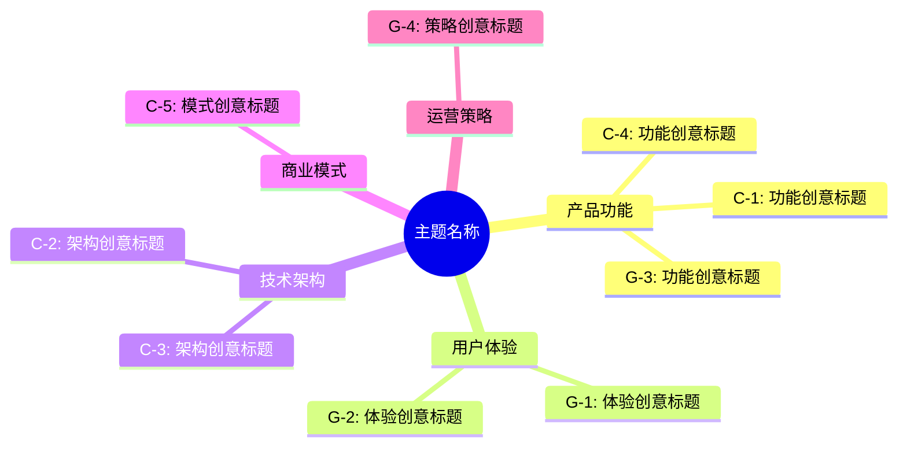
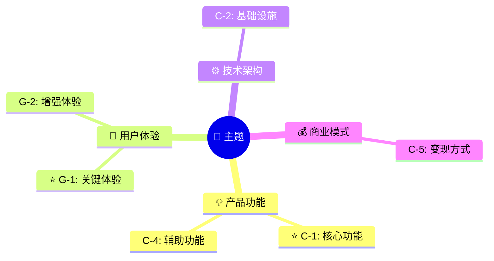
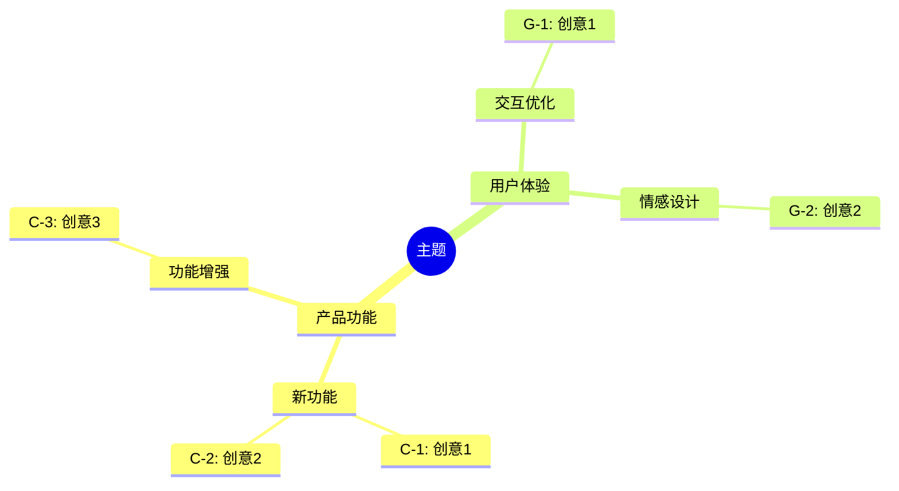
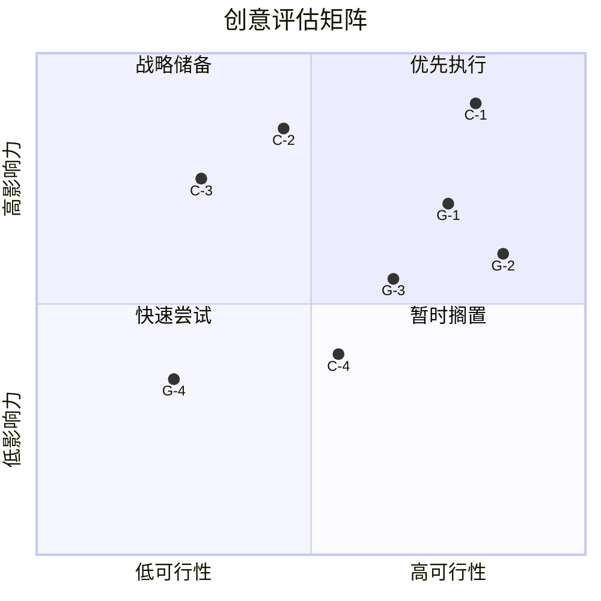
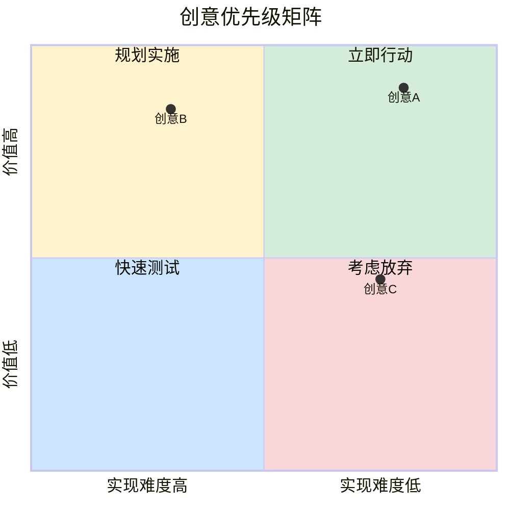
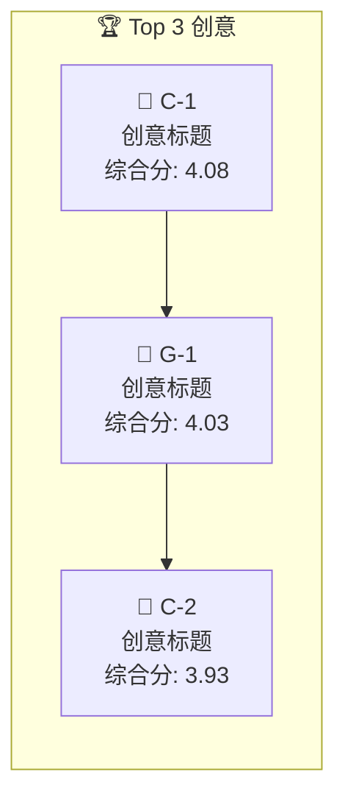
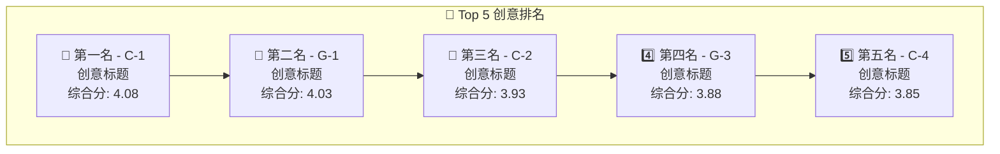
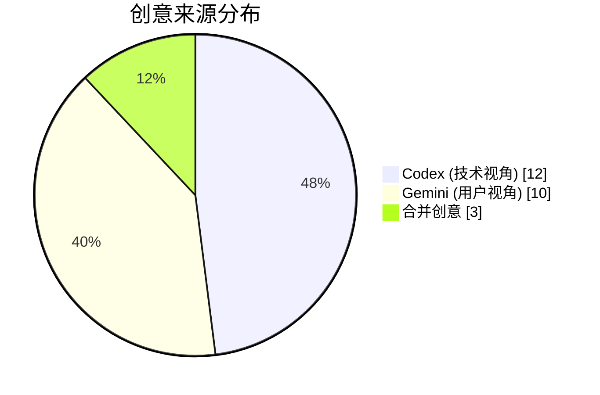
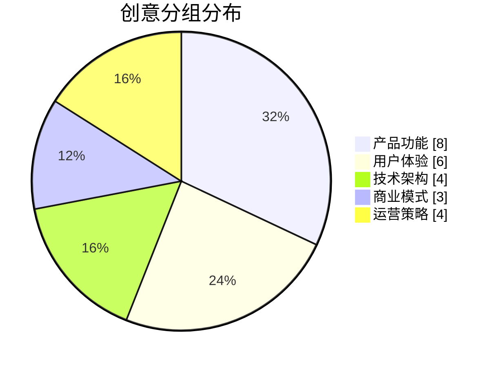
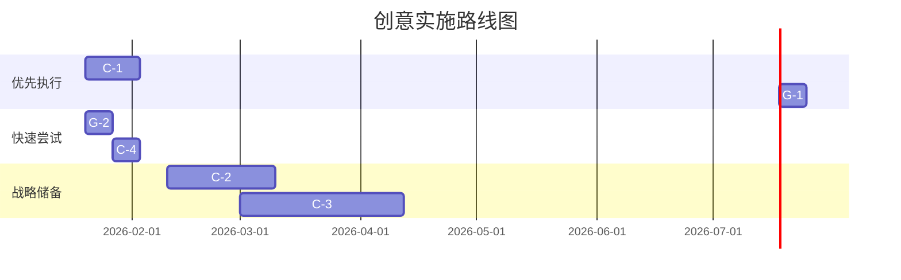

# Mermaid 可视化模板

## 思维导图（Mindmap）

### 基础模板 - 创意分组



### 变体 - 带图标



### 变体 - 层级展开



---

## 评估矩阵（Quadrant Chart）

### 基础模板 - Impact vs Feasibility



### 变体 - 带颜色标注



### 坐标计算方法

将 1-5 分的评分转换为 0-1 的坐标：

```
坐标值 = (评分 - 1) / 4
```

| 评分 | 坐标值 |
|------|--------|
| 1 | 0.00 |
| 2 | 0.25 |
| 3 | 0.50 |
| 4 | 0.75 |
| 5 | 1.00 |

---

## 排名展示（Flow Chart）

### Top 3 展示



### Top 5 垂直展示



---

## 分组统计（Pie Chart）

### 来源分布



### 分组分布



---

## 实施路线图（Gantt）

### 基于优先级的路线图



---

## 评估详情（Table）

### Markdown 表格模板

```markdown
| 排名 | ID | 创意 | 影响力 | 可行性 | 创新度 | 契合度 | 综合分 |
|:----:|:---:|:-----|:------:|:------:|:------:|:------:|:------:|
| 🥇 | C-1 | 创意标题 | ⭐⭐⭐⭐⭐ | ⭐⭐⭐⭐ | ⭐⭐⭐⭐ | ⭐⭐⭐⭐ | **4.08** |
| 🥈 | G-1 | 创意标题 | ⭐⭐⭐⭐ | ⭐⭐⭐⭐⭐ | ⭐⭐⭐⭐ | ⭐⭐⭐ | **4.03** |
| 🥉 | C-2 | 创意标题 | ⭐⭐⭐⭐ | ⭐⭐⭐⭐⭐ | ⭐⭐⭐⭐ | ⭐⭐⭐⭐ | **3.93** |
```

### 星级转换

| 分数 | 显示 |
|------|------|
| 5 | ⭐⭐⭐⭐⭐ |
| 4 | ⭐⭐⭐⭐ |
| 3 | ⭐⭐⭐ |
| 2 | ⭐⭐ |
| 1 | ⭐ |

---

## 使用注意事项

### Mermaid 兼容性

1. 确保代码块使用 ` ```mermaid ` 标记
2. 节点标签中避免特殊字符
3. 使用 `<br/>` 进行换行
4. 中文内容需要用引号包裹

### 渲染测试

在生成后，建议在以下工具中预览：
- GitHub/GitLab 预览
- VS Code Mermaid 插件
- https://mermaid.live

### 长内容处理

当创意数量超过 20 个时：
1. 思维导图只显示 Top 创意
2. 评估矩阵只显示关键创意
3. 完整列表使用表格展示
