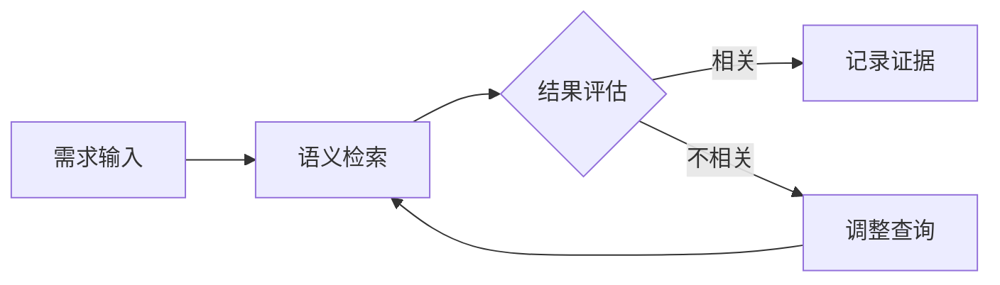
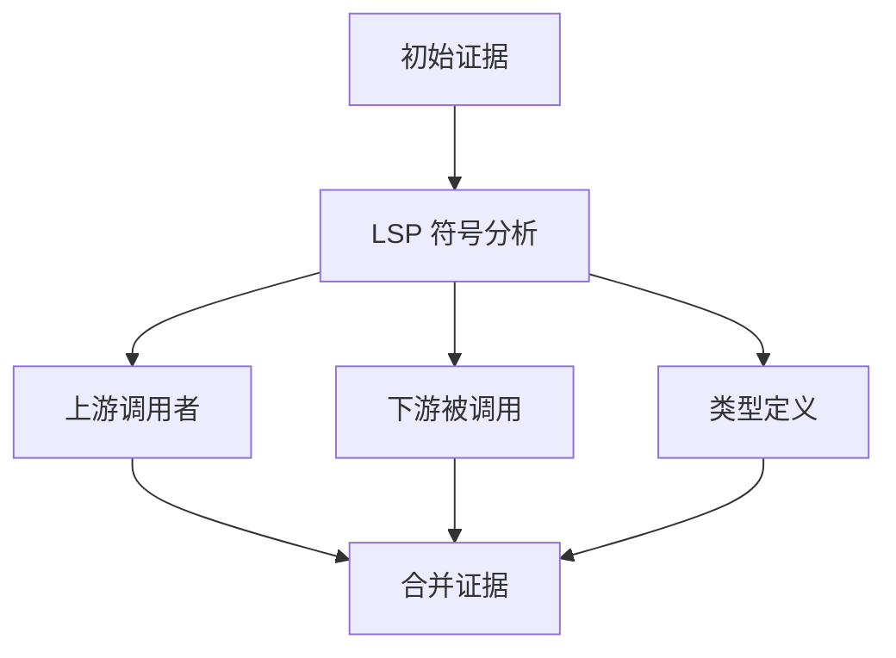
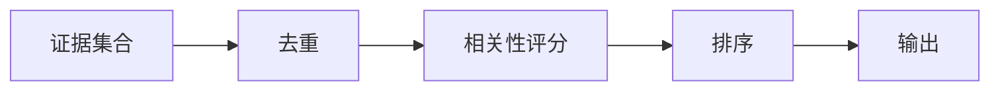

# 证据收集规则

## 概述

本文档定义了在上下文检索过程中收集证据的规则，确保结论有据可依。

## 证据类型

### 1. 代码证据

| 类型     | 描述             | 收集方式                        |
| -------- | ---------------- | ------------------------------- |
| 定义证据 | 函数/类/接口定义 | LSP goToDefinition              |
| 引用证据 | 符号使用位置     | LSP findReferences              |
| 调用证据 | 函数调用关系     | LSP incomingCalls/outgoingCalls |
| 模式证据 | 代码模式示例     | 语义检索 + 人工筛选             |

### 2. 配置证据

| 类型       | 描述         | 典型文件                             |
| ---------- | ------------ | ------------------------------------ |
| 环境配置   | 环境变量定义 | `.env`, `config/*.json`              |
| 构建配置   | 构建工具设置 | `tsconfig.json`, `webpack.config.js` |
| 依赖配置   | 包依赖关系   | `package.json`, `requirements.txt`   |
| 运行时配置 | 应用配置     | `app.config.ts`, `settings.py`       |

### 3. 文档证据

| 类型     | 描述         | 来源                      |
| -------- | ------------ | ------------------------- |
| 内部文档 | 项目文档     | `README.md`, `docs/`      |
| API 文档 | 接口定义     | OpenAPI spec, JSDoc       |
| ADR      | 架构决策记录 | `adr/`, `docs/decisions/` |
| 注释     | 代码注释     | 源代码内                  |

### 4. 外部证据

| 类型     | 描述     | 来源        |
| -------- | -------- | ----------- |
| 框架文档 | 官方文档 | Exa 检索    |
| 最佳实践 | 行业标准 | Exa 检索    |
| 类似实现 | 参考项目 | GitHub 搜索 |

## 证据收集规则

### 规则 1: 必须有出处

每条证据必须包含：

- 文件路径（内部代码）
- 行号范围
- 相关代码片段
- 收集时间戳

```json
{
  "type": "code",
  "file": "src/services/auth.ts",
  "line_start": 42,
  "line_end": 58,
  "snippet": "export async function validateToken(token: string) {...}",
  "collected_at": "2024-01-19T10:00:00Z",
  "tool_used": "lsp:goToDefinition"
}
```

### 规则 2: 完整性要求

| 证据类别 | 最小数量 | 必须包含         |
| -------- | -------- | ---------------- |
| 核心实现 | 1+       | 主要逻辑文件     |
| 依赖关系 | 全部     | 直接依赖的模块   |
| 接口定义 | 全部     | 公共 API 类型    |
| 测试用例 | 0+       | 相关测试（如有） |

### 规则 3: 相关性验证

证据必须与需求直接相关：

```yaml
relevance_criteria:
  - 关键词匹配度 > 50%
  - 调用链距离 <= 3
  - 同一功能模块
  - 相同业务领域
```

### 规则 4: 时效性检查

```yaml
freshness_rules:
  - file_modified_within: "30 days" # 最近修改
  - git_blame_check: true # 检查最后修改者
  - deprecation_check: true # 检查废弃标记
```

## 证据采集流程

### Phase 1: 初始检索



### Phase 2: 深度扩展



### Phase 3: 验证确认



## 证据质量标准

### 高质量证据

| 特征       | 说明                 |
| ---------- | -------------------- |
| 精确定位   | 具体到函数/行号      |
| 上下文完整 | 包含必要的前后文     |
| 可追溯     | 记录检索工具和查询   |
| 可复现     | 相同查询得到相同结果 |

### 低质量证据（需改进）

| 问题     | 改进方式           |
| -------- | ------------------ |
| 定位模糊 | 使用 LSP 精确定位  |
| 片段过长 | 提取关键部分       |
| 缺少来源 | 补充工具和查询信息 |
| 过期内容 | 检查 git 历史      |

## 证据存储格式

### 单条证据

```json
{
  "id": "EVD-001",
  "type": "code",
  "category": "implementation",
  "source": {
    "file": "src/services/auth.ts",
    "line_start": 42,
    "line_end": 58,
    "repository": "project-name",
    "commit": "abc123"
  },
  "content": {
    "snippet": "export async function validateToken...",
    "language": "typescript",
    "symbols": ["validateToken", "TokenPayload"]
  },
  "metadata": {
    "collected_at": "2024-01-19T10:00:00Z",
    "tool_used": "lsp:goToDefinition",
    "query": "token validation",
    "relevance_score": 0.92
  },
  "related_requirements": ["FR-001", "NFR-002"]
}
```

### 证据链

```json
{
  "chain_id": "CHAIN-001",
  "root_requirement": "FR-001",
  "evidences": [
    {
      "id": "EVD-001",
      "role": "entry_point",
      "description": "API 入口"
    },
    {
      "id": "EVD-002",
      "role": "implementation",
      "description": "核心实现"
    },
    {
      "id": "EVD-003",
      "role": "dependency",
      "description": "依赖服务"
    }
  ],
  "coverage": {
    "implementation": true,
    "types": true,
    "tests": false
  }
}
```

## 证据引用规范

在文档中引用证据时使用标准格式：

```markdown
## 实现分析

用户认证通过 JWT 实现 [EVD-001: src/services/auth.ts:42-58]。
Token 验证逻辑在 `validateToken` 函数中 [EVD-002]，
调用了 `jwtVerify` 库函数 [EVD-003]。

### 证据索引

| ID      | 文件                                 | 描述             |
| ------- | ------------------------------------ | ---------------- |
| EVD-001 | src/services/auth.ts:42-58           | Token 验证主函数 |
| EVD-002 | src/services/auth.ts:60-75           | Payload 解析     |
| EVD-003 | node_modules/jose/dist/jwt/verify.js | JWT 库           |
```

## 证据缺失处理

| 情况       | 处理策略                     |
| ---------- | ---------------------------- |
| 无相关代码 | 标记为"新实现"，使用外部证据 |
| 代码过期   | 记录技术债务，建议重构       |
| 文档缺失   | 从代码推断，标记不确定性     |
| 测试缺失   | 记录为风险项                 |
