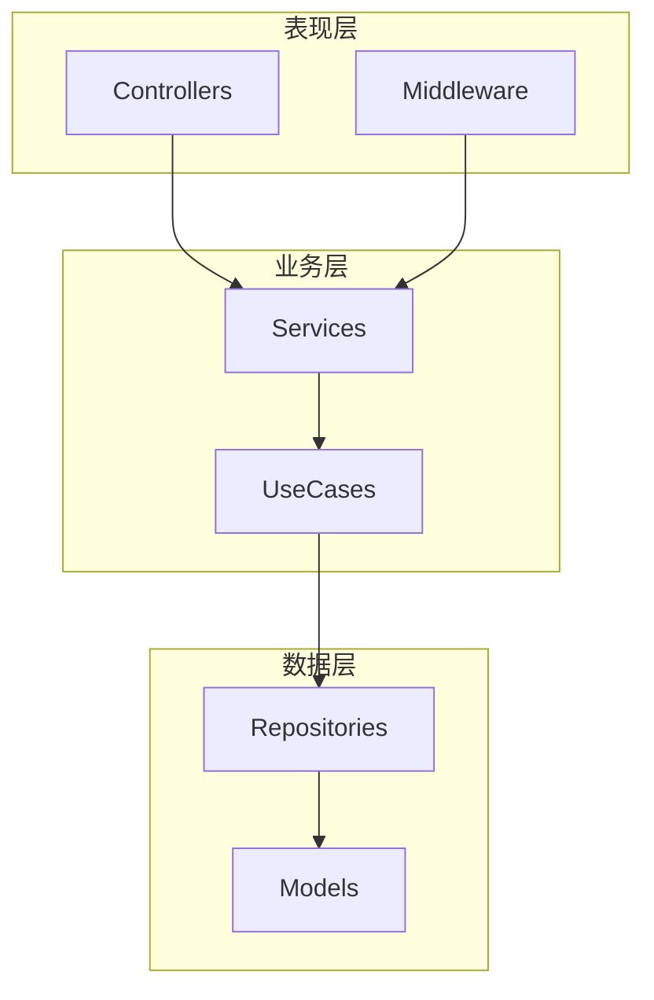

# 代码库映射指南

## 概述

本文档定义了代码库模块边界识别和映射的规则，用于指导上下文检索。

## 模块边界识别

### 目录结构模式

| 模式     | 描述       | 典型路径                                           |
| -------- | ---------- | -------------------------------------------------- |
| 分层架构 | 按职责分层 | `src/controllers/`, `src/services/`, `src/models/` |
| 功能模块 | 按业务功能 | `src/modules/auth/`, `src/modules/payment/`        |
| 领域驱动 | 按领域边界 | `src/domains/user/`, `src/domains/order/`          |
| Monorepo | 多包结构   | `packages/core/`, `packages/ui/`, `apps/web/`      |

### 边界标识符

| 标识符         | 说明       | 检测方式   |
| -------------- | ---------- | ---------- |
| `package.json` | NPM 包边界 | 文件存在性 |
| `index.ts/js`  | 模块入口   | 导出聚合   |
| `__init__.py`  | Python 包  | 文件存在性 |
| `go.mod`       | Go 模块    | 文件存在性 |
| `Cargo.toml`   | Rust crate | 文件存在性 |

## 依赖关系映射

### 静态分析

```typescript
// 导入分析示例
interface ImportMap {
  file: string;
  imports: {
    source: string; // 导入来源
    specifiers: string[]; // 导入的符号
    isExternal: boolean; // 是否外部依赖
  }[];
  exports: string[]; // 导出的符号
}
```

### 依赖方向

| 类型     | 描述         | 合规性  |
| -------- | ------------ | ------- |
| 向下依赖 | 上层依赖下层 | ✅ 推荐 |
| 向上依赖 | 下层依赖上层 | ❌ 违规 |
| 循环依赖 | A → B → A    | ❌ 违规 |
| 跨层依赖 | 跳过中间层   | ⚠️ 谨慎 |

## 代码分类

### 按职责分类

| 类别     | 描述     | 关键特征                            |
| -------- | -------- | ----------------------------------- |
| 入口点   | 应用启动 | `main`, `index`, `app`              |
| 路由     | 请求分发 | `router`, `routes`, `controller`    |
| 业务逻辑 | 核心功能 | `service`, `usecase`, `handler`     |
| 数据访问 | 持久化   | `repository`, `dao`, `model`        |
| 工具函数 | 通用功能 | `utils`, `helpers`, `lib`           |
| 配置     | 环境设置 | `config`, `env`, `settings`         |
| 类型定义 | 接口契约 | `types`, `interfaces`, `dto`        |
| 测试     | 验证代码 | `__tests__`, `*.test.*`, `*.spec.*` |

### 按变更频率分类

| 类别     | 变更频率 | 检索优先级     |
| -------- | -------- | -------------- |
| 核心模块 | 低       | 高（理解基础） |
| 业务模块 | 中       | 高（需求相关） |
| 工具模块 | 低       | 中（按需）     |
| 配置文件 | 低       | 低（环境相关） |
| 测试代码 | 高       | 中（验证参考） |

## 检索策略

### 按需求类型

| 需求类型 | 起始检索点       | 扩展方向   |
| -------- | ---------------- | ---------- |
| 新功能   | 相似功能模块     | 依赖链向下 |
| Bug 修复 | 错误堆栈涉及文件 | 调用链追踪 |
| 重构     | 目标模块         | 引用链向上 |
| 性能优化 | 热点路径         | 关键依赖   |

### 检索深度控制

```yaml
depth_rules:
  - condition: "核心业务逻辑"
    max_depth: 3
    include_tests: true

  - condition: "工具函数"
    max_depth: 1
    include_tests: false

  - condition: "配置文件"
    max_depth: 0
    include_tests: false
```

## 模块关系图

### Mermaid 模板



## 边界约束

### 合规检查

| 规则     | 描述         | 检测方法 |
| -------- | ------------ | -------- |
| 单向依赖 | 依赖方向一致 | 导入分析 |
| 接口隔离 | 通过接口交互 | 类型检查 |
| 循环检测 | 无循环依赖   | 图遍历   |
| 层级约束 | 不跨层调用   | 路径分析 |

### 违规处理

1. 记录违规详情
2. 评估修复成本
3. 纳入技术债务
4. 规划重构任务

## 输出格式

### 模块映射 JSON

```json
{
  "modules": [
    {
      "name": "auth",
      "path": "src/modules/auth",
      "type": "feature",
      "entry": "src/modules/auth/index.ts",
      "dependencies": ["user", "session"],
      "dependents": ["api", "middleware"],
      "exports": ["AuthService", "AuthGuard", "login", "logout"]
    }
  ],
  "violations": [
    {
      "type": "circular",
      "path": ["auth", "user", "auth"],
      "severity": "high"
    }
  ]
}
```
