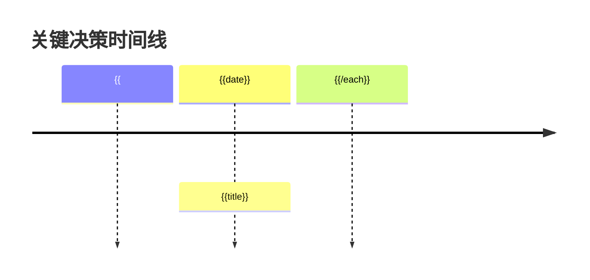

# 决策日志

## 项目信息

| 字段     | 值               |
| -------- | ---------------- |
| 规划 ID  | {{plan_id}}      |
| 项目名称 | {{project_name}} |
| 创建时间 | {{created_at}}   |
| 更新时间 | {{updated_at}}   |

---

## 1. 决策概览

### 1.1 决策统计

| 类别     | 数量                | 已批准                 | 待定                  | 已撤销                |
| -------- | ------------------- | ---------------------- | --------------------- | --------------------- |
| 架构     | {{arch_count}}      | {{arch_approved}}      | {{arch_pending}}      | {{arch_revoked}}      |
| 技术     | {{tech_count}}      | {{tech_approved}}      | {{tech_pending}}      | {{tech_revoked}}      |
| 流程     | {{proc_count}}      | {{proc_approved}}      | {{proc_pending}}      | {{proc_revoked}}      |
| 业务     | {{biz_count}}       | {{biz_approved}}       | {{biz_pending}}       | {{biz_revoked}}       |
| **总计** | **{{total_count}}** | **{{total_approved}}** | **{{total_pending}}** | **{{total_revoked}}** |

### 1.2 决策时间线

---

## 2. 架构决策记录 (ADR)

{{#each architecture_decisions}}

### ADR-{{number}}: {{title}}

| 属性     | 值               |
| -------- | ---------------- |
| 状态     | {{status}}       |
| 日期     | {{date}}         |
| 决策者   | {{deciders}}     |
| 影响范围 | {{scope}}        |
| 相关需求 | {{requirements}} |

#### 上下文

{{context}}

#### 问题陈述

{{problem}}

#### 备选方案

{{#each options}}

##### 方案 {{@index}}: {{name}}

**描述**: {{description}}

**优点**:
{{#each pros}}

- {{this}}
  {{/each}}

**缺点**:
{{#each cons}}

- {{this}}
  {{/each}}

**成本**: {{cost}}

**风险**: {{risk}}

{{/each}}

#### 决策

**选择方案**: {{chosen_option}}

**理由**: {{rationale}}

#### 后果

**正面**:
{{#each positive_consequences}}

- {{this}}
  {{/each}}

**负面**:
{{#each negative_consequences}}

- {{this}}
  {{/each}}

**中性**:
{{#each neutral_consequences}}

- {{this}}
  {{/each}}

#### 相关决策

{{#each related_decisions}}

- [ADR-{{number}}]({{link}}): {{title}}
  {{/each}}

#### 备注

{{notes}}

---

{{/each}}

## 3. 技术决策

{{#each technical_decisions}}

### TDR-{{number}}: {{title}}

| 属性   | 值           |
| ------ | ------------ |
| 状态   | {{status}}   |
| 日期   | {{date}}     |
| 决策者 | {{deciders}} |
| 类别   | {{category}} |

#### 背景

{{background}}

#### 决策

{{decision}}

#### 理由

{{rationale}}

#### 影响

- **代码变更**: {{code_impact}}
- **性能影响**: {{performance_impact}}
- **维护成本**: {{maintenance_cost}}

#### 验证方式

{{validation}}

---

{{/each}}

## 4. 流程决策

{{#each process_decisions}}

### PDR-{{number}}: {{title}}

| 属性     | 值           |
| -------- | ------------ |
| 状态     | {{status}}   |
| 日期     | {{date}}     |
| 决策者   | {{deciders}} |
| 影响团队 | {{teams}}    |

#### 当前流程

{{current_process}}

#### 问题

{{problem}}

#### 新流程

{{new_process}}

#### 变更理由

{{rationale}}

#### 过渡计划

{{transition_plan}}

---

{{/each}}

## 5. 业务决策

{{#each business_decisions}}

### BDR-{{number}}: {{title}}

| 属性   | 值           |
| ------ | ------------ |
| 状态   | {{status}}   |
| 日期   | {{date}}     |
| 决策者 | {{deciders}} |
| 优先级 | {{priority}} |

#### 业务背景

{{business_context}}

#### 决策内容

{{decision}}

#### 业务影响

- **收益**: {{benefit}}
- **成本**: {{cost}}
- **风险**: {{risk}}

#### 成功指标

{{#each success_metrics}}

- {{metric}}: {{target}}
  {{/each}}

---

{{/each}}

## 6. 待定决策

{{#each pending_decisions}}

### 待定: {{title}}

| 属性       | 值                |
| ---------- | ----------------- |
| 提出日期   | {{proposed_date}} |
| 提出人     | {{proposer}}      |
| 目标决策日 | {{target_date}}   |
| 阻塞任务   | {{blocking}}      |

#### 问题描述

{{problem}}

#### 待选方案

{{#each options}}

- **{{name}}**: {{description}}
  {{/each}}

#### 决策依赖

{{#each dependencies}}

- {{this}}
  {{/each}}

#### 下一步

{{next_steps}}

---

{{/each}}

## 7. 已撤销决策

{{#each revoked_decisions}}

### 已撤销: {{original_id}} - {{title}}

| 属性       | 值                |
| ---------- | ----------------- |
| 原决策日期 | {{original_date}} |
| 撤销日期   | {{revoke_date}}   |
| 撤销原因   | {{revoke_reason}} |

#### 原决策

{{original_decision}}

#### 撤销影响

{{impact}}

#### 替代决策

{{replacement}}

---

{{/each}}

## 8. 决策矩阵

### 8.1 决策优先级矩阵

| 决策 | 紧急度 | 影响度 | 可逆性 | 综合优先级 |
| ---- | ------ | ------ | ------ | ---------- |

{{#each decision_matrix}}
| {{id}} | {{urgency}} | {{impact}} | {{reversibility}} | {{priority}} |
{{/each}}

### 8.2 RACI 矩阵

| 决策 | Responsible | Accountable | Consulted | Informed |
| ---- | ----------- | ----------- | --------- | -------- |

{{#each raci_matrix}}
| {{id}} | {{responsible}} | {{accountable}} | {{consulted}} | {{informed}} |
{{/each}}

---

## 9. 决策追溯

### 9.1 需求到决策

| 需求 | 相关决策 | 状态 |
| ---- | -------- | ---- |

{{#each requirement_decisions}}
| {{requirement_id}} | {{decision_ids}} | {{status}} |
{{/each}}

### 9.2 任务到决策

| 任务 | 依赖决策 | 决策状态 |
| ---- | -------- | -------- |

{{#each task_decisions}}
| {{task_id}} | {{decision_ids}} | {{status}} |
{{/each}}

---

## 附录

### A. 决策状态定义

| 状态       | 描述           |
| ---------- | -------------- |
| Proposed   | 已提出，待讨论 |
| Pending    | 讨论中，待决策 |
| Approved   | 已批准，待实施 |
| Active     | 已实施，生效中 |
| Revoked    | 已撤销         |
| Superseded | 被新决策替代   |

### B. 决策类别

| 类别 | 描述         | 示例           |
| ---- | ------------ | -------------- |
| 架构 | 系统架构相关 | 微服务 vs 单体 |
| 技术 | 技术选型相关 | 框架、库选择   |
| 流程 | 开发流程相关 | Git 分支策略   |
| 业务 | 业务规则相关 | 功能优先级     |

### C. 可逆性级别

| 级别 | 描述                   | 示例               |
| ---- | ---------------------- | ------------------ |
| 高   | 可轻松回退             | 功能开关           |
| 中   | 需要一定成本回退       | 数据库 schema 变更 |
| 低   | 回退成本很高或不可回退 | 技术栈重大变更     |

### D. 更新记录

| 日期 | 变更内容 | 变更人 |
| ---- | -------- | ------ |

{{#each updates}}
| {{date}} | {{change}} | {{author}} |
{{/each}}
