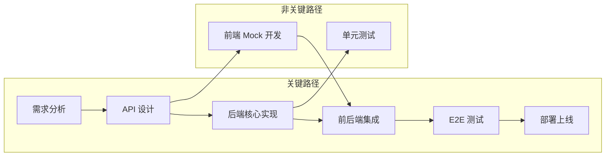
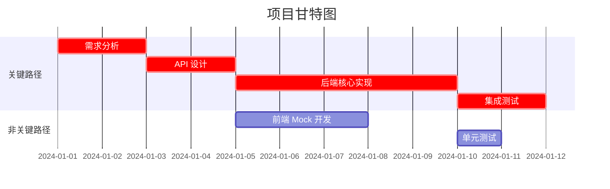

# 关键路径方法 (CPM)

## 概述

关键路径方法（Critical Path Method, CPM）是一种项目管理技术，用于识别项目中最长的任务序列，该序列决定了项目的最短完成时间。

## 核心概念

### 关键路径定义

```
关键路径 = 从项目开始到结束的最长路径
关键路径上的任务延迟 = 项目延迟
```

### 关键术语

| 术语 | 英文            | 定义         |
| ---- | --------------- | ------------ |
| ES   | Earliest Start  | 最早开始时间 |
| EF   | Earliest Finish | 最早完成时间 |
| LS   | Latest Start    | 最晚开始时间 |
| LF   | Latest Finish   | 最晚完成时间 |
| TF   | Total Float     | 总浮动时间   |
| FF   | Free Float      | 自由浮动时间 |

### 浮动时间

```
总浮动 (TF) = LS - ES = LF - EF
自由浮动 (FF) = 后继任务的 ES - 当前任务的 EF

TF = 0 的任务位于关键路径上
```

## 计算步骤

### Step 1: 前向传递（计算 ES 和 EF）

```
ES = max(所有前置任务的 EF)
EF = ES + Duration

起始任务: ES = 0
```

### Step 2: 后向传递（计算 LS 和 LF）

```
LF = min(所有后续任务的 LS)
LS = LF - Duration

终止任务: LF = 项目截止时间
```

### Step 3: 计算浮动时间

```
TF = LS - ES (或 LF - EF)
FF = min(后续任务的 ES) - EF
```

### Step 4: 识别关键路径

```
关键路径 = TF = 0 的所有任务连成的路径
```

## 计算示例

### 网络图

```
      → B(3) →
     /         \
A(2)            → E(2)
     \         /
      → C(4) →
         ↓
        D(1)
```

### 前向传递

| 任务 | Duration | ES  | EF  |
| ---- | -------- | --- | --- |
| A    | 2        | 0   | 2   |
| B    | 3        | 2   | 5   |
| C    | 4        | 2   | 6   |
| D    | 1        | 6   | 7   |
| E    | 2        | 6   | 8   |

### 后向传递

| 任务 | Duration | LS  | LF  |
| ---- | -------- | --- | --- |
| E    | 2        | 6   | 8   |
| D    | 1        | 7   | 8   |
| C    | 4        | 2   | 6   |
| B    | 3        | 3   | 6   |
| A    | 2        | 0   | 2   |

### 浮动时间计算

| 任务 | ES  | EF  | LS  | LF  | TF  | 关键? |
| ---- | --- | --- | --- | --- | --- | ----- |
| A    | 0   | 2   | 0   | 2   | 0   | ✅    |
| B    | 2   | 5   | 3   | 6   | 1   | ❌    |
| C    | 2   | 6   | 2   | 6   | 0   | ✅    |
| D    | 6   | 7   | 7   | 8   | 1   | ❌    |
| E    | 6   | 8   | 6   | 8   | 0   | ✅    |

### 关键路径

```
A → C → E
总工期: 8 个时间单位
```

## 软件开发应用

### 典型全栈项目关键路径



### 缩短关键路径的策略

#### 1. 快速跟进 (Fast Tracking)

将原本串行的任务改为并行：

```
原来: 后端开发(5d) → 前端开发(3d) = 8d
优化: 后端开发 + 前端 Mock 开发 并行 = 5d
```

**风险**: 返工可能性增加

#### 2. 赶工 (Crashing)

投入更多资源缩短任务时间：

```
原来: 1人开发(10d)
赶工: 2人开发(6d) [不是线性，有沟通开销]
```

**风险**: 成本增加，收益递减

#### 3. 范围削减

减少功能范围：

```
原来: 完整功能(10d)
MVP: 核心功能(5d) + 后续迭代
```

**风险**: 可能影响产品价值

### 实际估算技术

#### 三点估算法 (PERT)

```
预期时间 = (乐观 + 4×最可能 + 悲观) / 6

示例:
乐观: 2d
最可能: 3d
悲观: 8d

预期 = (2 + 4×3 + 8) / 6 = 3.67d
```

#### 标准差

```
标准差 σ = (悲观 - 乐观) / 6

置信区间:
- 68%: 预期 ± 1σ
- 95%: 预期 ± 2σ
- 99.7%: 预期 ± 3σ
```

## 工具实现

### JavaScript 实现

```javascript
class CPMCalculator {
  constructor(tasks) {
    this.tasks = tasks;
    this.results = {};
  }

  forwardPass() {
    const sorted = this.topologicalSort();
    for (const taskId of sorted) {
      const task = this.tasks[taskId];
      const predecessorEFs = task.dependencies.map(
        (dep) => this.results[dep]?.ef || 0,
      );
      const es = Math.max(0, ...predecessorEFs);
      const ef = es + task.duration;
      this.results[taskId] = { ...this.results[taskId], es, ef };
    }
  }

  backwardPass() {
    const sorted = this.topologicalSort().reverse();
    const projectEnd = Math.max(
      ...Object.values(this.results).map((r) => r.ef),
    );

    for (const taskId of sorted) {
      const task = this.tasks[taskId];
      const successorLSs = this.getSuccessors(taskId).map(
        (suc) => this.results[suc]?.ls || projectEnd,
      );
      const lf =
        successorLSs.length > 0 ? Math.min(...successorLSs) : projectEnd;
      const ls = lf - task.duration;
      this.results[taskId] = {
        ...this.results[taskId],
        ls,
        lf,
        tf: ls - this.results[taskId].es,
      };
    }
  }

  getCriticalPath() {
    return Object.entries(this.results)
      .filter(([_, r]) => r.tf === 0)
      .map(([id, _]) => id);
  }
}
```

### 输出格式

```markdown
# 关键路径分析 - [项目名称]

## 项目概览

- 总任务数: N
- 项目工期: X 天
- 关键任务数: Y

## 任务时间表

| ID    | 任务 | 工期 | ES  | EF  | LS  | LF  | TF  | 关键? |
| ----- | ---- | ---- | --- | --- | --- | --- | --- | ----- |
| T-001 | ...  | 2d   | 0   | 2   | 0   | 2   | 0   | ✅    |

## 关键路径
```

T-001 → T-003 → T-005 → T-007

```

## 甘特图
[Mermaid Gantt]

## 风险分析
- 关键路径长度: X 天
- 非关键任务浮动: [分布统计]
- 瓶颈任务: [任务列表]

## 优化建议
1. [快速跟进建议]
2. [赶工建议]
3. [范围调整建议]
```

## Mermaid 甘特图



## 检查清单

### 计算前

- [ ] 所有任务已识别？
- [ ] 依赖关系已明确？
- [ ] 工期估算已完成？
- [ ] 网络图已验证（无环）？

### 计算后

- [ ] 关键路径是否合理？
- [ ] 项目工期是否可接受？
- [ ] 浮动时间分布是否健康？
- [ ] 是否有优化空间？

### 执行时

- [ ] 关键任务是否优先？
- [ ] 延迟是否及时上报？
- [ ] 浮动时间是否被滥用？
- [ ] 关键路径是否发生变化？
