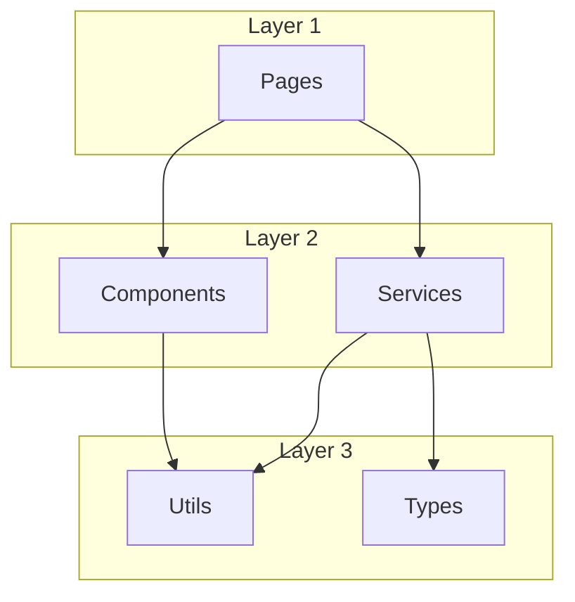
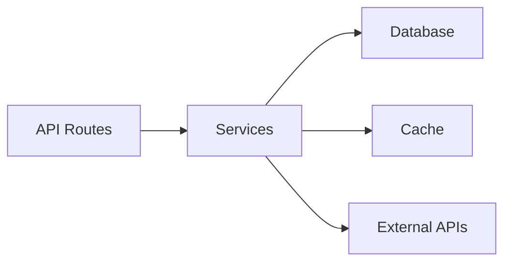

# code-map-generator

## Purpose

Generate visual code maps showing module relationships, dependency flows, and architectural layers using Mermaid diagrams.

## Diagram Types

| Type         | Content                            | Use Case                        |
| ------------ | ---------------------------------- | ------------------------------- |
| `dependency` | Module import/export relationships | Understanding coupling          |
| `data-flow`  | How data moves between modules     | API and service design          |
| `layer`      | Architectural layer visualization  | Onboarding, architecture review |

## Steps

### Phase 1: Module Discovery

1. Call `Skill("context-memory:module-discovery", {run_dir})` to get `modules.json`.
2. Apply scope filter if specified.

### Phase 2: Dependency Analysis

3. Use `Skill("context-memory:codex-cli", {role: "analyzer", prompt})` to analyze:
   - Import graphs between modules
   - Data flow patterns (which module produces vs consumes)
   - Circular dependency detection
4. Build adjacency list from analysis.

### Phase 3: Mermaid Generation

5. Generate Mermaid diagrams:

**Dependency diagram:**

**Data flow diagram:**

### Phase 4: Output

6. Write Mermaid files to `${run_dir}/code-map-{type}.md`.
7. Write JSON graph to `${run_dir}/code-map.json` if format includes json.
8. Write summary to `${run_dir}/code-map-summary.md`:
   - Module count per layer
   - Top connected modules (most imports/exports)
   - Circular dependencies (if any)

## Verification

- Mermaid diagrams render without syntax errors.
- Every module from modules.json appears in at least one diagram.
- Circular dependencies are flagged in summary.
