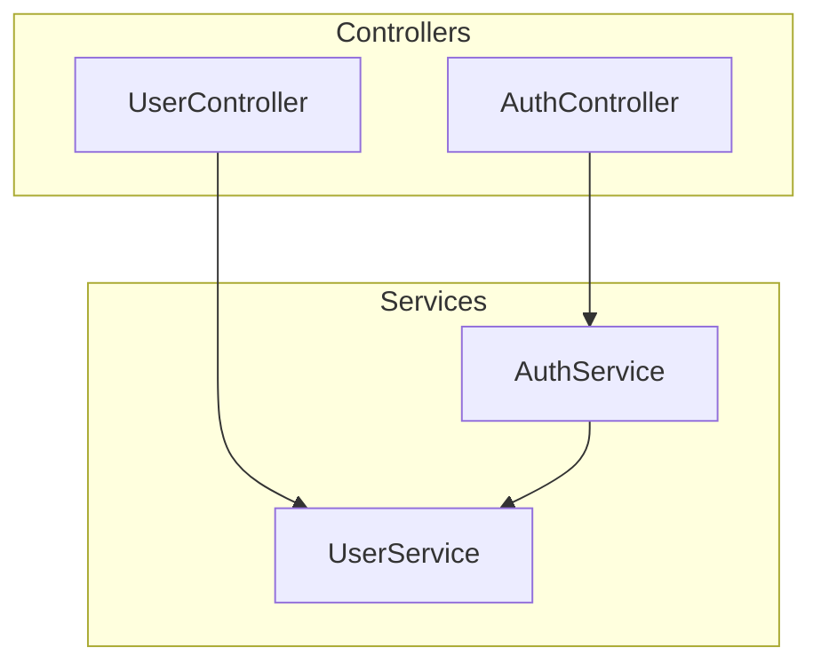

# Module Patterns Reference

## 模块类型识别

### TypeScript/JavaScript

```typescript
// Service 模块
export class UserService {}
export const userService = {};

// Controller 模块
@Controller("users")
export class UserController {}

// Repository 模块
export class UserRepository {}

// Utility 模块
export function formatDate() {}
export const utils = {};
```

### 依赖关系标记

| 关系类型 | 符号 | 示例         |
| -------- | ---- | ------------ |
| 直接依赖 | `→`  | A → B        |
| 可选依赖 | `⇢`  | A ⇢ B        |
| 循环依赖 | `↔`  | A ↔ B (警告) |
| 实现接口 | `◁`  | A ◁ IB       |

### Mermaid 图例



## 复杂度指标

| 指标     | 阈值  | 说明       |
| -------- | ----- | ---------- |
| 依赖数   | > 10  | 高耦合警告 |
| 被依赖数 | > 15  | 核心模块   |
| 循环深度 | > 2   | 重构建议   |
| 文件行数 | > 500 | 拆分建议   |
