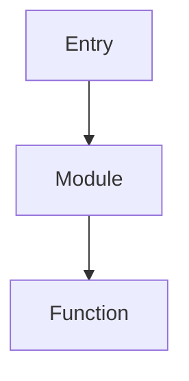

# Memory Plugin - Codex CLI Skill

## 执行流程

```
1. 接收分析任务
       │
       ▼
2. 构建 Codex Prompt
   - 加载专属模板
   - 注入上下文文件
       │
       ▼
3. 执行 Codex CLI
   codex --approval-mode full-auto \
         --full-stdout \
         "$PROMPT"
       │
       ▼
4. 处理输出
   - 解析分析结果
   - 格式化为目标格式
       │
       ▼
5. 返回结果
```

## 专属 Prompt 模板

### 模块结构分析

```markdown
# Memory Plugin - Code Analysis

## Task

分析以下代码的模块结构

## Context Files

${context_files}

## Analysis Focus

1. 入口点识别
2. 模块依赖关系
3. 导出接口清单
4. 内部调用链

## Output Format

${output_format}
```

### 函数调用链追踪

```markdown
# Memory Plugin - Call Chain Analysis

## Task

追踪函数 ${function_name} 的完整调用链

## Context Files

${context_files}

## Output Requirements

- Mermaid 序列图格式
- 包含参数传递
- 标注异步调用
```

### API 端点提取

```markdown
# Memory Plugin - API Endpoint Extraction

## Task

扫描项目，提取所有 API 端点

## Framework Detection

自动检测: Express | NestJS | FastAPI | Spring | Go

## Output Format

| Method | Path | Handler | Parameters |
| ------ | ---- | ------- | ---------- |
```

### 数据流分析

```markdown
# Memory Plugin - Data Flow Analysis

## Task

分析数据从 ${source} 到 ${target} 的流转路径

## Context Files

${context_files}

## Analysis Depth

- 变量追踪
- 函数边界
- 模块边界
- 外部调用
```

## 降级策略

```
Codex CLI 不可用时:
1. 检测错误类型
   - 网络错误 → 重试 (3次, 指数退避)
   - 配额错误 → 通知用户
   - 服务错误 → 降级到本地分析

2. 本地降级分析
   - 使用 grep/glob 进行模式匹配
   - 输出能力受限警告
```

## 输出格式规范

### Markdown (默认)

```markdown
# Analysis Result

## Summary

[概述]

## Details

[详细分析]

## Recommendations

[建议]
```

### JSON

```json
{
  "summary": "...",
  "modules": [...],
  "dependencies": [...],
  "exports": [...]
}
```

### Mermaid



## 使用示例

```
# 分析模块结构
Skill("memory:codex-cli",
  prompt="分析 src/services/ 的模块结构",
  context_files=["src/services/"],
  output_format="markdown"
)

# 追踪调用链
Skill("memory:codex-cli",
  prompt="追踪 handleRequest 函数的调用链",
  context_files=["src/handlers/request.ts"],
  output_format="mermaid"
)
```
