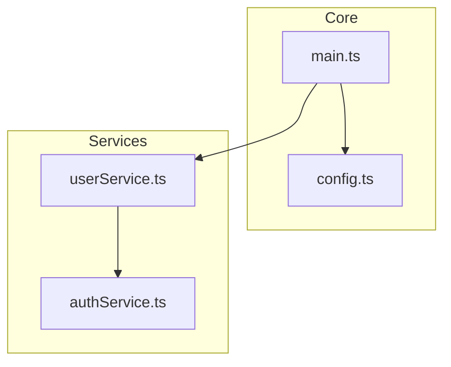
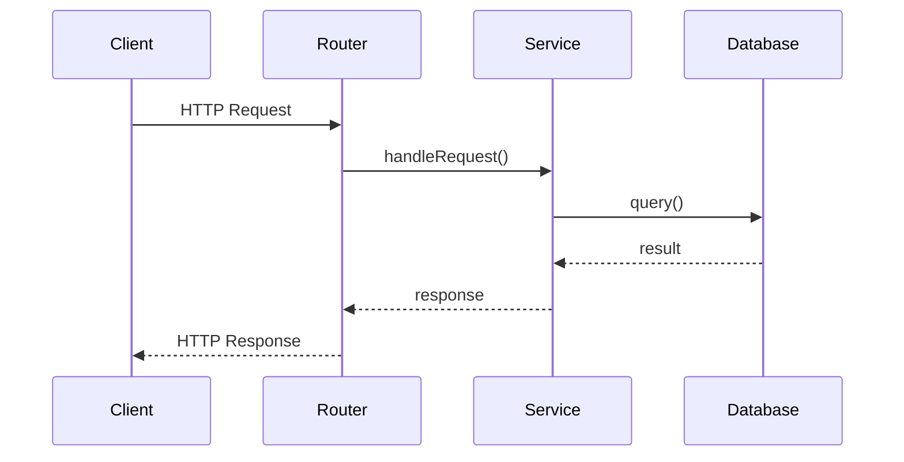
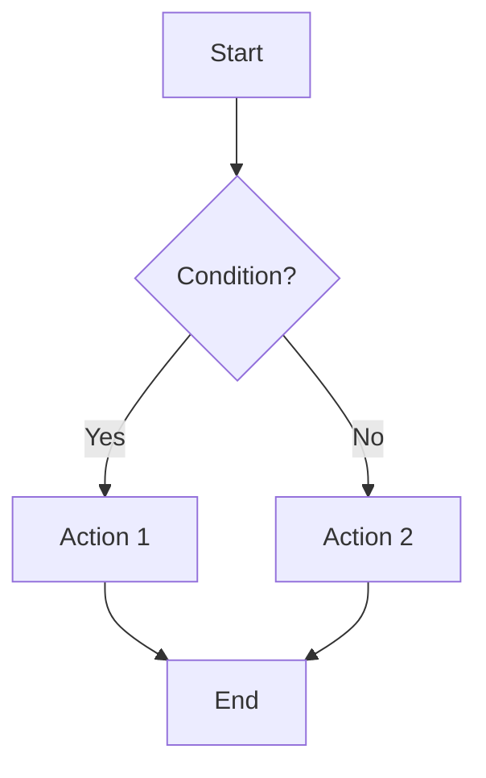
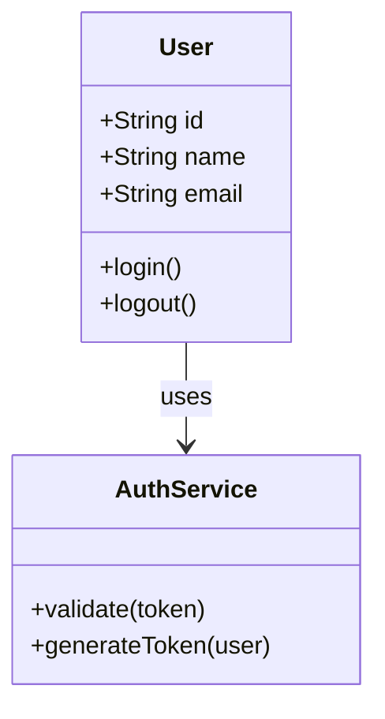

# Codex CLI - Output Formats

## Markdown 格式

### 标准结构

```markdown
# Analysis: [Title]

## Summary

[1-2 句概述]

## Findings

### [Finding 1]

- Detail A
- Detail B

### [Finding 2]

- Detail A
- Detail B

## Recommendations

1. [Recommendation 1]
2. [Recommendation 2]

## References

- [File: path/to/file.ts:line]
```

### 带图表

```markdown
# Analysis: [Title]

## Architecture

\`\`\`mermaid
graph TD
A[Entry] --> B[Module]
\`\`\`

## Details

...
```

## JSON 格式

### 模块分析

```json
{
  "analysis_type": "module_structure",
  "timestamp": "2024-01-20T08:00:00Z",
  "summary": "...",
  "modules": [
    {
      "name": "module_name",
      "path": "src/module/",
      "exports": ["func1", "func2"],
      "dependencies": ["dep1", "dep2"],
      "loc": 1500
    }
  ],
  "dependency_graph": {
    "nodes": [...],
    "edges": [...]
  }
}
```

### 函数分析

```json
{
  "analysis_type": "function_analysis",
  "functions": [
    {
      "name": "functionName",
      "file": "path/to/file.ts",
      "line": 42,
      "params": [{ "name": "param1", "type": "string" }],
      "return_type": "Promise<Result>",
      "async": true,
      "exported": true,
      "calls": ["otherFunc1", "otherFunc2"],
      "called_by": ["callerFunc"]
    }
  ]
}
```

### API 端点

```json
{
  "analysis_type": "api_endpoints",
  "framework": "express",
  "endpoints": [
    {
      "method": "GET",
      "path": "/api/users/:id",
      "handler": "getUser",
      "file": "src/routes/users.ts",
      "line": 15,
      "params": [{ "name": "id", "in": "path", "type": "string" }],
      "middleware": ["auth", "validate"]
    }
  ]
}
```

## Mermaid 格式

### 依赖图



### 序列图



### 流程图



### 类图



## 格式选择指南

| 用途         | 推荐格式           |
| ------------ | ------------------ |
| 人类阅读报告 | markdown           |
| 程序处理     | json               |
| 可视化展示   | mermaid            |
| 文档嵌入     | markdown + mermaid |
