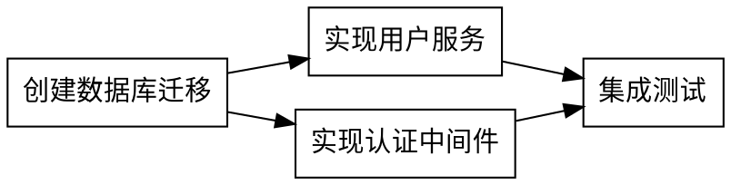
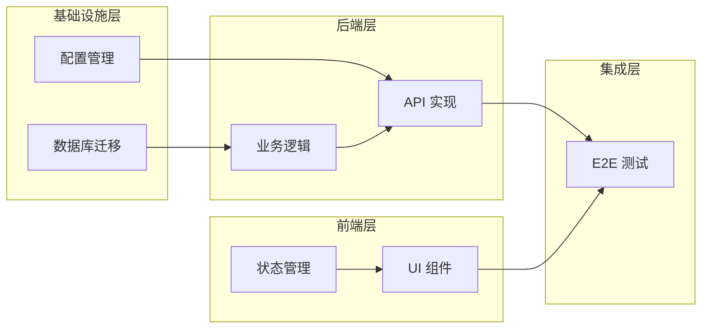
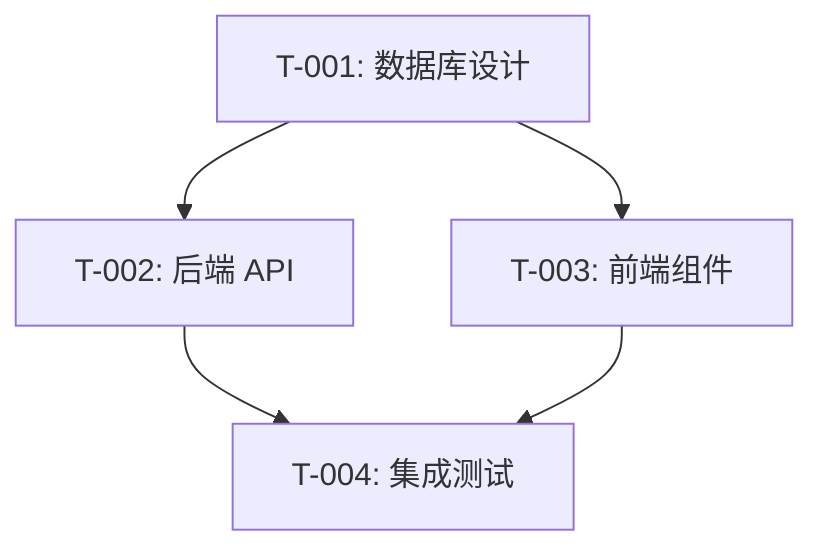

# 依赖图设计指南

## 概述

依赖图（Dependency Graph）是描述任务之间先后顺序和依赖关系的有向图。正确的依赖管理是项目按时交付的关键。

## 基础概念

### 图论基础

```
有向无环图 (DAG - Directed Acyclic Graph)
- 有向：A → B 表示 B 依赖 A
- 无环：不允许 A → B → C → A 这样的循环
```

### 依赖类型

| 类型 | 全称             | 含义                        | 示例                     |
| ---- | ---------------- | --------------------------- | ------------------------ |
| FS   | Finish-to-Start  | A 完成后 B 才能开始         | 编码完成 → 开始测试      |
| SS   | Start-to-Start   | A 开始后 B 可以开始         | 前端开发开始 → Mock 同步 |
| FF   | Finish-to-Finish | A 完成时 B 也必须完成       | 代码冻结 → 文档同步完成  |
| SF   | Start-to-Finish  | A 开始后 B 才能完成（少用） | 新系统上线 → 旧系统下线  |

### 默认依赖

- **软件开发中 90% 使用 FS 依赖**
- SS 用于可并行但需要同步启动的任务
- FF 用于必须同时完成的交付物

## DAG 约束

### 强制规则

1. **无环检测**

   ```
   ❌ 禁止: A → B → C → A
   ✅ 正确: A → B → C → D
   ```

2. **单一入口检查**
   - 理想情况：有明确的起始任务
   - 允许多个独立入口（无依赖任务）

3. **可达性检查**
   - 所有任务必须从入口可达
   - 不能有"孤岛"任务

### 检测循环依赖

```python
# 拓扑排序检测
def has_cycle(graph):
    visited = set()
    rec_stack = set()

    def dfs(node):
        visited.add(node)
        rec_stack.add(node)
        for neighbor in graph[node]:
            if neighbor not in visited:
                if dfs(neighbor):
                    return True
            elif neighbor in rec_stack:
                return True
        rec_stack.remove(node)
        return False

    for node in graph:
        if node not in visited:
            if dfs(node):
                return True
    return False
```

### 解决循环依赖

| 问题模式             | 解决方案                     |
| -------------------- | ---------------------------- |
| A 和 B 互相依赖      | 提取公共部分 C，A → C，B → C |
| 隐式依赖导致循环     | 明确接口契约，打破耦合       |
| 需求不清导致的假依赖 | 重新分析，去除不必要的依赖   |

## 依赖关系建模

### 依赖矩阵

```markdown
|       | T-001 | T-002 | T-003 | T-004 |
| ----- | ----- | ----- | ----- | ----- |
| T-001 | -     | 0     | 0     | 0     |
| T-002 | 1     | -     | 0     | 0     |
| T-003 | 1     | 0     | -     | 0     |
| T-004 | 0     | 1     | 1     | -     |

1 = 行依赖列
T-002 依赖 T-001
T-003 依赖 T-001
T-004 依赖 T-002 和 T-003
```

### 邻接表表示

```json
{
  "T-001": [],
  "T-002": ["T-001"],
  "T-003": ["T-001"],
  "T-004": ["T-002", "T-003"]
}
```

### Graphviz DOT 格式



## 依赖类型详解

### 硬依赖 vs 软依赖

| 类型   | 定义                 | 示例                       |
| ------ | -------------------- | -------------------------- |
| 硬依赖 | 技术上必须的先后顺序 | 数据库必须先建表才能插数据 |
| 软依赖 | 偏好或最佳实践的顺序 | 先写测试再写代码（TDD）    |

### 全栈项目依赖模式



### 常见依赖模式

#### 1. 顺序模式

```
A → B → C → D
```

适用：严格的流水线工作

#### 2. 扇出模式

```
    → B
A
    → C
```

适用：基础设施完成后多任务并行

#### 3. 扇入模式

```
B →
    → D
C →
```

适用：多个前置任务汇聚到集成点

#### 4. 菱形模式

```
    → B →
A         → D
    → C →
```

适用：典型的分支合并场景

## 优化策略

### 缩短关键路径

1. **任务拆分**
   - 将大任务拆成可并行的小任务
   - 提取独立部分提前执行

2. **依赖松绑**
   - 使用接口契约替代实现依赖
   - 使用 Mock 数据解耦前后端

3. **资源投入**
   - 关键路径任务分配更多资源
   - 考虑加班或增加人手

### 并行度优化

```
并行度 = 当前可执行任务数 / 团队人数

理想: 并行度 ≥ 1
警告: 并行度 < 0.5 说明存在瓶颈
```

### 依赖图简化

| 问题       | 优化方法         |
| ---------- | ---------------- |
| 依赖链过长 | 寻找可并行的任务 |
| 单点瓶颈   | 拆分瓶颈任务     |
| 过度依赖   | 评估是否为真依赖 |

## 工具和可视化

### Mermaid 图表



### Graphviz 命令

```bash
# 生成 PNG
dot -Tpng dependency.dot -o dependency.png

# 生成 SVG
dot -Tsvg dependency.dot -o dependency.svg
```

### 验证工具

```bash
# 使用 tred 简化传递依赖
tred input.dot > simplified.dot

# 使用 acyclic 检测环
acyclic input.dot
```

## 依赖图检查清单

### 创建时检查

- [ ] 是否为 DAG（无循环）？
- [ ] 所有任务是否可达？
- [ ] 依赖关系是否为真依赖？
- [ ] 是否有不必要的串行依赖？

### 优化时检查

- [ ] 关键路径是否可以缩短？
- [ ] 是否有可以并行的任务？
- [ ] 瓶颈任务是否可以拆分？
- [ ] 依赖是否可以通过契约解耦？

### 执行时检查

- [ ] 任务完成后是否更新依赖状态？
- [ ] 阻塞任务是否及时上报？
- [ ] 依赖变更是否通知相关方？

## 输出格式

### 依赖图文档结构

```markdown
# 依赖图 - [项目名称]

## 概览

- 总任务数: N
- 并行度: X
- 关键路径长度: Y

## 依赖矩阵

[矩阵表格]

## 可视化

[Mermaid 图或 Graphviz 图]

## 关键路径

[任务序列]

## 并行执行组

### 第 1 波（无依赖）

- T-001, T-002

### 第 2 波（依赖第 1 波）

- T-003, T-004

## 风险依赖

[高风险的依赖关系]
```
