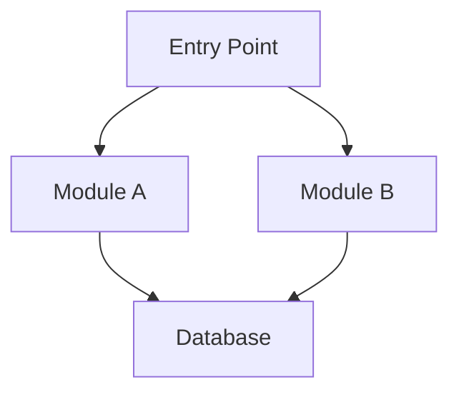
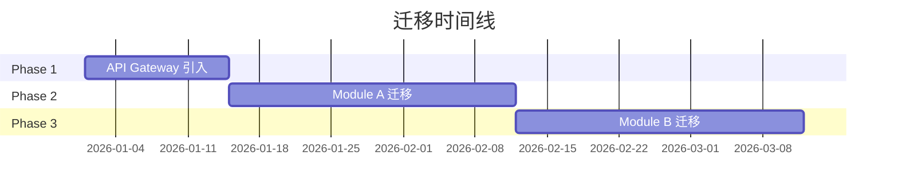

# Legacy Analyzer - 遗留系统分析原子技能

## 🚨 CRITICAL: MUST USE TOOLS

```
┌─────────────────────────────────────────────────────────────────┐
│  🔍 架构分析                                                     │
│     ✅ 后端分析: codex-cli skill（识别架构模式、依赖、耦合）     │
│     ✅ 前端分析: gemini-cli skill（识别框架、组件、状态管理）    │
│     ❌ 禁止: Claude 自己猜测架构                                  │
│                                                                  │
│  📋 策略生成                                                     │
│     ✅ 必须使用 context7 查询目标技术栈文档                      │
│                                                                  │
│  ⚠️  必须通过多模型协作分析，确保方案全面！                      │
└─────────────────────────────────────────────────────────────────┘
```

---

## MCP 工具集成

| MCP 工具              | 用途                         | 触发条件        |
| --------------------- | ---------------------------- | --------------- |
| `auggie-mcp`          | 语义级架构分析               | 🚨 每次执行必用 |
| `context7`            | 查询目标技术栈文档和最佳实践 | 🚨 每次执行必用 |

---

## 前置检查

1. 验证 `source_stack` 参数存在
2. 验证 `target_stack` 参数存在
3. 如果缺失，使用 AskUserQuestion 询问：

```
AskUserQuestion(
  questions=[
    {
      "question": "请描述当前系统的技术栈（源技术栈）",
      "header": "Source Stack",
      "options": [
        {"label": "jQuery + PHP + MySQL", "description": "传统 LAMP 栈"},
        {"label": "AngularJS + Java + Oracle", "description": "企业级遗留栈"},
        {"label": "COBOL + DB2", "description": "大型机遗留系统"},
        {"label": "自定义描述", "description": "输入自定义技术栈"}
      ],
      "multiSelect": false
    },
    {
      "question": "请描述目标技术栈",
      "header": "Target Stack",
      "options": [
        {"label": "React + Node.js + PostgreSQL", "description": "现代全栈"},
        {"label": "Vue + Spring Boot + MySQL", "description": "Java 现代化"},
        {"label": "Angular + .NET Core + SQL Server", "description": ".NET 现代化"},
        {"label": "自定义描述", "description": "输入自定义技术栈"}
      ],
      "multiSelect": false
    }
  ]
)
```

---

## 执行流程


```
  thought: "规划遗留系统分析策略。源栈：${source_stack}，目标栈：${target_stack}。需要：1) 识别架构边界 2) 评估技术债务 3) 设计迁移路径 4) 评估风险 5) 制定时间线",
  thoughtNumber: 1,
  totalThoughts: 6,
  nextThoughtNeeded: true
})
```

### Step 1: 项目结构扫描

使用 Glob 获取项目文件分布：

```bash
# 识别技术栈标识文件
Glob(pattern="**/{package.json,composer.json,pom.xml,build.gradle,Gemfile,requirements.txt,go.mod,Cargo.toml}")

# 识别前端文件
Glob(pattern="**/*.{js,jsx,ts,tsx,vue,svelte,html,css,scss}")

# 识别后端文件
Glob(pattern="**/*.{php,java,py,rb,go,cs,rs,cbl,cob}")
```

### Step 2: 语义级架构分析（auggie-mcp）

🚨 **MUST: 使用 auggie-mcp 进行深度分析**

```
mcp__auggie-mcp__codebase-retrieval({
  information_request: "分析项目的整体架构：
    1. 识别主要模块和职责边界
    2. 分析模块间依赖关系（耦合度）
    3. 识别数据流和控制流
    4. 找出核心业务逻辑位置
    5. 识别技术债务热点
    6. 评估测试覆盖情况"
})
```

### Step 3: 后端架构深度分析（codex-cli）

🚨 **MUST: 使用 Skill 工具调用 codex-cli**

```
Skill(skill="refactor:codex-cli", args="--role legacy-analyst --prompt '${CODEX_PROMPT}' --sandbox read-only")
```

**CODEX_PROMPT 构建**：

```
## 角色
你是遗留系统现代化专家，精通 Strangler Fig Pattern 和渐进式迁移。

## 任务
分析后端遗留代码，识别现代化机会。

## 源技术栈
${source_stack}

## 目标技术栈
${target_stack}

## 分析维度
1. **架构模式**：识别当前架构模式（单体/分层/模块化）
2. **耦合分析**：识别高耦合模块和循环依赖
3. **边界识别**：找出可独立迁移的"接缝"（seams）
4. **数据层**：分析数据访问模式和 ORM 使用
5. **API 层**：评估现有 API 的 REST/RPC 程度
6. **技术债务**：标记过时依赖、反模式、安全漏洞

## 输出格式
JSON：
{
  "architecture_pattern": "monolithic|layered|modular|microservices",
  "coupling_hotspots": [...],
  "migration_seams": [...],
  "technical_debt": [...],
  "recommended_strategy": "strangler_fig|big_bang|incremental"
}
```

### Step 4: 前端架构深度分析（gemini-cli）

🚨 **MUST: 使用 Skill 工具调用 gemini-cli**

```
Skill(skill="refactor:gemini-cli", args="--role frontend-analyst --prompt '${GEMINI_PROMPT}'")
```

**GEMINI_PROMPT 构建**：

```
## 角色
你是前端架构专家，精通 SPA 迁移和组件化重构。

## 任务
分析前端遗留代码，设计现代化方案。

## 源技术栈
${source_stack}

## 目标技术栈
${target_stack}

## 分析维度
1. **框架识别**：jQuery/AngularJS/Backbone/其他
2. **组件结构**：是否有组件化，组件粒度如何
3. **状态管理**：全局状态 vs 组件状态
4. **构建工具**：Grunt/Gulp/Webpack/None
5. **样式架构**：全局 CSS/SASS/CSS-in-JS
6. **依赖分析**：过时库和安全漏洞

## 输出格式
JSON：
{
  "framework": "jquery|angularjs|backbone|none",
  "component_maturity": "none|partial|full",
  "state_management": "global|mixed|component",
  "build_system": "none|grunt|gulp|webpack|vite",
  "css_architecture": "global|modular|css-in-js",
  "migration_complexity": "low|medium|high|critical"
}
```

### Step 5: 目标技术栈文档查询（context7）

🚨 **MUST: 查询目标框架的迁移指南**

```
# 1. 解析目标框架库 ID
mcp__context7__resolve-library-id({
  libraryName: "${target_framework}",
  query: "migration guide from legacy systems"
})

# 2. 查询迁移最佳实践
mcp__context7__query-docs({
  libraryId: "${resolved_library_id}",
  query: "migration from ${source_framework}, incremental adoption, strangler fig pattern"
})
```

### Step 6: 生成迁移策略

根据分析结果，选择迁移策略：

| 条件                  | 推荐策略               |
| --------------------- | ---------------------- |
| 架构边界清晰 + 低耦合 | Strangler Fig          |
| 高耦合 + 小型项目     | Big Bang Rewrite       |
| 高耦合 + 大型项目     | 先解耦再 Strangler Fig |
| 有微服务基础          | Service-by-Service     |
| 前端独立于后端        | Frontend-First         |

### Step 7: 生成输出文件

**写入 `${run_dir}/legacy-analysis.md`**：

````markdown
# 遗留系统分析报告

## 1. 系统概览

| 属性       | 值              |
| ---------- | --------------- |
| 源技术栈   | ${source_stack} |
| 目标技术栈 | ${target_stack} |
| 分析时间   | ${timestamp}    |
| 代码行数   | ${loc}          |
| 文件数     | ${file_count}   |

## 2. 架构分析

### 2.1 当前架构模式

${architecture_pattern_description}

### 2.2 架构图


````

### 2.3 耦合热点

| 模块           | 耦合度            | 依赖数  | 被依赖数      | 风险    |
| -------------- | ----------------- | ------- | ------------- | ------- |
| ${module_name} | ${coupling_score} | ${deps} | ${dependents} | ${risk} |

## 3. 技术债务评估

### 3.1 过时依赖

| 依赖        | 当前版本   | 最新版本  | 风险等级 |
| ----------- | ---------- | --------- | -------- |
| ${dep_name} | ${current} | ${latest} | ${risk}  |

### 3.2 代码质量问题

- **反模式**: ${antipatterns}
- **安全漏洞**: ${vulnerabilities}
- **测试覆盖**: ${coverage}%

## 4. 迁移策略

### 4.1 推荐策略

**${recommended_strategy}**

${strategy_description}

### 4.2 迁移阶段



### 4.3 迁移接缝（Seams）

按优先级排序的可独立迁移模块：

| 优先级 | 模块      | 风险   | 依赖    | 建议          |
| ------ | --------- | ------ | ------- | ------------- |
| 1      | ${module} | 🟢 Low | ${deps} | ${suggestion} |

## 5. 风险评估

| 风险         | 影响      | 可能性        | 缓解措施      |
| ------------ | --------- | ------------- | ------------- |
| ${risk_name} | ${impact} | ${likelihood} | ${mitigation} |

## 6. 下一步建议

1. ${recommendation_1}
2. ${recommendation_2}
3. ${recommendation_3}

````

**写入 `${run_dir}/migration-plan.json`**：

```json
{
  "timestamp": "2026-01-19T12:00:00Z",
  "source_stack": {
    "frontend": ["jQuery", "Bootstrap"],
    "backend": ["PHP", "Laravel"],
    "database": ["MySQL"],
    "build": ["None"]
  },
  "target_stack": {
    "frontend": ["React", "Tailwind"],
    "backend": ["Node.js", "Express"],
    "database": ["PostgreSQL"],
    "build": ["Vite"]
  },
  "analysis": {
    "architecture_pattern": "monolithic",
    "coupling_score": 7.5,
    "technical_debt_score": 65,
    "test_coverage": 12
  },
  "strategy": {
    "name": "strangler_fig",
    "rationale": "架构边界可识别，业务持续运营",
    "estimated_duration": "6-12 months"
  },
  "phases": [
    {
      "id": 1,
      "name": "API Gateway 引入",
      "duration": "2 weeks",
      "risk": "low",
      "deliverables": ["API Gateway 部署", "流量路由配置"]
    },
    {
      "id": 2,
      "name": "认证模块迁移",
      "duration": "4 weeks",
      "risk": "medium",
      "dependencies": [1],
      "deliverables": ["OAuth2 实现", "JWT 迁移"]
    }
  ],
  "seams": [
    {
      "module": "auth",
      "priority": 1,
      "risk": "low",
      "dependencies": [],
      "effort": "2 weeks"
    }
  ],
  "risks": [
    {
      "name": "数据一致性",
      "impact": "high",
      "likelihood": "medium",
      "mitigation": "双写 + CDC 同步"
    }
  ]
}
````

---

## 质量门控

### 工具使用验证

- [ ] 调用了 `mcp__auggie-mcp__codebase-retrieval` 分析架构
- [ ] 调用了 codex-cli skill 分析后端
- [ ] 调用了 gemini-cli skill 分析前端
- [ ] 调用了 context7 查询目标技术栈
- [ ] 生成了 `legacy-analysis.md`
- [ ] 生成了 `migration-plan.json`

### 产出质量验证

- [ ] 识别了架构边界和迁移接缝
- [ ] 评估了技术债务和风险
- [ ] 提供了具体的迁移阶段计划
- [ ] 迁移建议可操作

---

## 约束

- 不直接执行迁移代码（分析阶段）
- 分析结果供后续 phase 使用
- **后端分析 MUST 通过 codex-cli skill**
- **前端分析 MUST 通过 gemini-cli skill**
- **迁移策略 MUST 基于实际分析，不可猜测**
