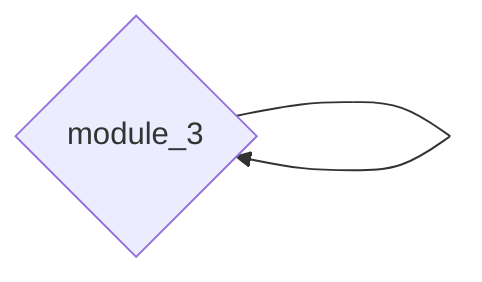
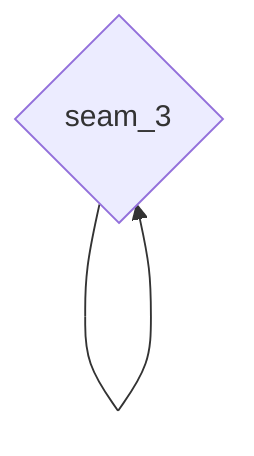

# 遗留系统分析报告

## 1. 系统概览

| 属性       | 值              |
| ---------- | --------------- |
| 源技术栈   | ${source_stack} |
| 目标技术栈 | ${target_stack} |
| 分析时间   | ${timestamp}    |
| 代码行数   | ${loc}          |
| 文件数     | ${file_count}   |
| 模块数     | ${module_count} |

---

## 2. 架构分析

### 2.1 当前架构模式

**模式**: ${architecture_pattern}

${architecture_description}

### 2.2 架构图

```mermaid
graph TD
    subgraph Frontend
        A[${frontend_entry}]
    end
    subgraph Backend
        B[${backend_service_1}]
        C[${backend_service_2}]
    end
    subgraph Data
        D[(${database})]
    end
    A --> B
    A --> C
    B --> D
    C --> D
```

### 2.3 技术栈详情

**前端**:
| 组件 | 技术 | 版本 | 状态 |
|------|------|------|------|
| ${component} | ${tech} | ${version} | ${status} |

**后端**:
| 组件 | 技术 | 版本 | 状态 |
|------|------|------|------|
| ${component} | ${tech} | ${version} | ${status} |

**数据层**:
| 组件 | 技术 | 版本 | 状态 |
|------|------|------|------|
| ${component} | ${tech} | ${version} | ${status} |

---

## 3. 耦合分析

### 3.1 模块依赖图



### 3.2 耦合热点

| 模块           | 耦合度            | 依赖数  | 被依赖数      | 风险    |
| -------------- | ----------------- | ------- | ------------- | ------- |
| ${module_name} | ${coupling_score} | ${deps} | ${dependents} | ${risk} |

### 3.3 循环依赖

| 循环链      | 涉及模块   | 严重程度    |
| ----------- | ---------- | ----------- |
| ${cycle_id} | ${modules} | ${severity} |

---

## 4. 技术债务评估

### 4.1 技术债务评分

**总评分**: ${debt_score}/100

| 维度       | 评分             | 权重 | 加权分        |
| ---------- | ---------------- | ---- | ------------- |
| 代码质量   | ${code_quality}  | 30%  | ${weighted_1} |
| 架构清晰度 | ${arch_clarity}  | 25%  | ${weighted_2} |
| 测试覆盖   | ${test_coverage} | 20%  | ${weighted_3} |
| 依赖健康度 | ${dep_health}    | 15%  | ${weighted_4} |
| 文档完整度 | ${doc_complete}  | 10%  | ${weighted_5} |

### 4.2 过时依赖

| 依赖        | 当前版本   | 最新版本  | 风险等级 | 说明    |
| ----------- | ---------- | --------- | -------- | ------- |
| ${dep_name} | ${current} | ${latest} | ${risk}  | ${note} |

### 4.3 代码气味统计

| 气味类型      | 数量     | 严重程度    | 主要位置     |
| ------------- | -------- | ----------- | ------------ |
| ${smell_type} | ${count} | ${severity} | ${locations} |

### 4.4 安全漏洞

| 漏洞         | CVE       | 严重程度    | 影响组件     | 修复建议 |
| ------------ | --------- | ----------- | ------------ | -------- |
| ${vuln_name} | ${cve_id} | ${severity} | ${component} | ${fix}   |

---

## 5. 迁移接缝分析

### 5.1 识别的接缝

| 优先级 | 接缝名称  | 类型      | 风险      | 依赖数    | 建议            |
| ------ | --------- | --------- | --------- | --------- | --------------- |
| 1      | ${seam_1} | ${type_1} | 🟢 Low    | ${deps_1} | ${suggestion_1} |
| 2      | ${seam_2} | ${type_2} | 🟡 Medium | ${deps_2} | ${suggestion_2} |
| 3      | ${seam_3} | ${type_3} | 🔶 High   | ${deps_3} | ${suggestion_3} |

### 5.2 接缝依赖关系



---

## 6. 迁移策略

### 6.1 推荐策略

**${recommended_strategy}**

${strategy_rationale}

### 6.2 策略对比

| 策略               | 适用性     | 风险        | 成本        | 周期            |
| ------------------ | ---------- | ----------- | ----------- | --------------- |
| Strangler Fig      | ${sf_fit}  | ${sf_risk}  | ${sf_cost}  | ${sf_duration}  |
| Big Bang           | ${bb_fit}  | ${bb_risk}  | ${bb_cost}  | ${bb_duration}  |
| Service-by-Service | ${sbs_fit} | ${sbs_risk} | ${sbs_cost} | ${sbs_duration} |

### 6.3 迁移阶段

```mermaid
gantt
    title 迁移时间线
    dateFormat YYYY-MM-DD
    section Phase 1
    ${phase_1_task}    :a1, ${start_1}, ${duration_1}
    section Phase 2
    ${phase_2_task}    :a2, after a1, ${duration_2}
    section Phase 3
    ${phase_3_task}    :a3, after a2, ${duration_3}
```

---

## 7. 风险评估

### 7.1 风险矩阵

| 风险         | 影响      | 可能性        | 等级     | 缓解措施      |
| ------------ | --------- | ------------- | -------- | ------------- |
| ${risk_name} | ${impact} | ${likelihood} | ${level} | ${mitigation} |

### 7.2 风险分布

| 等级        | 数量              | 占比                 |
| ----------- | ----------------- | -------------------- |
| 🟢 Low      | ${low_count}      | ${low_percent}%      |
| 🟡 Medium   | ${medium_count}   | ${medium_percent}%   |
| 🔶 High     | ${high_count}     | ${high_percent}%     |
| 🔴 Critical | ${critical_count} | ${critical_percent}% |

---

## 8. 下一步建议

### 8.1 立即行动

1. ${immediate_action_1}
2. ${immediate_action_2}
3. ${immediate_action_3}

### 8.2 短期计划（1-3 月）

1. ${short_term_1}
2. ${short_term_2}
3. ${short_term_3}

### 8.3 长期规划（3-12 月）

1. ${long_term_1}
2. ${long_term_2}
3. ${long_term_3}

---

## 附录

### A. 分析工具

- 后端分析: codex-cli
- 前端分析: gemini-cli
- 语义分析: auggie-mcp
- 文档查询: context7

### B. 参考文档

- 迁移策略: references/migration-strategies.md
- 遗留系统最佳实践: /commands/refactor/references/legacy-modernization.md

---

分析时间: ${timestamp}
分析模型: Codex + Gemini
