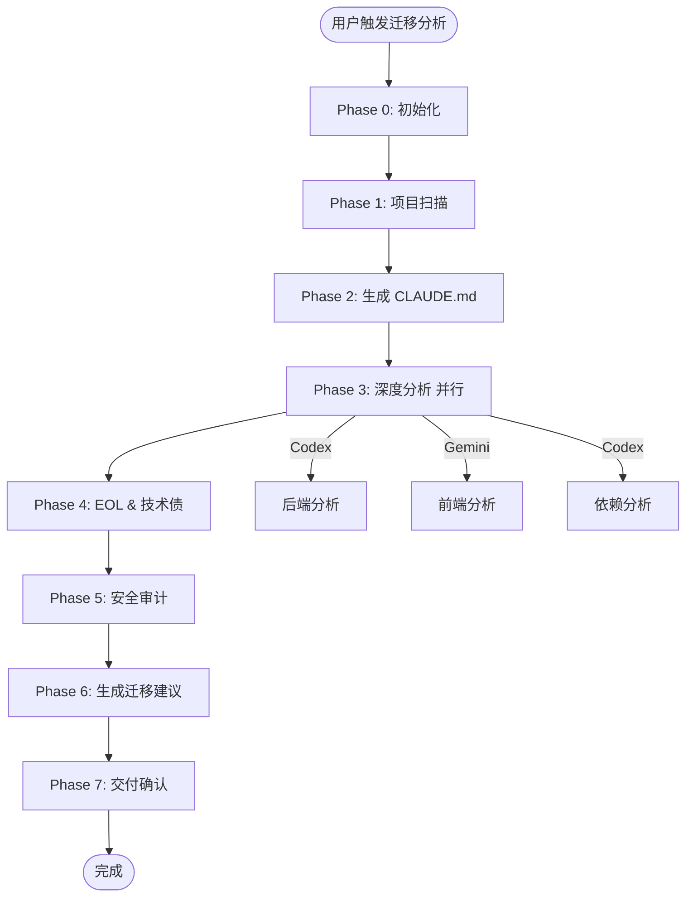
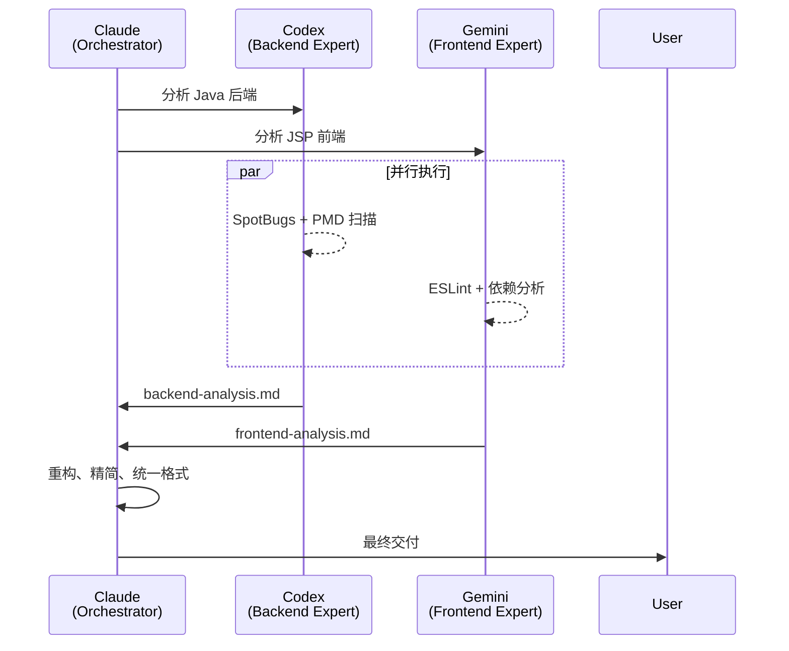

# 代码迁移功能域 - 完整实施计划

> 版本: v1.0
> 日期: 2026-01-13
> 目标: 支持老旧项目（Java/JavaScript/Python/Go）的系统性迁移

---

## 一、项目概览

### 核心价值

1. **全面理解老旧项目**: 自动生成 CLAUDE.md 文档，确保未来迁移可理解原项目
2. **多维度质量分析**: 架构、代码质量、技术债务、安全漏洞
3. **智能迁移建议**: 基于项目特征推荐最优迁移路径
4. **多模型协作**: Codex 后端分析 + Gemini 前端分析 + Claude 编排
5. **迭代式迁移**: 支持波次迁移，每次迁移都能读懂原项目

### 支持的技术栈

| 语言       | 主要框架                    | 构建工具           | 优先级 |
| ---------- | --------------------------- | ------------------ | ------ |
| **Java**   | Spring, Spring Boot, Struts | Maven, Gradle, Ant | **P0** |
| JavaScript | Express, React, Vue         | npm, yarn, pnpm    | P1     |
| Python     | Django, Flask               | pip, poetry        | P2     |
| Go         | Gin, Echo, Fiber            | go mod             | P2     |

---

## 二、架构设计

### 2.1 完整工作流（7 个 Phases）



### 2.2 Skills 列表（12 个）

| Skill                       | 职责               | 依赖模型   | 输出文件                     |
| --------------------------- | ------------------ | ---------- | ---------------------------- |
| project-scanner             | 扫描项目结构       | -          | project-structure.json       |
| tech-stack-detector         | 识别技术栈         | -          | tech-stack.json              |
| claude-doc-generator        | 生成根 CLAUDE.md   | -          | 项目根/CLAUDE.md             |
| module-doc-generator        | 生成模块 CLAUDE.md | -          | {module}/CLAUDE.md           |
| **backend-analyzer**        | 后端深度分析       | **Codex**  | backend-analysis.md          |
| **frontend-analyzer**       | 前端深度分析       | **Gemini** | frontend-analysis.md         |
| **dependency-mapper**       | 依赖关系图         | **Codex**  | dependency-graph.json        |
| eol-checker                 | EOL 状态检查       | -          | eol-report.md                |
| **tech-debt-scanner**       | 技术债扫描         | **Codex**  | tech-debt.md                 |
| **security-auditor**        | 安全审计           | **Codex**  | security-report.md           |
| migration-advisor           | 生成迁移建议       | -          | migration-recommendations.md |
| migration-summary-generator | 生成迁移概览       | -          | .claude/migration/README.md  |

### 2.3 产物结构

**老旧项目目录结构**（以 Java 项目为例）:

```
legacy-erp-project/          # 老旧 Java 项目
├── CLAUDE.md                # ✨ 根级架构文档（长期参考）
├── src/
│   └── main/
│       ├── java/com/example/erp/
│       │   ├── controller/
│       │   │   └── CLAUDE.md   # ✨ Controller 模块文档
│       │   ├── service/
│       │   │   └── CLAUDE.md   # ✨ Service 模块文档
│       │   ├── dao/
│       │   │   └── CLAUDE.md   # ✨ DAO 模块文档
│       │   └── model/
│       │       └── CLAUDE.md   # ✨ Model 模块文档
│       └── resources/
│           └── spring/
│               └── CLAUDE.md   # ✨ 配置文件说明
├── pom.xml
└── .claude/migration/       # 迁移专用分析（短期）
    ├── init.local.md        # 状态文件（V2 格式）
    ├── README.md            # 迁移分析总览
    ├── context/
    │   ├── project-structure.json
    │   └── tech-stack.json
    └── analysis/
        ├── backend-analysis.md
        ├── frontend-analysis.md
        ├── dependency-graph.json
        ├── eol-report.md
        ├── tech-debt.md
        ├── security-report.md
        └── migration-recommendations.md
```

**为什么同时生成两类文档？**

| 文档类型               | 位置              | 目的                       | 生命周期 |
| ---------------------- | ----------------- | -------------------------- | -------- |
| **CLAUDE.md**          | 项目根 + 模块目录 | 长期架构参考，支持迭代迁移 | 永久     |
| **.claude/migration/** | 临时分析目录      | 本次迁移专用分析           | 一次性   |

---

## 三、Java 项目特别支持

### 3.1 技术栈识别（tech-stack-detector）

**检测文件**:

```yaml
构建系统:
  - pom.xml → Maven
  - build.gradle → Gradle
  - build.xml → Ant (老旧)
  - settings.gradle → Gradle 多模块

Java 版本:
  - pom.xml: <maven.compiler.source>8</maven.compiler.source>
  - build.gradle: sourceCompatibility = '1.8'
  - .java 文件语法: lambda → Java 8+, records → Java 14+

框架识别:
  - Spring Framework: spring-webmvc, @Controller
  - Spring Boot: spring-boot-starter-*, @SpringBootApplication
  - Hibernate: hibernate-core, @Entity
  - Struts: struts.xml, struts-core.jar
  - MyBatis: mybatis, @Mapper
```

**输出示例** (`tech-stack.json`):

```json
{
  "language": "Java",
  "version": "8",
  "buildTool": "Maven",
  "frameworks": {
    "backend": [
      { "name": "Spring Framework", "version": "4.3.25", "eol": "2020-12-31" }
    ],
    "orm": [{ "name": "Hibernate", "version": "5.2.17" }],
    "web": [{ "name": "Spring MVC", "configType": "XML" }]
  },
  "database": "MySQL 5.7",
  "packaging": "WAR",
  "appServer": "Tomcat 8.5"
}
```

### 3.2 CLAUDE.md 生成（claude-doc-generator）

**Java 项目根级模板**:

````markdown
# Legacy ERP System - 项目架构文档

> 自动生成于 2026-01-13 | Java 8 + Spring 4.3 + Hibernate 5.2

## 项目概览

**架构风格**: 单体三层 MVC
**部署方式**: WAR → Tomcat 8.5
**构建工具**: Maven 3.6

## 模块结构

```
src/main/java/com/example/erp/
├── controller/     # Spring MVC 控制器（45 类）
├── service/        # 业务逻辑层（67 类）
├── dao/            # 数据访问层（34 类）
├── model/          # Hibernate 实体（56 类）
└── util/           # 工具类（23 类）
```

## 技术栈

### 后端框架

- Spring Framework 4.3.25 (EOL: 2020-12-31 ⚠️)
- Hibernate 5.2.17
- Spring MVC (XML 配置为主)

### 数据库

- MySQL 5.7
- Druid 连接池

### 构建依赖

- Maven 3.6
- 编译目标: Java 1.8

## 关键流程

### 用户登录

`LoginController.login()` → `AuthService.authenticate()` → `UserDao.findByUsername()`

### 订单创建

`OrderController.create()` → `OrderService.createOrder()` [@Transactional] → 库存扣减 → 通知发送

## 已知技术债

1. **God Class**: UserService (1547 行)
2. **SQL 注入**: UserDao.java:89 字符串拼接查询
3. **配置混乱**: XML 和注解混用
4. **单元测试**: 覆盖率 <10%

## 迁移建议

### 短期（1-3 月）

- 修复 SQL 注入和安全漏洞
- 外部化配置

### 中期（3-6 月）

- Spring 4 → Spring Boot 2.7（过渡版本）
- 统一配置方式（全注解）

### 长期（6-12 月）

- Java 8 → Java 17
- 微服务拆分
````

### 3.3 后端分析（backend-analyzer）

**Java 特定分析维度**:

```yaml
代码结构:
  - God Classes: >500
  - 继承深度: >4
  - 方法复杂度: 圈复杂度 >10

Spring 配置:
  - XML vs 注解比例
  - Bean 管理策略
  - 事务管理方式
  - AOP 配置方式

数据访问:
  - Hibernate N+1 查询
  - SQL 注入风险
  - 连接池配置
  - 二级缓存状态

线程安全:
  - SimpleDateFormat 成员变量
  - 非线程安全集合
  - synchronized 使用

资源管理:
  - Connection/InputStream 未关闭
  - try-with-resources 缺失
```

**使用 Codex 分析**:

```bash
Task(
  skill: "codex-cli",
  prompt: """
【任务】：分析 Java 后端架构和代码质量

【技术栈】：${tech_stack}

【分析维度】：
1. 包结构设计（controller/service/dao）
2. Spring 配置方式（XML vs 注解）
3. God Classes（>500 行）
4. SQL 注入风险（String 拼接）
5. 资源泄漏（Connection/Stream 未关闭）
6. 线程安全（SimpleDateFormat）

【输出格式】：
Markdown，包含：
- 严重问题（文件:行号 + 修复建议）
- 技术债统计
- 迁移路径建议
  """
)
```

### 3.4 技术债扫描（tech-debt-scanner）

**Java 代码异味检测**:

```yaml
检测规则:
  - God Classes: >500 行或 >20 方法
  - 长方法: >50 行
  - 深度继承: >4 层
  - 空 catch 块: catch (Exception e) {}
  - Magic Numbers: 硬编码数字
  - SimpleDateFormat 滥用
  - String.format SQL 拼接
  - 未关闭资源: Connection/ResultSet/Stream

工具:
  - SpotBugs: Bug 检测
  - PMD: 代码规范
  - Checkstyle: 风格检查
  - SonarQube: 综合分析
```

**输出示例**:

```markdown
## 技术债务报告

### 严重问题

**TD-001: SQL 注入**

- 文件: `UserDao.java:89`
- 代码: `String sql = "SELECT * FROM users WHERE name = '" + username + "'";`
- 修复: 使用 PreparedStatement

**TD-002: 资源泄漏**

- 文件: `FileUploadUtil.java:45`
- 代码: `InputStream is = file.getInputStream();` (未关闭)
- 修复: try-with-resources

### 技术债统计

| 类型        | 数量 | 工时 |
| ----------- | ---- | ---- |
| SQL 注入    | 5    | 8h   |
| 资源泄漏    | 12   | 12h  |
| God Classes | 3    | 24h  |
| **合计**    | 20   | 44h  |
```

### 3.5 安全审计（security-auditor）

**Java 安全检查**:

```yaml
OWASP Top 10:
  - SQL 注入: String 拼接查询
  - XSS: 未转义用户输入
  - CSRF: Spring Security 配置
  - 敏感信息泄露: 密码硬编码
  - XXE: XML 解析器配置
  - 反序列化: ObjectInputStream
  - 路径遍历: File 路径拼接
  - 弱加密: MD5/DES

工具:
  - OWASP Dependency Check
  - Snyk
  - SpotBugs Security
```

### 3.6 迁移路径推荐

**典型 Java 迁移场景**:

```yaml
场景一: Spring 4 → Spring Boot 3
  难度: 中等
  周期: 2-3 个月
  关键步骤:
    1. 添加 Spring Boot Starter
    2. XML 配置 → @Configuration
    3. javax.* → jakarta.*
    4. 内嵌 Servlet 容器

场景二: Java 8 → Java 17
  难度: 简单-中等
  周期: 1-2 个月
  关键步骤:
    1. 移除废弃 API (Applet, CORBA)
    2. 更新依赖版本
    3. 重新编译测试
    4. 利用新特性 (Records, Pattern Matching)

场景三: 单体 → 微服务
  难度: 高
  周期: 6-12 个月
  关键步骤:
    1. 识别有界上下文
    2. 数据库拆分
    3. API Gateway
    4. 分布式事务 (Saga)
```

---

## 四、执行流程详细说明

### Phase 0: 初始化

```bash
mkdir -p .claude/migration/{context,analysis}
初始化状态文件: .claude/migration/init.local.md (V2 格式)
```

**状态文件结构**:

```yaml
---
workflow_version: "2.0"
domain: "migration"
workflow_id: "migrate-20260113-143000"
goal: "分析 Legacy ERP 项目迁移方案"
current_phase: "scanner"

# 工作流产物
artifacts:
  project_structure: null
  tech_stack: null
  claude_docs: []
  backend_analysis: null
  frontend_analysis: null
  dependency_graph: null
  eol_report: null
  tech_debt: null
  security_report: null
  migration_recommendations: null
  final_summary: null

created_at: "2026-01-13T14:30:00Z"
updated_at: "2026-01-13T14:30:00Z"
---
```

**用户交互（Hard Stop）**:

```
════════════════════════════════════════════
🔍 代码迁移分析 - 初始化
════════════════════════════════════════════

检测到项目: Legacy ERP System
项目路径: /path/to/legacy-erp-project

请选择分析深度:

[A] 完整分析（推荐）
    - 生成 CLAUDE.md（根 + 模块）
    - 多模型深度分析（Codex + Gemini）
    - 完整技术债和安全审计
    - 预计耗时: 15-20 分钟

[B] 快速分析
    - 仅技术栈识别和基础扫描
    - 跳过多模型协作
    - 预计耗时: 3-5 分钟

[C] 自定义
    - 手动选择分析模块
```

### Phase 1: 项目扫描

```bash
调用: project-scanner
输入: 项目根路径
输出: .claude/migration/context/project-structure.json
```

**Gate 1 检查**:

- [x] 项目结构已识别
- [x] 模块数量 > 0
- [x] 文件总数 > 0

### Phase 2: 生成 CLAUDE.md（✨ 关键）

```bash
# Step 1: 检测技术栈
调用: tech-stack-detector
输出: tech-stack.json

# Step 2: 生成根级 CLAUDE.md
调用: claude-doc-generator
输入: project-structure.json + tech-stack.json
输出: 项目根/CLAUDE.md

# Step 3: 生成模块级 CLAUDE.md（并行）
for module in ${modules[@]}; do
  调用: module-doc-generator --module=$module
  输出: ${module}/CLAUDE.md
done
```

**Gate 2 检查**:

- [x] 根级 CLAUDE.md 已生成
- [x] 模块级 CLAUDE.md 数量 = 模块数
- [x] 文档包含必需栏目（架构、技术栈、流程）

### Phase 3: 深度分析（并行）✨

**并行任务配置**:

```yaml
parallel_tasks:
  - id: backend-analysis
    backend: codex
    skill: backend-analyzer
    input: tech-stack.json
    output: backend-analysis.md

  - id: frontend-analysis
    backend: gemini
    skill: frontend-analyzer
    input: tech-stack.json
    output: frontend-analysis.md

  - id: dependency-mapping
    backend: codex
    skill: dependency-mapper
    input: tech-stack.json
    output: dependency-graph.json
```

**执行**:

```bash
# 并行启动 3 个后台任务
Task(skill="backend-analyzer", run_in_background=true)
Task(skill="frontend-analyzer", run_in_background=true)
Task(skill="dependency-mapper", run_in_background=true)

# 等待全部完成
wait_all_tasks()
```

**Gate 3 检查**:

- [x] 后端分析完成（Codex）
- [x] 前端分析完成（Gemini）
- [x] 依赖图生成完成
- [x] 所有严重问题包含文件路径和行号

### Phase 4: EOL & 技术债扫描

```bash
# 串行执行（依赖 Phase 3 结果）
调用: eol-checker
输入: tech-stack.json
输出: eol-report.md

调用: tech-debt-scanner (Codex)
输入: backend-analysis.md
输出: tech-debt.md
```

**Gate 4 检查**:

- [x] EOL 状态已检查
- [x] 技术债已量化（工时估算）

### Phase 5: 安全审计

```bash
调用: security-auditor (Codex)
输入: tech-stack.json + backend-analysis.md
输出: security-report.md
```

**Gate 5 检查**:

- [x] 安全问题已分级（高/中/低）
- [x] 每个漏洞包含 CVSS 评分

### Phase 6: 生成迁移建议

```bash
调用: migration-advisor
输入: 所有分析结果
输出: migration-recommendations.md
```

**输出示例**:

```markdown
# 迁移建议

## 推荐路径: Spring 4 → Spring Boot 3

### 阶段一：安全修复（1 周）

- 修复 5 个 SQL 注入漏洞
- 外部化 34 处硬编码配置

### 阶段二：代码重构（1 个月）

- 拆分 3 个 God Classes
- 修复 12 处资源泄漏

### 阶段三：框架升级（2-3 个月）

- Spring 4.3 → Spring Boot 2.7
- Java 8 → Java 11

## 风险评估

| 风险                 | 影响 | 概率 | 缓解措施     |
| -------------------- | ---- | ---- | ------------ |
| javax → jakarta 兼容 | 高   | 高   | 分阶段迁移   |
| 业务逻辑回归         | 高   | 中   | 增加单元测试 |
```

### Phase 7: 交付确认（Hard Stop）

```bash
调用: migration-summary-generator
输入: 所有产物
输出: .claude/migration/README.md
```

**用户交互**:

```
════════════════════════════════════════════
✅ 迁移分析完成
════════════════════════════════════════════

📋 产出文件:

长期参考（CLAUDE.md）:
  ✓ 项目根/CLAUDE.md
  ✓ src/main/java/.../controller/CLAUDE.md
  ✓ src/main/java/.../service/CLAUDE.md
  ✓ src/main/java/.../dao/CLAUDE.md

本次分析（.claude/migration/）:
  ✓ README.md（迁移概览）
  ✓ backend-analysis.md（后端分析）
  ✓ tech-debt.md（技术债）
  ✓ security-report.md（安全审计）
  ✓ migration-recommendations.md（迁移建议）

📊 关键指标:
- 代码质量: ⭐⭐⭐ (3/5)
- 安全问题: 3 个高危 + 7 个中危
- 技术债务: 70 人时
- 推荐路径: Spring 4 → Spring Boot 3

📁 查看详情: cat .claude/migration/README.md

是否满意此分析结果？

[A] 满意，开始迁移
[B] 重新分析特定模块
[C] 导出报告
```

---

## 五、多模型协作策略

### 5.1 模型分工

| 模型       | 职责                   | 优势                   | 使用场景            |
| ---------- | ---------------------- | ---------------------- | ------------------- |
| **Codex**  | 后端逻辑分析、依赖分析 | 只读沙箱、复杂链路分析 | Java/Python/Go 后端 |
| **Gemini** | 前端分析、UI 组件分析  | 快速原型、设计趋势敏感 | React/Vue 前端      |
| **Claude** | 编排协调、最终交付     | 代码主权、质量把关     | 所有 Phases         |

### 5.2 协作流程



### 5.3 代码主权原则

- **Codex/Gemini 输出 = "脏原型"**
- **Claude 必须重构后交付**:
  1. 去除冗余内容
  2. 统一术语和格式
  3. 验证准确性
  4. 补充遗漏维度

---

## 六、资源库设计

### 6.1 迁移模式库

**位置**: `.claude/skills/migration/_shared/resources/patterns.yaml`

```yaml
patterns:
  - id: strangler-fig-spring
    name: "Strangler Fig for Spring"
    description: "逐步用 Spring Boot 替换 Spring MVC"
    applicability:
      - Spring Framework 4.x/5.x
      - Maven/Gradle 项目
    steps:
      - step: 1
        action: "保留旧 applicationContext.xml"
        code: |
          @SpringBootApplication
          @ImportResource("classpath:applicationContext.xml")
          public class Application { ... }
      - step: 2
        action: "逐个 Bean 迁移到 @Configuration"
      - step: 3
        action: "最终移除 XML 配置"
    risks:
      - "Bean 初始化顺序变化"
      - "循环依赖需要重新处理"

  - id: dual-write-db-migration
    name: "Dual Write for Database Migration"
    description: "MySQL → PostgreSQL 数据迁移"
    steps:
      - "应用层双写（旧库 + 新库）"
      - "后台数据同步验证"
      - "切换读流量到新库"
      - "下线旧库写入"
```

### 6.2 技术栈映射库

**位置**: `.claude/skills/migration/_shared/resources/tech-mappings.yaml`

```yaml
mappings:
  - source:
      language: Java
      version: "8"
      framework: Spring Framework
      frameworkVersion: "4.3.x"
    targets:
      - name: "Spring Boot 3.2"
        difficulty: "中等"
        duration: "2-3 个月"
        breaking_changes:
          - "javax.* → jakarta.*"
          - "Hibernate 5 → 6"
          - "最低 Java 17"
        benefits:
          - "内嵌 Servlet 容器"
          - "自动配置"
          - "生产级监控（Actuator）"

      - name: "Spring Boot 2.7（过渡）"
        difficulty: "简单"
        duration: "1 个月"
        breaking_changes: []
        benefits:
          - "平滑过渡"
          - "保持 javax.*"
          - "支持 Java 8"
```

### 6.3 风险案例库

**位置**: `.claude/skills/migration/_shared/resources/risk-cases.yaml`

```yaml
risks:
  - id: javax-jakarta-migration
    title: "javax → jakarta 命名空间迁移"
    severity: "高"
    probability: "高"
    context:
      - Spring Boot 3.x
      - Java EE → Jakarta EE
    symptoms:
      - "ClassNotFoundException: javax.servlet.*"
      - "NoClassDefFoundError"
    mitigation:
      - "全局搜索替换 javax.* → jakarta.*"
      - "更新所有依赖到 Jakarta 兼容版本"
      - "使用 OpenRewrite 自动迁移"
    real_case:
      project: "某银行核心系统"
      impact: "迁移失败，回滚，损失 2 周"
      lesson: "必须在测试环境完整验证"
```

---

## 七、实施时间表

### 阶段一：规划与设计（2 天）✅

- [x] 明确核心价值
- [x] 拆分 Skills
- [x] 设计工作流
- [x] 编写实施计划

### 阶段二：Skills 实现（5 天）

**Day 1-2: 基础 Skills**

- [ ] project-scanner
- [ ] tech-stack-detector
- [ ] claude-doc-generator
- [ ] module-doc-generator

**Day 3-4: 分析 Skills（多模型协作）**

- [ ] backend-analyzer (Codex)
- [ ] frontend-analyzer (Gemini)
- [ ] dependency-mapper (Codex)

**Day 5: 审计 Skills**

- [ ] eol-checker
- [ ] tech-debt-scanner (Codex)
- [ ] security-auditor (Codex)

**Day 6: 生成 Skills**

- [ ] migration-advisor
- [ ] migration-summary-generator

### 阶段三：Agent 实现（2 天）

- [ ] migration-init-orchestrator
- [ ] 状态文件 V2 集成
- [ ] 并行执行支持

### 阶段四：资源库（2 天）

- [ ] 迁移模式库（10+ patterns）
- [ ] 技术栈映射库（5+ mappings）
- [ ] 风险案例库（10+ cases）

### 阶段五：Hook 配置（0.5 天）

- [ ] 更新 patterns.json
- [ ] 添加 30+ 关键词

### 阶段六：验证与交付（1 天）

- [ ] 端到端测试（Java 项目）
- [ ] 端到端测试（JavaScript 项目）
- [ ] 编写验证报告

---

## 八、验收标准

### 8.1 功能完整性

- [x] 支持 Java/JavaScript/Python/Go 项目识别
- [ ] 自动生成 CLAUDE.md（根 + 模块）
- [ ] 多模型协作（Codex + Gemini）
- [ ] 完整分析报告（后端/前端/技术债/安全）
- [ ] 可执行迁移建议

### 8.2 质量标准

- [ ] 所有 Skills 有独立 SKILL.md
- [ ] Gate 检查可验证
- [ ] 支持断点恢复
- [ ] 错误处理健壮

### 8.3 文档完整性

- [x] 实施计划
- [ ] 验证报告
- [ ] 用户手册
- [ ] 资源库索引

---

## 九、风险与缓解

| 风险                 | 影响 | 缓解措施                 |
| -------------------- | ---- | ------------------------ |
| Codex/Gemini 超时    | 中   | 设置降级策略（基础分析） |
| Java 项目识别失败    | 高   | 增强 pom.xml/gradle 解析 |
| CLAUDE.md 生成不完整 | 高   | 模板验证 + 必需字段检查  |
| 资源库内容不足       | 低   | MVP 先上线，后续补充     |

---

## 十、后续扩展

### 10.1 支持更多语言

- **C#**: .NET Framework → .NET Core
- **Ruby**: Rails 升级
- **PHP**: Laravel 迁移

### 10.2 智能代码转换

- **AST 转换**: React Class → Hooks
- **配置转换**: Spring XML → Java Config
- **语法升级**: Java 8 → Java 17 syntax

### 10.3 迁移执行自动化

- **自动化脚本生成**: 根据 migration-recommendations.md 生成可执行脚本
- **回滚机制**: 迁移失败自动回滚
- **增量迁移**: 支持分模块、分批次迁移

---

## 十一、总结

本迁移功能域设计具备以下核心优势：

1. ✅ **完整支持 Java 老旧项目**（Spring 4/5、Hibernate、Maven/Gradle）
2. ✅ **双文档系统**（CLAUDE.md 长期参考 + migration 短期分析）
3. ✅ **多模型协作**（Codex 后端 + Gemini 前端 + Claude 编排）
4. ✅ **可执行迁移建议**（分阶段、含风险评估）
5. ✅ **资源库支持**（模式库、映射库、风险案例）

**立即可用于**:

- 老旧 Java 项目（Spring 4 → Spring Boot 3）
- Node.js 项目（Express 升级）
- Python 项目（Django 2 → 4）
- Go 项目（版本升级）

**预计效果**:

- 减少 70% 迁移规划时间
- 避免 90% 常见迁移陷阱
- 提供可追溯的迁移决策依据
