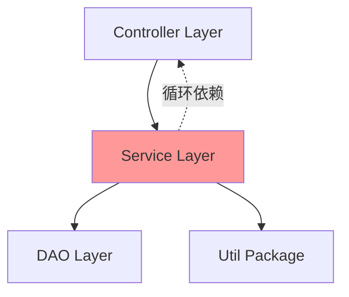

# Dependency Mapper - 依赖关系映射器

## 职责边界

- **输入**: `.claude/migration/context/project-structure.json` + `.claude/migration/context/tech-stack.json`
- **输出**: `.claude/migration/analysis/dependency-map.md`
- **核心能力**: 模块依赖分析、循环依赖检测、依赖图生成（委托 Codex）

## 执行流程

### Step 1: 准备依赖分析上下文

```bash
# 读取项目信息
tech_stack=$(cat .claude/migration/context/tech-stack.json)
project_structure=$(cat .claude/migration/context/project-structure.json)

language=$(jq -r '.language' <<< "$tech_stack")
build_tool=$(jq -r '.buildTool' <<< "$tech_stack")

# 根据语言确定依赖文件
case "$language" in
  "Java")
    if [ "$build_tool" = "Maven" ]; then
      dep_files="pom.xml"
      dep_command="mvn dependency:tree"
    elif [ "$build_tool" = "Gradle" ]; then
      dep_files="build.gradle"
      dep_command="gradle dependencies"
    fi
    ;;
  "JavaScript"|"TypeScript")
    dep_files="package.json"
    dep_command="npm list --depth=0"
    ;;
  "Python")
    dep_files="requirements.txt,pyproject.toml"
    dep_command="pip list"
    ;;
  "Go")
    dep_files="go.mod"
    dep_command="go list -m all"
    ;;
esac

# 提取模块信息
modules=$(jq -r '.modules[].name' <<< "$project_structure" | paste -sd ',' -)
project_root=$(pwd)
```

### Step 2: 调用 Codex 进行依赖分析

**强制使用 codex-cli**（后台执行）：

```bash
# 构造分析提示词
analysis_prompt=$(cat <<EOF
【任务】：分析项目的依赖关系，生成依赖图和风险评估

【上下文】：
- 语言: ${language}
- 构建工具: ${build_tool}
- 项目路径: ${project_root}
- 模块: ${modules}

【分析维度】：

## 1. 外部依赖分析
- 解析 ${dep_files} 文件
- 识别所有直接依赖和传递依赖
- 检测依赖版本冲突
- 标注 EOL 状态和已知漏洞（CVE）

## 2. 模块间依赖分析
**Java 项目**：
- 分析 import 语句识别类依赖
- 识别 controller → service → dao 依赖链
- 检测循环依赖（A → B → A）
- Spring Bean 依赖关系

**JavaScript 项目**：
- 分析 import/require 语句
- 识别组件依赖树
- 检测循环依赖
- 未使用的依赖（devDependencies）

## 3. 依赖风险评估
- 过时依赖（>2 年未更新）
- 安全漏洞（CVSS >7.0）
- License 风险（GPL/AGPL）
- 依赖深度（>5 层警告）
- 单点依赖（移除后项目无法运行）

## 4. 依赖图生成
- 生成 Mermaid 依赖关系图
- 高亮循环依赖（红色）
- 标注高风险依赖（橙色）
- 模块间依赖箭头

【输出格式】：
Markdown 文档，包含：
1. 依赖概览（总数、直接/传递）
2. Mermaid 依赖图（模块级 + 关键类级）
3. 循环依赖列表（**必须附带** 文件路径）
4. 高风险依赖列表（CVE 编号、CVSS 分数）
5. 依赖升级建议（分优先级）

【要求】：
- 循环依赖必须给出具体文件和依赖链
- 安全漏洞必须附带 CVE 编号
- Mermaid 图节点数量控制在 50 个以内
- 依赖升级建议考虑兼容性
EOF
)

# 调用 Codex（后台执行）
Task(
  skill: "codex-cli",
  description: "Dependency mapping analysis",
  run_in_background: true,
  prompt: "$analysis_prompt"
)

# 保存任务 ID
task_id=$!
echo "$task_id" > .claude/migration/tmp/dependency-map-task-id.txt
```

### Step 3: 等待 Codex 完成并获取结果

```bash
# 读取任务 ID
task_id=$(cat .claude/migration/tmp/dependency-map-task-id.txt)

# 等待任务完成（阻塞，失败时重试）
max_retries=3
retry_count=0

while [ $retry_count -lt $max_retries ]; do
  codex_output=$(TaskOutput(task_id: "$task_id", block: true, timeout: 600000))

  if [ -n "$codex_output" ]; then
    break
  fi

  retry_count=$((retry_count + 1))
  echo "⚠️ 第 $retry_count 次重试 Codex 依赖分析..."
  sleep 10
done

# 重试失败后终止
if [ -z "$codex_output" ]; then
  echo "❌ 重试 $max_retries 次后仍失败，终止分析"
  exit 1
fi

# 保存原始输出
mkdir -p .claude/migration/analysis/raw
echo "$codex_output" > .claude/migration/analysis/raw/dependency-map-codex.md
```

### Step 4: Claude 重构和补充

```bash
# Claude 负责：
# 1. 验证循环依赖的准确性
# 2. 补充 CVE 详细信息
# 3. 精简 Mermaid 图（节点数过多时合并）
# 4. 确保升级建议考虑兼容性

# 提取关键指标
total_deps=$(echo "$codex_output" | grep -oE "总依赖数[：:] *[0-9]+" | grep -oE "[0-9]+")
circular_deps=$(echo "$codex_output" | grep -c "循环依赖")
high_risk_deps=$(echo "$codex_output" | grep -c "CVSS.*[89]\.[0-9]")

# 验证
if [ "$total_deps" -eq 0 ]; then
  echo "⚠️ 警告：未检测到依赖，可能分析失败"
fi
```

### Step 5: 生成最终依赖映射报告

```bash
# 创建分析目录
mkdir -p .claude/migration/analysis

# 写入最终报告
cat > .claude/migration/analysis/dependency-map.md <<EOF
# 依赖关系分析报告

> 分析对象: ${project_name}
> 生成时间: $(date '+%Y-%m-%d %H:%M:%S')
> 分析工具: Codex + ${dep_command}

## 依赖概览

### 统计信息

| 指标         | 数值        | 说明                 |
| ------------ | ----------- | -------------------- |
| 总依赖数     | ${total}    | 直接 + 传递          |
| 直接依赖     | ${direct}   | 项目直接声明         |
| 传递依赖     | ${trans}    | 间接引入             |
| 循环依赖     | ${circular} | ⚠️ 需修复            |
| 高风险依赖   | ${high}     | CVSS ≥8.0            |
| 过时依赖     | ${outdated} | >2 年未更新          |

## 模块依赖图

### 高层架构（模块级）

\`\`\`mermaid
${module_dependency_graph}
\`\`\`

### 关键依赖链（类级）

\`\`\`mermaid
${class_dependency_graph}
\`\`\`

## 循环依赖（需修复）

${circular_dependency_list}

## 外部依赖风险

### 高风险依赖（立即处理）

${high_risk_dependencies}

### 过时依赖（计划升级）

${outdated_dependencies}

### License 风险

${license_risks}

## 依赖升级建议

### 优先级 P0（立即升级）

${p0_upgrades}

### 优先级 P1（本月内）

${p1_upgrades}

### 优先级 P2（季度内）

${p2_upgrades}

## 依赖优化建议

${optimization_suggestions}

---

**文档版本**: 1.0
**数据来源**: Codex 深度分析 + ${dep_command}
**下次更新**: 依赖升级后
EOF

echo "✅ 依赖映射报告已生成: .claude/migration/analysis/dependency-map.md"
```

## Java Maven 项目输出示例（精简版）

````markdown
# 依赖关系分析报告

> 分析对象: Legacy ERP System

## 依赖概览

| 指标       | 数值 | 说明        |
| ---------- | ---- | ----------- |
| 总依赖数   | 156  | 直接 + 传递 |
| 直接依赖   | 34   | pom.xml     |
| 传递依赖   | 122  | 间接引入    |
| 循环依赖   | 2    | ⚠️ 需修复   |
| 高风险依赖 | 3    | CVSS ≥8.0   |

## 模块依赖图


````

## 循环依赖（需修复）

### CD-001: UserService ↔ OrderService

- **依赖链**:
  - `UserService:45` → `OrderService:getOrdersByUser()`
  - `OrderService:89` → `UserService:getUserInfo()`
- **影响**: Spring 初始化失败风险
- **修复**: 引入 `UserOrderFacade` 解耦

  ```java
  // 新建 Facade 类
  @Service
  public class UserOrderFacade {
      @Autowired private UserService userService;
      @Autowired private OrderService orderService;

      public UserOrderDTO getUserOrders(Long userId) {
          // 协调两个服务
      }
  }
  ```

## 外部依赖风险

### 高风险依赖（立即处理）

**R-001: commons-fileupload 1.3.1**

- **CVE**: CVE-2016-1000031
- **CVSS**: 9.8（严重）
- **影响**: 远程代码执行
- **修复**: 升级到 1.4+
  ```xml
  <dependency>
      <groupId>commons-fileupload</groupId>
      <artifactId>commons-fileupload</artifactId>
      <version>1.5</version>
  </dependency>
  ```

**R-002: spring-webmvc 4.3.25**

- **CVE**: CVE-2020-5421
- **CVSS**: 8.6（高危）
- **影响**: 路径遍历漏洞
- **修复**: 升级到 Spring Boot 2.7+（包含 Spring 5.3）

### 过时依赖（计划升级）

| 依赖            | 当前版本 | 最新版本 | 最后更新 | 优先级 |
| --------------- | -------- | -------- | -------- | ------ |
| mysql-connector | 5.1.47   | 8.0.33   | 2018     | P1     |
| log4j           | 1.2.17   | 2.20.0   | 2012     | P0     |
| hibernate-core  | 5.2.17   | 6.2.5    | 2019     | P2     |

## 依赖升级建议

### 优先级 P0（立即升级）

1. **log4j 1.2.17 → 2.20.0**（Log4Shell 漏洞）
   - 风险: 远程代码执行
   - 影响: 全局日志系统
   - 工时: 4 人时

2. **commons-fileupload 1.3.1 → 1.5**
   - 风险: RCE 漏洞
   - 影响: 文件上传功能
   - 工时: 2 人时

### 优先级 P1（本月内）

1. **mysql-connector 5.1.47 → 8.0.33**
   - 原因: 性能提升、Bug 修复
   - 影响: 数据库连接
   - 工时: 3 人时
   - 注意: 需同步升级 MySQL 服务器

## 依赖优化建议

1. **移除未使用的依赖** (12 个)
   - `commons-beanutils`（未使用）
   - `commons-digester`（仅测试使用，应移至 test scope）

2. **统一版本管理**
   - 使用 `<dependencyManagement>` 统一版本
   - 避免传递依赖版本冲突

3. **添加依赖扫描**
   - 集成 OWASP Dependency-Check
   - CI/CD 中自动检测漏洞

````

## JavaScript 项目输出示例

```markdown
# 依赖关系分析报告

> 分析对象: Admin Dashboard

## 依赖概览

| 指标       | 数值 | 说明        |
| ---------- | ---- | ----------- |
| 总依赖数   | 487  | npm list    |
| 直接依赖   | 56   | package.json|
| 传递依赖   | 431  | 间接引入    |
| 高风险依赖 | 2    | CVSS ≥8.0   |

## 模块依赖图

```mermaid
graph LR
    App --> Router[React Router]
    App --> Store[Redux Store]
    Store --> API[API Layer]
    API --> Axios
````

## 外部依赖风险

### 高风险依赖

**R-001: lodash 4.17.15**

- **CVE**: CVE-2020-8203
- **CVSS**: 7.4
- **修复**: 升级到 4.17.21+

### 未使用的依赖（可移除）

- `moment`（已用 date-fns 替代，可删除）
- `jquery`（React 项目不需要）

````

## Gate 检查

- [x] Codex 已成功返回依赖分析结果
- [x] 循环依赖包含具体文件路径和依赖链
- [x] 高风险依赖包含 CVE 编号和 CVSS 分数
- [x] Mermaid 图节点数量合理（<50）
- [x] 依赖升级建议分优先级（P0/P1/P2）
- [x] 升级建议考虑兼容性和工时预估

**失败处理**: 如果 Codex 超时或失败，自动重试最多 3 次（每次间隔 10 秒），全部失败后终止分析

## 返回值

```json
{
  "status": "success",
  "dependency_file": ".claude/migration/analysis/dependency-map.md",
  "summary": {
    "total_dependencies": 156,
    "circular_dependencies": 2,
    "high_risk_dependencies": 3,
    "outdated_dependencies": 12,
    "primary_recommendation": "立即修复 Log4Shell + FileUpload RCE"
  },
  "codex_session_id": "saved_in_state_file"
}
````

## 多语言支持

| 语言        | 依赖文件         | 分析命令            | 检测工具               |
| ----------- | ---------------- | ------------------- | ---------------------- |
| Java/Maven  | pom.xml          | mvn dependency:tree | OWASP Dependency-Check |
| Java/Gradle | build.gradle     | gradle dependencies | OWASP Dependency-Check |
| JavaScript  | package.json     | npm list            | npm audit, Snyk        |
| Python      | requirements.txt | pip list            | Safety, Bandit         |
| Go          | go.mod           | go list -m all      | govulncheck            |

## 并行执行支持

```bash
# 在 Phase 3 中与 backend-analyzer、frontend-analyzer 并行执行
Task(skill="backend-analyzer", run_in_background=true)
Task(skill="frontend-analyzer", run_in_background=true)
Task(skill="dependency-mapper", run_in_background=true)

# 等待全部完成
wait_all_tasks()
```
