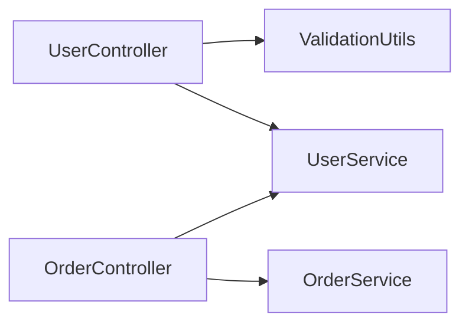
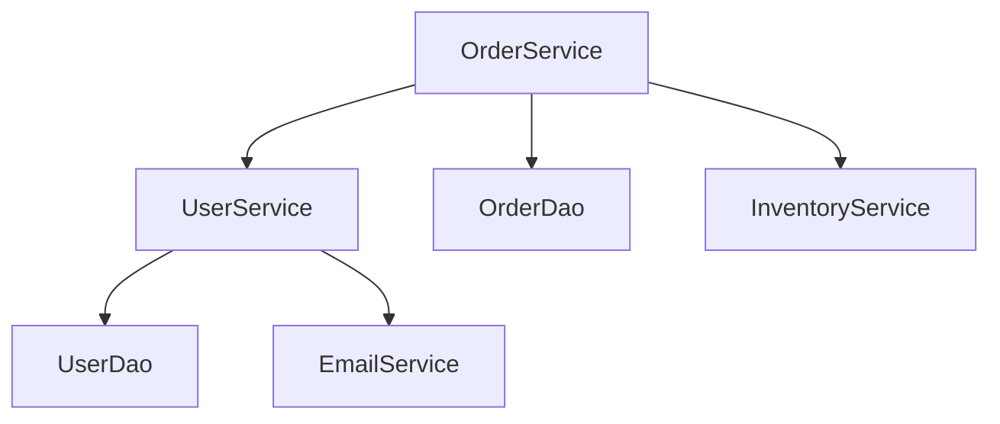
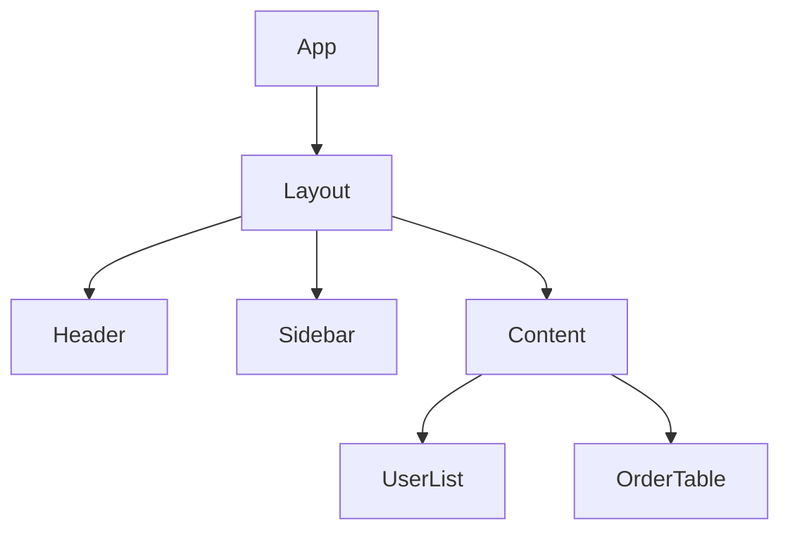

# Module Doc Generator - 模块级 CLAUDE.md 生成器

## 职责边界

- **输入**: `.claude/migration/context/project-structure.json`（遵循标准 schema）
- **输出**: 所有检测到的模块的 `{module_path}/CLAUDE.md`
- **核心能力**: 自动扫描项目中的所有模块，批量生成模块级详细文档
- **数据契约**: 参见 `_shared/schemas/project-structure-schema.md`

## 执行流程

### Step 1: 读取模块列表

**执行步骤**:

1. 使用 Read 工具读取 `.claude/migration/context/project-structure.json`

2. 提取标准字段 `modules` 数组：

   ```javascript
   // JSON 结构示例
   {
     "modules": [
       {"name": "pipe", "path": "apps/pipe", "type": "application"},
       {"name": "3d", "path": "modules/3d", "type": "library"},
       ...
     ]
   }
   ```

3. 如果 `modules` 数组不存在或为空：
   - 报告错误："project-structure.json 缺少标准 modules 数组，请重新运行 project-scanner"
   - 终止 Skill 执行

4. 向用户报告："📋 检测到 {count} 个模块，开始生成文档..."

5. 使用 Read 工具读取 `.claude/migration/context/tech-stack.json` 提取技术栈信息

### Step 2: 循环处理每个模块

**执行步骤**:

对 Step 1 提取的 `modules` 数组中的每个模块对象，执行以下操作：

#### 2.1 识别模块类型

**优先使用 JSON 中的 type 字段**：

- 如果 `module.type` 存在，直接使用（如 "application", "library", "service"）
- 如果 `module.type` 不存在或为 "other"，则根据路径特征推断：

| 路径特征                | 模块类型             | 描述              |
| ----------------------- | -------------------- | ----------------- |
| 包含 "controller"       | Controller Layer     | Spring MVC 控制器 |
| 包含 "service"          | Service Layer        | 业务逻辑层        |
| 包含 "dao"/"repository" | DAO/Repository Layer | 数据访问层        |
| 包含 "model"/"entity"   | Model/Entity Layer   | 实体类和数据模型  |
| 包含 "components"       | React Components     | React 组件        |
| 包含 "pages"            | Page Components      | 页面组件          |
| 包含 "api"/"services"   | API Services         | API 服务层        |
| 其他                    | Generic Module       | 通用模块          |

#### 2.2 扫描模块内容

根据 tech-stack.json 中的语言类型，选择扫描策略：

**Java/Kotlin 模块扫描**（使用 `module.path` 作为扫描目录）:

- 使用 Bash 工具统计类文件数量：`find <module.path> -name "*.java" -type f | wc -l`
- 使用 Bash 工具识别关键类（按行数排序，取前10）：`find <module.path> -name "*.java" -exec wc -l {} + | sort -rn | head -10`
- 使用 Grep 工具搜索注解：`pattern: "^@", path: <module.path>, glob: "*.java", output_mode: "content", head_limit: 20`
- 使用 Grep 工具统计依赖注入：`pattern: "@Autowired", path: <module.path>, glob: "*.java", output_mode: "count"`

**JavaScript/TypeScript 模块扫描**（使用 `module.path` 作为扫描目录）:

- 使用 Bash 工具统计组件文件：`find <module.path> \( -name "*.jsx" -o -name "*.tsx" -o -name "*.vue" \) | wc -l`
- 使用 Bash 工具识别关键组件（按行数排序，取前10）：`find <module.path> \( -name "*.jsx" -o -name "*.tsx" \) -exec wc -l {} + | sort -rn | head -10`
- 使用 Grep 工具搜索 Hooks：`pattern: "use[A-Z][a-zA-Z]*", path: <module.path>, glob: "*.{jsx,tsx}", output_mode: "content"`
- 使用 Grep 工具统计 import 语句：`pattern: "^import", path: <module.path>, glob: "*.{js,ts,jsx,tsx}", output_mode: "count"`

记录扫描结果到内存变量。

#### 2.3 分析代码特征

计算统计指标（使用 `module.path`）：

- 平均代码行数：使用 Bash 工具 `find <module.path> -name "*.java" -exec wc -l {} + | awk '{sum+=$1} END {print sum/NR}'`
- 最大代码行数：从 2.2 的关键文件列表中提取第一个

识别设计模式（仅 Java/Kotlin）：

- 使用 Grep 工具搜索：`pattern: "Factory|Builder|Singleton", path: <module.path>, glob: "*.java", output_mode: "files_with_matches"`

记录所有统计结果。

#### 2.4 生成模块文档

1. 根据 2.1 识别的模块类型，选择对应的文档模板（见下方模板库）：
   - Controller Layer → Controller 层模板（Java）
   - Service Layer → Service 层模板（Java）
   - React Components → React Components 模板
   - **Generic Module（其他）→ Generic Module 模板（通用）**

2. 使用 2.2 和 2.3 收集的数据 + `module.name` 和 `module.path` 填充模板变量

3. 计算面包屑导航路径（根据 `module.path` 的深度）：
   - `apps/pipe` → `[根目录](../../CLAUDE.md)`
   - `modules/3d` → `[根目录](../../CLAUDE.md)`
   - `packages/utils` → `[根目录](../../CLAUDE.md)`

4. 使用 Write 工具将生成的文档写入 `<module.path>/CLAUDE.md`

5. 记录生成结果（成功或失败）

### Step 3: 汇总报告

**执行步骤**:

1. 统计成功生成的模块文档数量（success_count）和总模块数（total_count）
2. 向用户报告：
   - "✅ 成功生成 {success_count}/{total_count} 个模块文档"
   - 如果有失败的模块，列出失败的模块路径和原因
3. 如果至少生成了一个模块文档，标记任务为成功
4. 如果所有模块都失败，向用户报告警告但不终止流程

**文档模板库**:

#### Controller 层模板（Java）:

````markdown
# Controller 层

> Spring MVC 控制器，${count} 个类

## 📍 面包屑导航

[根目录](../../../../../CLAUDE.md) > [Service 层](../service/CLAUDE.md) > **Controller 层**

## 模块概览

**职责**: HTTP 请求处理、参数验证、响应封装
**技术**: Spring MVC ${version}
**配置方式**: ${config_type}（注解 vs XML）

## 关键控制器

| 控制器                 | 路径前缀       | 行数 | 主要功能         |
| ---------------------- | -------------- | ---- | ---------------- |
| UserController.java    | `/api/user`    | 234  | 用户管理（CRUD） |
| OrderController.java   | `/api/order`   | 345  | 订单管理         |
| ProductController.java | `/api/product` | 178  | 商品管理         |

[📄 查看 UserController](./UserController.java)

## 路由设计

```
/api/user
├── GET    /         - 用户列表
├── GET    /{id}     - 用户详情
├── POST   /         - 创建用户
├── PUT    /{id}     - 更新用户
└── DELETE /{id}     - 删除用户
```

## 依赖关系



## 注解使用统计

| 注解            | 使用次数 | 说明        |
| --------------- | -------- | ----------- |
| @RestController | 12       | REST 控制器 |
| @RequestMapping | 45       | 请求映射    |
| @Autowired      | 34       | 依赖注入    |
| @Valid          | 28       | 参数验证    |

## 代码特征

- **平均代码行数**: ${avg_lines} 行/类
- **最大代码行数**: ${max_lines} 行（${file_name}）
- **依赖注入**: ${autowired_count} 处
- **异常处理**: ${exception_count} 处

## 配置方式

### 注解配置（推荐）✅

```java
@RestController
@RequestMapping("/api/user")
public class UserController {
    @Autowired
    private UserService userService;

    @GetMapping("/{id}")
    public ResponseEntity<User> getUser(@PathVariable Long id) {
        // ...
    }
}
```

### XML 配置（老旧）⚠️

```xml
<bean id="userController" class="com.example.UserController">
    <property name="userService" ref="userService"/>
</bean>
```

**建议**: 统一迁移到注解配置

## 已知问题

### 严重问题

1. **过度继承**: BaseController → AbstractController → UserController (4 层)
2. **缺少异常处理**: 无统一 @ExceptionHandler

### 中等问题

1. **参数验证不完整**: 部分接口缺少 @Valid
2. **响应格式不统一**: 混用 ResponseEntity 和 直接返回

## 测试覆盖

- **单元测试**: ${unit_test_count}/${class_count} (${coverage}%)
- **集成测试**: ${integration_test_count}/${class_count} (${coverage}%)

**测试建议**:

- 增加单元测试（目标 80%）
- 添加集成测试（@WebMvcTest）

## 优化建议

### 短期（1-2 周）

1. 添加统一异常处理 (@ControllerAdvice)
2. 统一响应格式（ResponseEntity<Result<T>>）

### 中期（1-2 月）

1. 拆分过大的 Controller
2. 增加参数验证

### 长期（3-6 月）

1. 迁移到 RESTful 最佳实践
2. 引入 OpenAPI 文档

---

**文档版本**: 1.0
**生成时间**: ${timestamp}
**返回**: [根目录](../../../../../CLAUDE.md)
````

**Service 层模板（Java）**:

````markdown
# Service 层

> 业务逻辑层，${count} 个类

## 📍 面包屑导航

[根目录](../../../../../CLAUDE.md) > [DAO 层](../dao/CLAUDE.md) > **Service 层**

## 模块概览

**职责**: 业务逻辑实现、事务管理、数据编排
**事务管理**: Spring @Transactional
**业务规则**: ${rule_count} 条

## 关键服务

| 服务                | 行数 | 事务方法 | 主要职责            |
| ------------------- | ---- | -------- | ------------------- |
| UserService.java    | 1547 | 15       | 用户管理（⚠️ 过大） |
| OrderService.java   | 1203 | 12       | 订单管理（⚠️ 过大） |
| ProductService.java | 234  | 5        | 商品管理            |

## 依赖关系



**循环依赖警告**: UserService ↔ OrderService

## 事务管理

### 事务配置

```java
@Transactional(propagation = Propagation.REQUIRED, timeout = 30)
public void createOrder(Order order) {
    // 业务逻辑
}
```

### 事务边界问题

⚠️ **问题**: `UserService.updateUserProfile()` 方法 450 行，事务过大
✅ **建议**: 拆分为细粒度事务

## 代码质量

### God Classes（需拆分）

1. **UserService** (1547 行)
   - 建议拆分:
     - `UserAuthenticationService` (登录/注册)
     - `UserProfileService` (资料管理)
     - `UserPermissionService` (权限管理)

2. **OrderService** (1203 行)
   - 建议拆分:
     - `OrderCreationService` (订单创建)
     - `OrderPaymentService` (支付处理)
     - `OrderFulfillmentService` (订单履约)

### 业务逻辑复杂度

- **圈复杂度 >10**: ${complex_method_count} 个方法
- **最复杂方法**: `OrderService.processOrder()` (圈复杂度 25)

## 已知问题

1. **事务边界过大**: 3 个方法超过 200 行
2. **缺少单元测试**: 覆盖率 <10%
3. **硬编码业务规则**: 15 处 magic numbers

## 测试覆盖

- **单元测试**: ${unit_test_count}/${class_count} (${coverage}%)
- **Mock 测试**: 使用 Mockito

**测试示例**:

```java
@Test
public void testCreateOrder() {
    // Arrange
    when(orderDao.save(any())).thenReturn(mockOrder);

    // Act
    Order result = orderService.createOrder(order);

    // Assert
    assertNotNull(result);
}
```

---

**文档版本**: 1.0
**返回**: [根目录](../../../../../CLAUDE.md)
````

**React Components 模板（JavaScript）**:

````markdown
# React Components

> React 组件库，${count} 个组件

## 📍 面包屑导航

[根目录](../../../CLAUDE.md) > **Components**

## 模块概览

**技术**: React ${version}
**组件数量**: ${count}
**样式方案**: ${styling}

## 组件分类

### 布局组件

- `Layout.jsx` - 主布局容器
- `Header.jsx` - 顶部导航
- `Sidebar.jsx` - 侧边栏
- `Footer.jsx` - 页脚

### 业务组件

- `UserList.jsx` - 用户列表
- `OrderTable.jsx` - 订单表格
- `ProductCard.jsx` - 商品卡片

### 通用组件

- `Button.jsx` - 按钮
- `Modal.jsx` - 弹窗
- `Form.jsx` - 表单

## Hooks 使用

| Hook        | 使用次数 | 说明     |
| ----------- | -------- | -------- |
| useState    | 45       | 状态管理 |
| useEffect   | 38       | 副作用   |
| useContext  | 12       | 上下文   |
| useCallback | 8        | 回调优化 |
| useMemo     | 5        | 计算优化 |

## 组件依赖



## 代码特征

- **平均行数**: ${avg_lines} 行/组件
- **Props 数量**: 平均 ${avg_props} 个
- **State 变量**: 平均 ${avg_state} 个

## 性能优化

### 需要优化的组件

1. **UserList.jsx** (234 行)
   - 问题: 大列表未虚拟化
   - 建议: 使用 react-window

2. **OrderTable.jsx** (189 行)
   - 问题: 每次渲染都重新计算
   - 建议: 使用 useMemo

## 测试覆盖

- **单元测试**: ${test_count}/${component_count} (${coverage}%)
- **测试库**: Jest + React Testing Library

---

**文档版本**: 1.0
**返回**: [根目录](../../../CLAUDE.md)
````

#### Generic Module 模板（通用）:

````markdown
# {module_name} 模块

> 业务模块，包含 {file_count} 个文件

## 📍 面包屑导航

[根目录](../../CLAUDE.md) > **{module_name}**

## 模块概览

**模块路径**: {module_path}
**文件数量**: {file_count}
**代码行数**: {total_lines}
**主要语言**: {language}

## 目录结构

```
{module_path}/
├── {subdir_1}/   - {description_1}
├── {subdir_2}/   - {description_2}
├── {subdir_3}/   - {description_3}
└── ...
```

## 关键文件

| 文件名   | 行数      | 说明     |
| -------- | --------- | -------- |
| {file_1} | {lines_1} | {desc_1} |
| {file_2} | {lines_2} | {desc_2} |
| {file_3} | {lines_3} | {desc_3} |

## 代码特征

- **平均文件行数**: {avg_lines} 行
- **最大文件**: {max_file} ({max_lines} 行)
- **文件类型分布**: {file_types}

## 依赖引用

主要依赖的库和模块（从 import 语句分析）：

- {dependency_1}
- {dependency_2}
- {dependency_3}

## 技术栈

- **框架**: {framework}
- **构建工具**: {build_tool}
- **测试覆盖**: {test_coverage}

## 已知问题

### 需要关注

1. **代码规模**: {total_lines} 行代码，建议评估是否需要拆分
2. **文件数量**: {file_count} 个文件，注意模块内聚性
3. **测试覆盖**: 当前覆盖率 {test_coverage}，建议提升

## 优化建议

### 短期（1-2 周）

1. 添加模块级README.md说明文档
2. 统一代码风格和命名规范

### 中期（1-2 月）

1. 评估模块职责边界，考虑拆分过大的子模块
2. 增加单元测试覆盖率

### 长期（3-6 月）

1. 迁移到现代化技术栈（根据项目整体迁移策略）
2. 重构遗留代码，减少技术债务

---

**文档版本**: 1.0
**生成时间**: {timestamp}
**返回**: [根目录](../../CLAUDE.md)
````

## Gate 检查

执行完成后，验证以下条件：

- [x] 模块类型已识别
- [x] 关键文件已列出（类/组件）
- [x] 代码统计已完成（行数、数量）
- [x] 依赖关系已分析（如适用）
- [x] 面包屑导航已添加
- [x] 返回链接已添加
- [x] CLAUDE.md 文件已写入 $MODULE_PATH 目录

**失败处理**: 如果模块为空或无法识别类型，生成简化版文档（仅包含基本信息和文件列表）

## 模块类型映射

| 目录特征       | 模块类型         | 文档重点                 |
| -------------- | ---------------- | ------------------------ |
| controller     | Controller Layer | 路由、注解、参数验证     |
| service        | Service Layer    | 事务、业务逻辑、依赖关系 |
| dao/repository | DAO Layer        | SQL 查询、事务、性能     |
| model/entity   | Model Layer      | 字段映射、关联关系       |
| components     | React Components | Props、Hooks、性能       |
| pages          | Page Components  | 路由、数据加载           |
| services       | API Services     | 接口调用、错误处理       |
